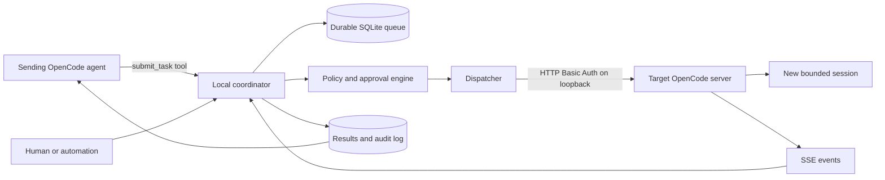

<!--
Research baseline: OpenCode v1.17.18, tag commit b1fc811, released 2026-07-09.
Research date: 2026-07-13, America/New_York.
Evidence labels: VERIFIED-SOURCE, DOCUMENTED, OBSERVED-EXTERNAL-REPORT, INFERRED, PROPOSED.
No live OpenCode binary was available in the execution sandbox, so runtime claims are source-derived unless explicitly labeled otherwise.
-->
# Executive Summary: Inter-Instance Communication Between OpenCode Agents

## Bottom line

OpenCode already exposes most of the low-level control surface needed for one process to send work to another running OpenCode instance, provided the sender knows the receiver's HTTP server address and a target session ID.

A normal OpenCode TUI is a client connected to an HTTP server started inside the same OpenCode process. The server supports session creation, session status, synchronous and asynchronous prompting, abort, event streaming, and TUI control endpoints. A sender can therefore submit a prompt directly to a known session or create a new session and submit work there. This is native programmatic control, not a purpose-built peer-agent protocol.

OpenCode does **not** currently provide a secure machine-wide registry of live instances, durable peer mailboxes, per-agent authentication, cryptographic peer provenance, leases, retries, dead-letter queues, or a distinct `peer-agent` message role. Optional mDNS can advertise a non-loopback server, but it is disabled by default and should not be treated as a secure local registry.

## Direct answers

| Question | Answer |
|---|---|
| Can one running OpenCode instance discover another automatically? | Not reliably by default. TUI servers normally use a random port. Optional mDNS exists, and OS process/socket inspection is possible, but a managed registry or known fixed endpoint is better. |
| Can one instance determine whether a session is busy or idle? | Yes, through `GET /session/status` and session status events. Missing entries are treated as idle by the current status service. Status is process-local runtime state, so it must be queried from the server that owns the active run. |
| Can one instance send a prompt to another? | Yes. Use `POST /session/:id/message` or `POST /session/:id/prompt_async`, or the typed SDK equivalents. |
| Can it wake an idle session and start inference? | Yes in the current v1.17.18 source path when `noReply` is not true. The prompt is stored as a user message and the session loop is started. Historical issue reports show this behavior has regressed in earlier releases, so production code must verify completion. |
| Can it tell an interactive TUI to run text? | Yes. The TUI API can append prompt text, select a session, and submit the current prompt. This is terminal/UI automation and is not the preferred production transport. |
| Does the receiving model know the prompt came from another agent? | No, not natively. The normal prompt API creates a standard `role: "user"` message. The prompt schema has no authenticated sender or peer provenance field, and the plugin `chat.message` hook does not receive transport provenance. |
| Does OpenCode treat an API prompt differently from human input? | At the model-message level, not in a way that establishes trustworthy provenance. Both become user messages. A TUI-injected prompt is especially indistinguishable from human-entered text. |
| Can a plugin implement peer communication? | Largely yes. A plugin receives an SDK client and server URL, can subscribe to events, run background JavaScript, watch files or sockets, expose tools, create sessions, send prompts, inspect status, and show TUI notifications. It cannot create a true security boundary because plugin code has the same OS privileges as OpenCode. |
| Is a plugin alone the best production architecture? | Usually no. Use an external durable broker or coordinator for identity, queueing, leases, replay protection, policy, and audit. Use a plugin as an adapter and UI integration layer. |

## Most important implementation finding

A submitted prompt is not automatically a durable FIFO job. The prompt path writes a new user message and calls the session run loop. The current runner's `ensureRunning` behavior returns the result of an already-running loop instead of creating a separate queued run. The existing loop may observe the newly written message, but there is a race near run completion. Multiple external senders must therefore not assume that every accepted prompt receives a distinct assistant response.

For reliable dispatch:

1. Prefer a new bounded session per externally delegated task.
2. Otherwise dispatch only when the target session is idle.
3. Assign a task ID and correlation ID in a broker-owned envelope.
4. Observe SSE events and reconcile by reading messages.
5. Mark completion only after a correlated assistant result is stored.
6. Retry through the broker, not by blindly resending prompts.

## Recommended architecture

The coordinator should own instance registration, task identity, authentication, authorization, queueing, leases, retries, cancellation, result correlation, and audit. OpenCode should remain the execution engine.

## Best choices by use case

| Use case | Recommended method |
|---|---|
| Quick same-user experiment | Fixed loopback ports plus HTTP API, or a filesystem mailbox plugin with atomic rename. |
| Reliable single-machine use | Local coordinator daemon with SQLite and authenticated loopback OpenCode servers. |
| Existing interactive TUI | Notify and request acceptance, then create a new task session. Avoid silent injection into the user's active conversation. |
| Headless autonomous workers | Controller-managed `opencode serve` workers, one task session per job, strict permissions, explicit timeouts. |
| Cross Windows/WSL | Broker on one side with an explicit TCP loopback endpoint or separate brokers bridged intentionally. Avoid relying on Unix sockets across the boundary. |
| High-security environment | OS-separated worker accounts or containers, deny-by-default permissions, broker-issued capabilities, no mDNS, no unauthenticated server, no terminal injection. |

## Methods to avoid as the main design

- `tmux send-keys`, `screen`, keyboard automation, or PTY injection
- Unix signals as a substitute for task delivery
- Blind polling of a shared folder without atomic claims and replay protection
- Multiple OpenCode server processes concurrently driving the same persisted session
- Binding OpenCode to `0.0.0.0` with no password
- Treating localhost as authentication
- Copying sender claims into system instructions
- Letting peer tasks inherit unrestricted Build-agent permissions

## Plugin feasibility verdict

A useful `opencode-peer` plugin is feasible as an adapter. It can:

- register a `peer_submit` tool
- monitor a broker or mailbox
- create or select sessions through the SDK
- call `session.prompt` or `prompt_async`
- subscribe to session events
- show a TUI toast
- add human acceptance commands
- apply session-specific permissions
- publish results back to the broker

The plugin should **not** be trusted to authenticate messages solely from prompt text. Authentication must occur at the broker or transport layer, before any untrusted body is sent to the model.

## Evidence baseline

- OpenCode v1.17.18 is the latest release observed during research, released July 9, 2026, commit `b1fc811`.
- Official server documentation states that the TUI starts a server, supports explicit host/port selection, exposes an OpenAPI specification, and provides session, event, and TUI endpoints.
- Tagged source confirms that `prompt_async` starts `promptSvc.prompt(...)` in a scoped background fiber.
- Tagged source confirms that prompt creation constructs an ordinary user message, invokes `chat.message`, saves the message, and starts the session loop unless `noReply` is true.
- No executable OpenCode installation was available in the research sandbox, so live two-instance regression tests remain required before production deployment.

See [sources.md](sources.md) for immutable source links and access notes.
