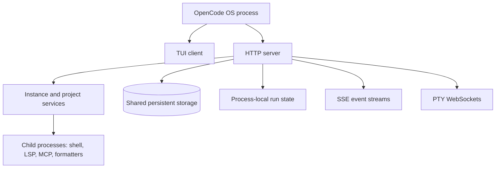

<!--
Research baseline: OpenCode v1.17.18, tag commit b1fc811, released 2026-07-09.
Research date: 2026-07-13, America/New_York.
Evidence labels: VERIFIED-SOURCE, DOCUMENTED, OBSERVED-EXTERNAL-REPORT, INFERRED, PROPOSED.
No live OpenCode binary was available in the execution sandbox, so runtime claims are source-derived unless explicitly labeled otherwise.
-->
# Native Capabilities and Runtime Model

## 1. Research baseline and confidence

| Item | Value |
|---|---|
| Stable release examined | OpenCode v1.17.18 |
| Release date | 2026-07-09 |
| Tagged commit shown by GitHub | `b1fc811` |
| Research date | 2026-07-13 |
| Live runtime tests | Not performed because OpenCode was not installed in the isolated execution sandbox |
| Primary evidence | Official documentation and immutable tagged source |

The conclusions below distinguish documented API behavior from source-level mechanics. Historical GitHub issues are included as regression warnings, not as evidence that current source is broken.

## 2. OpenCode process model

### 2.1 TUI and server

**DOCUMENTED:** Running `opencode` starts both a TUI and an HTTP server. The TUI is a client of that server. A standalone server can be started with `opencode serve`.

**DOCUMENTED:** A TUI normally chooses a random port. The user can specify `--hostname` and `--port`, which is essential for reliable inter-instance addressing.

**VERIFIED-SOURCE:** The server is a Node HTTP server. If port `0` is requested, current source first attempts 4096 and then falls back to an available port. Graceful shutdown has a one-second timeout and can force-close HTTP and WebSocket connections.



### 2.2 Standalone server and attached clients

`opencode serve` starts a separate server. Starting it while another TUI is running does not attach to the TUI's server. It creates another server. Clients can attach explicitly to a known URL.

This distinction matters because session status and active runner state are held in an instance-local map. Two server processes can see persistent session records but do not share the same in-memory runner ownership map.

**Operational rule:** Never use a second OpenCode server process as an alternate endpoint for a session actively owned by another server. Route all control requests for an active session to its owning server URL.

## 3. Native control surfaces

### 3.1 Health and discovery-related endpoints

| Capability | Endpoint or method | Notes |
|---|---|---|
| Health/version | `GET /global/health` | Confirms a server and reports version. |
| OpenAPI spec | `GET /doc` | Runtime schema for client generation and compatibility checks. |
| Projects | `GET /project` | Lists known projects in the server context. |
| Current project | `GET /project/current` | Useful for endpoint registration verification. |
| Current path | `GET /path` | Confirms directory/worktree context. |
| Optional discovery | mDNS | Disabled by default. Source publishes HTTP service `opencode-<port>` only when enabled and bound non-loopback. |

There is no documented machine-wide registry file or standard Unix-domain control socket for all TUI instances. A coordinator should create its own registry.

### 3.2 Session endpoints

| Capability | Endpoint | Inter-agent relevance |
|---|---|---|
| List sessions | `GET /session` | Locate candidate sessions. |
| Create session | `POST /session` | Preferred for bounded peer tasks. |
| Read session | `GET /session/:id` | Confirm target and metadata. |
| Status map | `GET /session/status` | Detect process-local active states. |
| Read messages | `GET /session/:id/message` | Reconcile accepted tasks and results. |
| Synchronous prompt | `POST /session/:id/message` | Sends a standard user message and waits for response. |
| Asynchronous prompt | `POST /session/:id/prompt_async` | Starts prompt processing in a background fiber and returns 204. |
| Abort | `POST /session/:id/abort` | Cancels active processing and related background jobs. |
| Execute slash command | `POST /session/:id/command` | Powerful; do not expose without policy. |
| Run shell | `POST /session/:id/shell` | High risk; not needed for peer messaging. |
| Fork | `POST /session/:id/fork` | Can isolate delegated work from an existing conversation. |

### 3.3 Event stream

`GET /event` exposes an SSE stream. Current source:

- eagerly registers the event listener
- filters events to the relevant directory and workspace
- emits `server.connected`
- emits a heartbeat every 10 seconds
- ends on `server.instance.disposed`

Relevant events include session created, updated, status, idle, error, message updates, permission requests, file watcher updates, and TUI events.

A consumer should use SSE for responsiveness but periodically reconcile through REST. SSE is not a durable queue.

### 3.4 TUI control

The TUI API can:

- append text to the current prompt
- clear the prompt
- submit the prompt
- select a session
- execute known TUI commands
- show a toast
- open session, model, theme, and help views

This enables IDE integration and can be used for inter-instance automation. However, it drives presentation state. It does not provide authenticated peer provenance and is vulnerable to focus, session-selection, and timing races.

## 4. Prompt lifecycle

### 4.1 Prompt creation

**VERIFIED-SOURCE:** `SessionPrompt.createUserMessage` creates a `SessionV1.User` object with `role: "user"`, the selected agent and model, optional system text, and supplied parts. It invokes the plugin `chat.message` hook, validates and saves the message and parts, and returns the stored user message.

**VERIFIED-SOURCE:** `SessionPrompt.prompt` then:

1. loads the session
2. cleans up revert state
3. creates and saves the user message
4. touches the session timestamp
5. applies deprecated per-prompt tool booleans if supplied
6. returns immediately if `noReply === true`
7. otherwise calls the session loop

### 4.2 Asynchronous prompting

**VERIFIED-SOURCE:** The `prompt_async` handler verifies that the session exists, calls the same `promptSvc.prompt(...)` path, forks it into the server scope with immediate start, logs failures, publishes a session error event, and returns HTTP 204.

This means current tagged source is intended to wake an idle session and cause inference, not merely append a message.

### 4.3 Busy-session semantics

The runner has these states:

- Idle
- Running
- Shell
- ShellThenRun

When `ensureRunning(work)` is called:

- Idle: starts the supplied work.
- Running: waits for the existing run and does not enqueue the newly supplied work as a separate run.
- Shell: stores one pending run to start after the shell exits.
- ShellThenRun: waits for the already pending run.

Because the prompt message is stored before `ensureRunning`, a new message submitted during a run may be observed by the existing loop. Near completion, however, there is no independent durable run record guaranteeing a distinct response for each accepted message.

**Best practice:** do not send concurrent peer prompts to the same session. Use one task session per job or serialize dispatch through a broker after confirming idle state.

## 5. What “wake up” means

| Layer | Can OpenCode do it? | Explanation |
|---|---:|---|
| Resume a stopped OS process | OS-dependent | `SIGCONT` can resume a stopped Unix process, but this does not create an LLM turn. |
| Notify a running process | Yes | HTTP request, file event, signal, socket, or TUI event can notify code. |
| Insert a user message | Yes | Session prompt API or TUI prompt submission. |
| Start inference on an idle session | Yes | Current prompt path starts the session loop unless `noReply` is true. |
| Guarantee durable FIFO execution | No | OpenCode's prompt endpoint is not a broker queue. |
| Authenticate a peer agent | No | Basic server authentication identifies a client credential, not a named agent with capabilities. |
| Preserve peer provenance to the model | No | The stored prompt is a normal user message. |

## 6. Discovery options

### 6.1 Explicit registry, recommended

Launch each managed server with:

- loopback hostname
- allocated fixed port
- random per-instance password
- explicit project directory
- generated instance ID

Register these facts in a coordinator-owned file or database with mode `0600` on Unix or a user-only ACL on Windows.

### 6.2 mDNS, conditional

Source publishes an HTTP Bonjour service named `opencode-<port>` with host default `opencode.local` only if mDNS is enabled and the server is not bound to loopback. This is unsuitable for high-security same-machine discovery because it can expose the service on the LAN.

### 6.3 OS inspection, diagnostic only

Tools such as `ss`, `lsof`, `/proc`, PowerShell `Get-NetTCPConnection`, Process Explorer, or WMI can correlate OpenCode processes and listening ports. PID reuse and command-line truncation make this a poor primary registry.

## 7. Cross-environment matrix

| Pair | Feasibility | Notes |
|---|---|---|
| TUI to TUI, same user | High | Use known HTTP endpoints. Avoid shared active session. |
| TUI to headless | High | Best when headless instance is a managed worker. |
| Headless to TUI | High technically | Prefer notification and acceptance over silent injection. |
| Headless to headless | High | Best production shape. |
| Different repositories | High | Register directory/worktree and create target session in correct context. |
| Same repository | High but risky | Use separate sessions and avoid concurrent edits without worktree isolation. |
| Different OS users | Conditional | Requires bind/listener permissions and authentication; OS account isolation is beneficial. |
| Windows to WSL | Conditional | TCP is more portable than named pipes or Unix sockets across the boundary. Explicitly test localhost routing under VPN and mirrored networking. |
| Container to host | Conditional | Requires intentional port exposure and stronger authentication. |
| Remote host | Possible | Use SSH tunnel or authenticated TLS proxy. Do not expose plain HTTP Basic Auth directly. |

## 8. Historical regression warnings

A prior upstream issue reported that `prompt_async` returned 204 without reliably starting an idle session. Current v1.17.18 tagged source and API description explicitly start the prompt path, so the issue should be treated as a regression test requirement rather than the current specification.

Another class of issues has reported TUI rendering or event synchronization problems for API-injected messages. Therefore:

- verify stored messages through the session API
- do not infer failure solely from TUI rendering
- correlate completion by message IDs and events
- test the exact OpenCode version in CI

## 9. Minimal direct API workflow

```text
1. GET /global/health
2. GET /project/current and /path
3. POST /session to create a bounded task session
4. Subscribe to /event
5. POST /session/<id>/prompt_async
6. Observe session.status and message.updated events
7. Reconcile with GET /session/<id>/message
8. Abort on timeout
9. Record result in the external broker
```

The direct workflow is adequate for prototypes. Production systems still need durable orchestration outside OpenCode.
