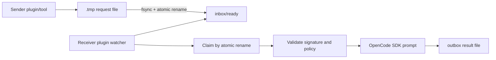
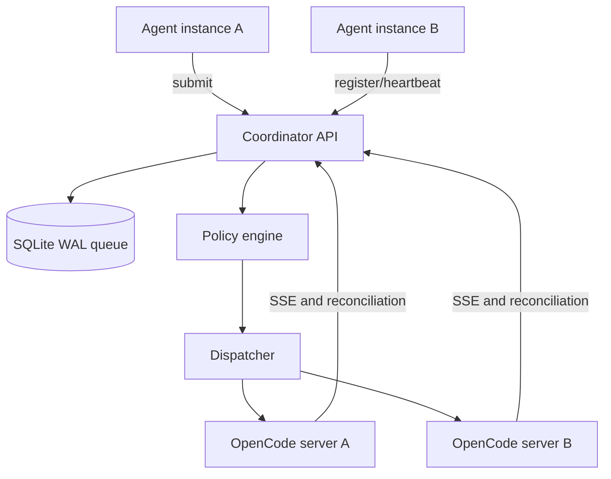
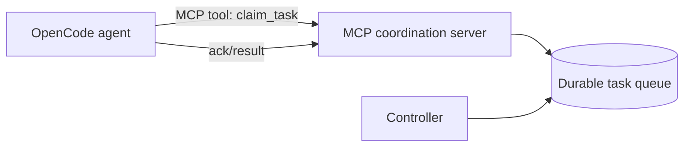
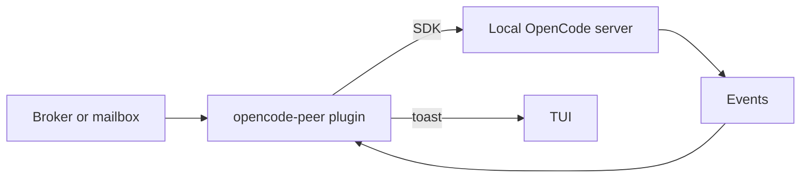
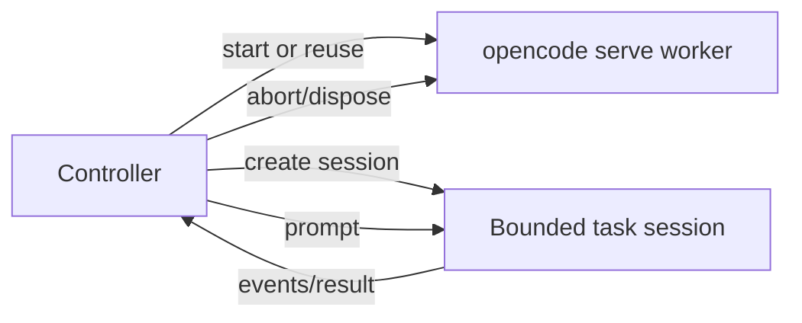
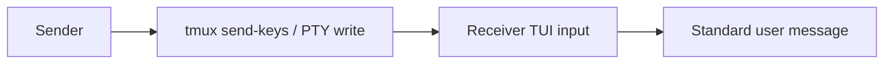

<!--
Research baseline: OpenCode v1.17.18, tag commit b1fc811, released 2026-07-09.
Research date: 2026-07-13, America/New_York.
Evidence labels: VERIFIED-SOURCE, DOCUMENTED, OBSERVED-EXTERNAL-REPORT, INFERRED, PROPOSED.
No live OpenCode binary was available in the execution sandbox, so runtime claims are source-derived unless explicitly labeled otherwise.
-->
# Communication Methods Comparison

## Decision matrix

Legend: **Yes**, **Partial**, **No**. Security ratings assume careful implementation.

| Method | Can notify | Can trigger LLM turn | Durable | Authenticated | Targets existing session | Cross-platform | Reliability | Security | Complexity | Recommendation |
|---|---:|---:|---:|---:|---:|---:|---:|---:|---:|---|
| OpenCode session HTTP API | Yes | Yes | Message persists, delivery queue does not | Basic server credential only | Yes | High | Medium-high with reconciliation | Medium | Low | Recommended for transport |
| OpenCode SDK | Yes | Yes | Same as HTTP | Same as HTTP | Yes | High | Medium-high | Medium | Low | Recommended client interface |
| TUI append and submit API | Yes | Yes | Conversation persists | Same server credential | Current/selected TUI session | High | Medium-low | Low-medium | Low | Conditional, UI workflows only |
| SSE event stream | Yes | No | No | Same server credential | Per server/directory | High | Medium | Medium | Low | Recommended as signal, not queue |
| Shared filesystem mailbox | Yes | Via plugin/poller | Yes | Filesystem ACL plus signature | Yes through adapter | High | Medium-high | Medium-high | Medium | Good prototype or fallback |
| SQLite local broker | Yes | Via dispatcher | Yes | Broker auth and OS ACL | Yes | High | High | High | Medium | Recommended single-machine core |
| Local HTTP broker | Yes | Via dispatcher | Yes if backed by DB | Strong token or mTLS | Yes | High | High | High | Medium | Recommended |
| Unix-domain socket broker | Yes | Via dispatcher | Yes if backed by DB | Peer credentials plus ACL | Yes | Unix/WSL | High | High | Medium | Recommended on Unix |
| Windows named-pipe broker | Yes | Via dispatcher | Yes if backed by DB | ACL and impersonation checks | Yes | Windows | High | High | Medium | Recommended on Windows |
| MCP task service | Pull by default | Only after agent/tool call or adapter prompt | Yes if service persists | Service-defined | Indirect | High | High for pull workflows | High | Medium | Recommended as agent-facing API |
| Plugin file watcher | Yes | Yes, through SDK | Depends on mailbox | Plugin-defined | Yes | High | Medium | Medium | Medium | Conditional adapter |
| OS signal | Yes | No by itself | No | Same-user/process permissions | Process only | Medium | Low | Low | Low | Not a task transport |
| FIFO/named pipe directly to TUI | Yes | Maybe with custom reader | No unless paired with DB | Weak by default | Process | Medium | Low | Low | Medium | Discouraged |
| tmux or screen send-keys | Yes | Yes | No | tmux socket ACL only | Active pane | Unix | Low | Low | Low | Experimental only |
| PTY input injection | Yes | Yes | No | Weak | Active process | Low | Low | Very low | High | Do not use in production |
| Clipboard/desktop automation | Yes | Yes | No | None meaningful | Focused UI | Medium | Very low | Very low | Medium | Do not use |
| Git commits/refs as mailbox | Yes by polling | Via adapter | Yes | Commit signing optional | Repository-bound | High | Medium | Medium | Medium | Niche, not recommended generally |
| Redis/NATS/ZeroMQ | Yes | Via adapter | Varies | Service-defined | Yes | High | High | High if configured | High | Useful when already deployed |
| OpenCode core peer protocol | Yes | Yes | Could be | Could be strong | Yes | High | Potentially high | Potentially high | Very high | Upstream proposal |

## Architecture A: shared filesystem mailbox

### Control flow

1. Sender writes a complete envelope to a private temporary file.
2. Sender flushes it and atomically renames it into `ready/`.
3. Receiver watches or polls `ready/`.
4. Receiver verifies ownership, mode, canonical path, size, schema, expiry, nonce, and HMAC/signature.
5. Receiver claims by atomic rename into `processing/<worker-id>/`.
6. Receiver creates a bounded session and submits the untrusted task body.
7. Receiver writes result and acknowledgement atomically.
8. Stale claims are reaped using leases.

### Strengths

- Simple
- Durable
- Inspectable
- No listening port
- Works offline
- Easy to back up and debug

### Weaknesses

- Cross-filesystem rename is not atomic
- Network filesystems weaken locking and ownership assumptions
- Watchers can lose/coalesce events, so periodic scans are mandatory
- Same-user malware can forge requests unless signatures use a protected key
- Requires careful symlink-safe handling

### Status

**Conditionally recommended** for a same-user prototype or local fallback. Use a coordinator-owned directory outside repositories.

## Architecture B: local coordinator daemon

### Required broker responsibilities

- instance registry and health
- stable instance ID independent of PID
- project/worktree identity
- per-agent capability tokens
- durable requests, acknowledgements, leases, and results
- retry and dead-letter policy
- deduplication and idempotency keys
- approval state
- rate and depth limits
- loop detection
- audit and redaction
- dispatch serialization per target session

### Status

**Recommended** for reliable single-machine production use.

## Architecture C: MCP-based coordination

MCP is naturally a pull interface. It is excellent for exposing `list_tasks`, `claim_task`, `get_task`, `submit_result`, and `heartbeat` tools. It does not by itself wake an idle OpenCode session. A plugin, external controller, or periodic agent loop must initiate the model turn that calls the MCP tool.

### Status

**Recommended** as the agent-facing task API, paired with a broker and an explicit wake/dispatch mechanism.

## Architecture D: OpenCode plugin

The plugin can run JavaScript background logic, subscribe to OpenCode events, watch files or connect sockets, expose tools, mutate configuration, and use the SDK client. A `dispose` hook permits cleanup.

### Limitations

- No sandbox between plugin and OpenCode
- No native peer-agent message role
- No transport provenance in `chat.message`
- Background task robustness is plugin-owned
- A plugin crash can affect the host process
- Plugin dependency installation expands supply-chain risk

### Status

**Conditionally recommended** as an adapter and UX layer, not as the sole durable authority.

## Architecture E: headless worker processes

This avoids trying to turn a human's active conversation into a worker queue. Workers can have narrow permissions and isolated worktrees.

### Status

**Strongly recommended** for autonomous workflows.

## Architecture F: terminal or PTY injection

There is no trustworthy provenance. Text can land in the wrong pane or prompt, include terminal control characters, or execute partial commands. Busy-state handling is poor. It is difficult to acknowledge or retry safely.

### Status

**Discouraged**. Acceptable only for disposable demonstrations with visible human supervision.

## Architecture G: OpenCode core enhancement

A core protocol could add authenticated local instance registration, durable inboxes, peer-message provenance, capability-scoped submission, and explicit task lifecycle events. See [05-core-enhancement-proposal.md](05-core-enhancement-proposal.md).

## “Wake up and check this folder” patterns

| Pattern | What actually wakes | Does it create an LLM turn? | Recommendation |
|---|---|---:|---|
| `inotify`/FSEvents/ReadDirectoryChangesW | Plugin or daemon callback | Only if callback calls prompt API | Good signal, always add periodic rescan |
| Sentinel file | Poller/watcher | Only through adapter | Fine for prototype |
| FIFO write | Reader loop | Only through adapter | Fragile across crashes |
| HTTP callback | Receiver daemon/plugin | Yes if handler calls prompt API | Good with authentication |
| OS signal | Process signal handler | Not natively | Not useful without core/plugin handler |
| TUI prompt API | TUI event subscriber | Yes after submit | Conditional |
| Session prompt API | Session service | Yes | Best native wake mechanism |
| MCP queue | Agent tool call | Not while idle | Best pull mechanism |

## Ranked recommendations

1. **Reliable production:** local coordinator plus headless workers and one session per job.
2. **Agent-facing integration:** MCP tools backed by the same coordinator.
3. **Interactive UX:** plugin notification and explicit accept/reject, then bounded session.
4. **Simple prototype:** private filesystem mailbox plus plugin, atomic claims, HMAC, and strict permissions.
5. **Avoid:** terminal injection, signals, clipboard automation, and concurrent prompting of one session.
