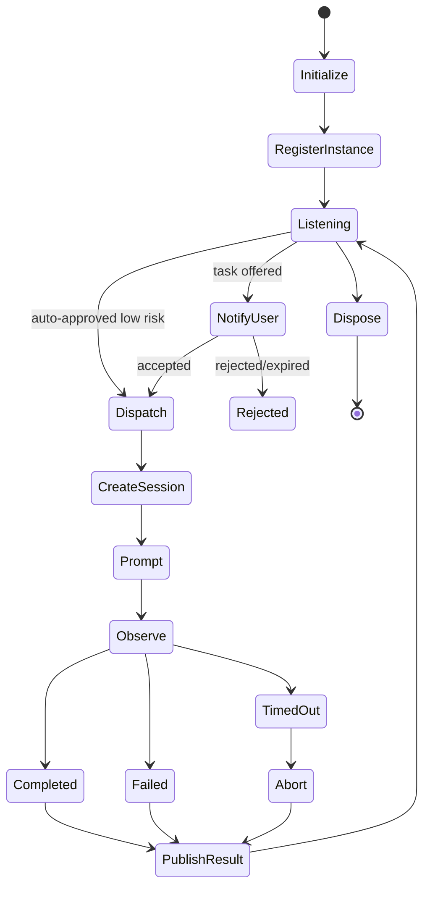

<!--
Research baseline: OpenCode v1.17.18, tag commit b1fc811, released 2026-07-09.
Research date: 2026-07-13, America/New_York.
Evidence labels: VERIFIED-SOURCE, DOCUMENTED, OBSERVED-EXTERNAL-REPORT, INFERRED, PROPOSED.
No live OpenCode binary was available in the execution sandbox, so runtime claims are source-derived unless explicitly labeled otherwise.
-->
# Plugin Feasibility and Proposed `opencode-peer` Design

## 1. Feasibility summary

| Requirement | Current plugin/API support | Verdict |
|---|---|---|
| Run background logic | Plugin initializer can start JavaScript logic; `dispose` hook exists | Feasible, lifecycle is plugin-owned |
| Watch files | Standard JS APIs or dependency such as chokidar | Feasible |
| Open sockets | Standard JS runtime networking | Feasible |
| Expose agent tools | `tool` hook is documented | Feasible |
| Subscribe to OpenCode events | `event` hook | Feasible |
| Create session | SDK client `session.create` | Feasible |
| Prompt existing session | SDK `session.prompt` / async endpoint | Feasible |
| Start a model turn | Yes through prompt without `noReply` | Feasible |
| Inspect busy/idle | SDK/HTTP session status and events | Feasible |
| Show TUI notification | TUI show-toast endpoint and event | Feasible |
| Request OpenCode tool approval | OpenCode permission system handles tool requests | Feasible, not a peer-task acceptance flow |
| Add peer provenance role | No native message role or signed metadata field | Not feasible without convention/core change |
| Authenticate external sender | Plugin can implement transport auth | Feasible but not provided by OpenCode |
| Isolate plugin privileges | No. Plugin runs with OpenCode process privileges | Not feasible in plugin alone |
| Guarantee durable delivery | Not from plugin memory | Requires broker or durable mailbox |
| Register native slash commands | Can be achieved through configuration/command files, not a dedicated documented plugin registration hook | Conditional |

## 2. Current plugin security boundary

There is effectively no OS security boundary between a plugin and OpenCode. A plugin receives:

- project, directory, and worktree information
- an SDK client
- the server URL
- Bun shell execution access
- event hooks
- tool hooks
- environment mutation hooks

Plugin code can use normal filesystem and network APIs. It should be treated like trusted native code under the user's account.

## 3. Recommended division of responsibility

### Coordinator owns

- authentication and principal registry
- durable queue and task state
- HMAC/signature keys
- replay protection
- authorization policy
- repository/worktree mapping
- approvals
- retries, leases, and dead letters
- audit log
- server endpoint registry

### Plugin owns

- registration and heartbeat to coordinator
- local OpenCode session status reporting
- user notifications
- acceptance/rejection UX
- creation of scoped task sessions
- prompt rendering
- SSE/event correlation
- result publication
- clean shutdown

## 4. Proposed plugin lifecycle



## 5. Configuration

```jsonc
{
  "plugin": ["opencode-peer"],
  "peer": {
    "enabled": true,
    "coordinator": "http://127.0.0.1:47821",
    "principal": "agent:builder-local",
    "registrationTokenFile": "~/.config/ocpeer/registration-token",
    "mode": "approval",
    "sessionStrategy": "new-per-task",
    "maxConcurrentTasks": 1,
    "allowedProjects": ["sha256:..."],
    "defaultPermissionProfile": "peer-readonly",
    "maxPromptBytes": 131072,
    "maxTaskSeconds": 1800,
    "showToasts": true
  }
}
```

Do not put long-lived secrets directly in a repository configuration file.

## 6. Agent-facing tools

### `peer_submit`

Arguments:

- target principal or capability
- requested action
- untrusted body
- project/worktree reference
- required scope
- expiration
- correlation ID

The tool sends a structured task to the coordinator. It does not contact another OpenCode server directly.

### `peer_status`

Returns broker task state and summarized result metadata.

### `peer_cancel`

Requests cancellation. Coordinator validates that the caller owns the task or holds a cancellation capability.

### `peer_inbox`

Lists offered tasks. In approval mode, the human can inspect before accepting.

## 7. Session strategy

Default: **new session per task**.

Advantages:

- clean correlation
- no prompt collision
- clear permission profile
- easier timeout and abort
- independent transcript and export
- reduced contamination of human conversations

Optional strategies:

- fork a named base session for context
- reuse a dedicated worker session only with strict serialized dispatch and post-task compaction/reset
- never silently reuse the current interactive session

## 8. Message handling

The plugin should:

1. receive a verified broker task object
2. independently check project and path scope
3. construct session permissions
4. create session with title `Peer task <short-id>: <action>`
5. render trusted metadata and untrusted body separately
6. submit through SDK
7. subscribe to events and poll as fallback
8. collect final assistant message and file diff
9. publish a signed result envelope
10. retain broker state even if the plugin restarts

## 9. Idle and busy handling

- Never send a second task to a session with active run state.
- Treat a missing status entry as “not known busy by this server,” not proof that no other server owns the session.
- Maintain an adapter-side per-session mutex.
- Reconcile session ownership with the registered server instance.
- Prefer creating a new task session on the registered server.

## 10. Human approval

Low-risk read-only tasks may be automatically accepted under policy. Tasks requesting any of the following should default to human approval or denial:

- edit/write
- shell commands beyond a narrow allowlist
- network access
- secret access
- Git commit or push
- package installation
- MCP server addition
- task delegation
- external-directory access
- destructive cleanup

## 11. Error handling

| Failure | Action |
|---|---|
| Coordinator unavailable | Backoff with jitter; do not buffer unbounded tasks in plugin memory |
| OpenCode server mismatch | Refuse and re-register |
| Session creation fails | Release lease or mark retryable |
| Prompt accepted but no completion | Reconcile messages, then abort on deadline |
| Session error event | Store error and classify retryability |
| Plugin restart | Coordinator lease expires; new plugin incarnation re-registers |
| Duplicate offer | Idempotently return current task state |
| User rejects | Record signed rejection reason |
| Project moved | Require registry update and reauthorization |

## 12. Code skeleton

A plugin-shaped TypeScript skeleton is included at:

- [`prototype/plugin/opencode-peer.ts`](prototype/plugin/opencode-peer.ts)

It is deliberately conservative and marked experimental. It demonstrates:

- plugin initialization
- coordinator polling
- TUI toast
- new-session creation
- prompt submission
- result callback
- cleanup through `dispose`

It does not claim production readiness.

## 13. Testing strategy

### Unit tests

- envelope schema validation
- signature canonicalization
- expiry and replay
- path canonicalization
- policy decisions
- prompt rendering and delimiter escaping
- idempotent result publication

### Integration tests by pinned OpenCode version

- two managed servers on fixed ports
- create and prompt idle session
- prompt_async completion
- busy-session collision test
- SSE disconnect and reconciliation
- plugin restart during task
- OpenCode process crash
- wrong password
- wrong directory/worktree
- permission request and rejection
- abort on timeout
- Windows, WSL, Linux, and macOS endpoint behavior

### Security tests

- forged sender field
- reused nonce
- symlinked mailbox files
- oversized body
- terminal control characters
- recursive delegation loop
- same task sent to two workers
- compromised project plugin attempting broker impersonation

## 14. Packaging and supply chain

- publish with pinned OpenCode peer dependency ranges
- generate an SBOM
- sign releases
- pin transitive dependencies where practical
- avoid dynamic code loading from task messages
- keep cryptographic and queue logic in the coordinator, not duplicated across plugins
- support `--pure` or equivalent no-plugin diagnostics

## 15. Missing native hooks worth requesting upstream

- authenticated per-request principal metadata
- peer task message role or immutable provenance metadata
- explicit session ownership token
- atomic enqueue-to-session API
- per-session task queue and message correlation
- task acceptance UI primitive
- capability-scoped API tokens
- durable event cursor/resume
- instance registry endpoint with secure local discovery
