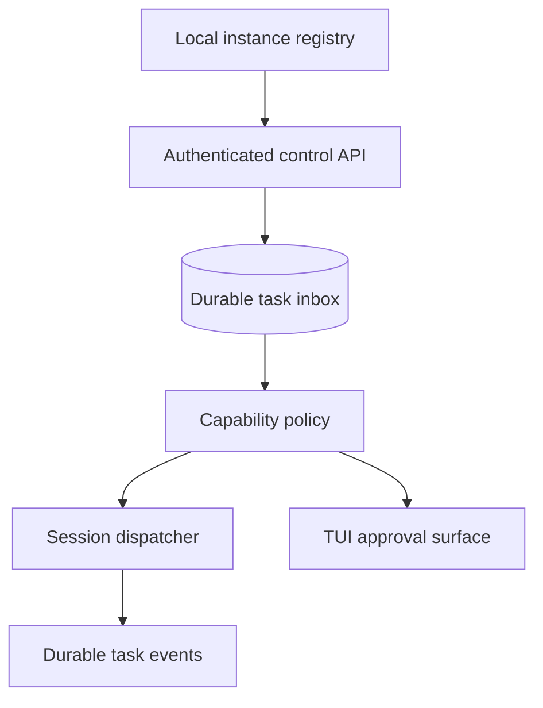

<!--
Research baseline: OpenCode v1.17.18, tag commit b1fc811, released 2026-07-09.
Research date: 2026-07-13, America/New_York.
Evidence labels: VERIFIED-SOURCE, DOCUMENTED, OBSERVED-EXTERNAL-REPORT, INFERRED, PROPOSED.
No live OpenCode binary was available in the execution sandbox, so runtime claims are source-derived unless explicitly labeled otherwise.
-->
# Proposed OpenCode Core Enhancement: Local Control and Peer Task Protocol

## 1. Motivation

OpenCode's HTTP API is sufficient for direct programmatic control, but it lacks the semantics required for safe peer-agent coordination:

- no secure instance registry
- no scoped API token
- no durable task inbox
- no session ownership lease
- no peer-agent provenance field
- no atomic enqueue and acknowledgement
- no durable event cursor
- no acceptance policy or human approval object

A core enhancement should build on the existing server rather than inventing a separate terminal-control path.

## 2. Proposed components



## 3. Local discovery

### Unix

Use `$XDG_RUNTIME_DIR/opencode/control/` with mode `0700`.

Each instance writes an atomic registration record:

```json
{
  "schema": 1,
  "instance_id": "oci_...",
  "pid": 12345,
  "started_at": "...",
  "endpoint": "unix:///run/user/1000/opencode/oci_....sock",
  "http_endpoint": "http://127.0.0.1:41237",
  "project_id": "...",
  "directory": "...",
  "challenge_public_key": "..."
}
```

Use Unix-domain sockets and verify peer credentials where supported.

### Windows

Use a per-user named pipe and registry directory under the user's local application data. Apply a DACL granting only the user SID and optionally SYSTEM.

### WSL

Expose an explicit opt-in TCP bridge or run one coordinator per environment. Do not assume Unix sockets or named pipes cross the boundary reliably.

## 4. Capability tokens

Issue short-lived, audience-bound tokens with claims:

```json
{
  "iss": "opencode-control",
  "sub": "agent:reviewer",
  "aud": "oci_target",
  "exp": 1783965000,
  "jti": "...",
  "cap": [
    "session.create:project:abc",
    "task.submit:readonly",
    "task.read:own"
  ]
}
```

Tokens must not grant generic shell, file, or permission-response APIs unless explicitly requested.

## 5. Task API sketch

### Register instance

```http
POST /control/v1/instances/register
```

### List authorized instances

```http
GET /control/v1/instances
```

### Submit task

```http
POST /control/v1/tasks
Content-Type: application/json
Authorization: Bearer <capability>
```

```json
{
  "idempotency_key": "...",
  "target": {"instance_id": "oci_..."},
  "project_id": "...",
  "action": "review",
  "scope": {"read": ["src/**"], "write": []},
  "body": {"type": "text", "text": "..."},
  "approval": "target-policy",
  "deadline": "..."
}
```

### Task states

```text
queued -> awaiting_approval -> leased -> running
running -> succeeded | failed | cancelled | expired
queued/leased -> dead after retry policy
```

### Accept or reject

```http
POST /control/v1/tasks/:id/decision
```

### Cancel

```http
POST /control/v1/tasks/:id/cancel
```

### Events

```http
GET /control/v1/events?cursor=<opaque>
Accept: text/event-stream
```

Events must have durable sequence numbers and resumable cursors.

## 6. Peer provenance in sessions

Add immutable metadata to user messages or a new input type:

```ts
type MessageOrigin =
  | { type: "human" }
  | { type: "api"; clientID?: string }
  | {
      type: "peer_task"
      taskID: string
      principalID: string
      instanceID: string
      policyID: string
      verified: true
    }
```

This metadata should be stored and exposed to UI and plugins. It should not be writable through the general prompt body.

The model may receive a system-generated summary, but authorization must not depend on model interpretation.

## 7. Atomic task dispatch

Add an API that atomically:

1. validates target session ownership
2. checks the session is dispatchable
3. stores task metadata and user message
4. creates a run record or queues the run
5. returns task and message IDs

This avoids the current split between storing a user message and reusing an existing run loop.

## 8. Human approval UI

The TUI should display:

- verified sender identity
- requested action
- repository/worktree
- requested permissions
- risk score
- untrusted body
- accept once, accept with edited scope, reject

Externally supplied content must be visually distinct from verified metadata.

## 9. Backward compatibility

- retain existing `/session/:id/message` APIs
- map legacy prompts to origin `{type: "api"}` when distinguishable
- keep TUI prompts as `{type: "human"}` only when submitted by the local TUI client through a trusted channel
- add new control API under versioned paths
- allow deployments to disable peer task functionality entirely

## 10. Minimal viable upstream change

A smaller first contribution could add:

1. immutable message origin metadata
2. scoped API tokens for prompt-only access
3. instance ID and startup metadata endpoint
4. per-session dispatch lock and queued prompt records
5. task ID propagation through events

This would materially improve external coordinators without forcing OpenCode to own a full broker.

## 11. Reasons to keep orchestration external

OpenCode should not necessarily become a general distributed workflow engine. Retries, DAGs, fleet scheduling, quotas, and cross-machine brokers are separate concerns. Core should provide safe primitives:

- identity
- provenance
- scoped authorization
- atomic dispatch
- durable correlation
- observable lifecycle

External products can build higher-level orchestration on those primitives.
