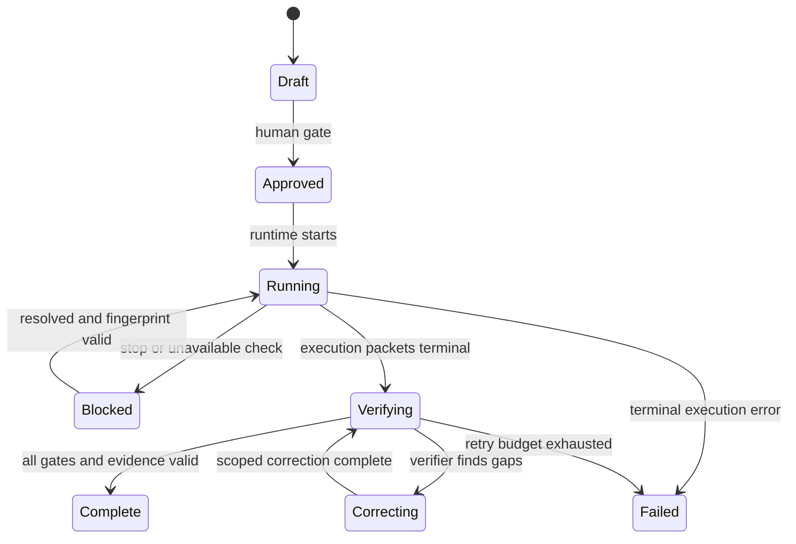

# Agent Workflows Optimal Architecture Research

- Research date: 2026-08-21
- Repository: `fariello/agent-workflows`
- Reviewed commit: `a2110e96b980fbf778027f1676a73774cb819292`
- Repository version at commit: `1.2.1`
- Status: architecture recommendation and unexecuted implementation plan

## 1. Executive summary

The optimal design is a **deterministic-core, progressive-disclosure hybrid**:

1. Define each workflow once as a typed canonical package.
2. Compile it into a portable semantic intermediate representation, bounded just-in-time work packets, evidence predicates, catalog data, and thin host adapters.
3. Put sequencing, resume/retry, human gates, and terminal transitions in a deterministic `aw run` state machine rather than in model memory.
4. Capture command and artifact evidence at tool boundaries in an append-only run ledger.
5. Separate coordinator, executor, and verifier authority. A fresh, read-only verifier examines frozen requirements, the actual diff, and raw evidence. A same-session self-audit is diagnostic only.
6. Use Agent Skills for discovery and packaging, not as the sole authority for workflow semantics. Keep `SKILL.md` concise and load references/scripts progressively.
7. Exploit native subagents, forks, background jobs, or worktrees only through versioned host adapters. Portable behavior must still work with separate processes and files.
8. Enable parallelism for independent read-only analysis. Serialize mutations unless each worker has a separate worktree, disjoint ownership, independent dependencies, and a deterministic integration/revalidation gate.
9. Maintain one semantic contract across models. Model profiles may tune reasoning level, packet size, retry, and verifier policy only after controlled evaluation.
10. Replace the static conformance matrix with an exact host/version/configuration claim registry whose unsupported or expired claims default to `unverified`.

The highest-priority change is not a longer prompt. It is to make a reassuring claim unable to change durable completion state. Detailed checklists remain useful, especially for Gemini Flash, but should be distributed across a short orchestrator, bounded child IPDs, a generated requirement ledger, one current work packet, and an independent validation record. This preserves detail while reducing instruction density.

The repository already contains strong pieces: E/V bijection, fail-closed IPD lifecycle linting, modular step loading, actual-diff verification, corrective IPDs, read-only audit lanes, deterministic tools, and isolated conformance fixtures. The redesign should preserve those invariants and turn advisory prose into enforceable runtime predicates.

## 2. Scope, snapshot, and limitations

The audit used the exact public commit [`a2110e96b980fbf778027f1676a73774cb819292`](https://github.com/fariello/agent-workflows/commit/a2110e96b980fbf778027f1676a73774cb819292), confirmed through both a local checkout and the GitHub connector. The workflow tree contains 151 non-cache files, including 141 Markdown files and 60 manifest command rows. The complete tree was inspected rather than only the entry pages.

In scope:

- canonical workflow structure, dispatch, modularity, and evidence;
- false-completion prevention, detection, and recovery;
- workflow versus skill versus orchestrator decisions;
- GPT-5.6 Sol, Gemini 3.7 Flash with medium thinking, Claude Opus 5, and GLM-5.3;
- Codex CLI, OpenCode, Kiro CLI, Gemini CLI, Claude Code where relevant, and repository `agy`/Antigravity integration;
- subagents, fresh/forked contexts, background execution, worktrees, resumability, evaluation, compatibility, and rollout.

Limitations:

- No named host executable (`codex`, `opencode`, `kiro-cli`, `gemini`, `claude`, or `agy`) was installed in the research environment. No paid live-model call was made and no provider credentials were accessed.
- Exact model quality claims therefore remain hypotheses or repository observations, not controlled comparative results.
- The repository's 11-child Gemini/Antigravity episode is powerful incident evidence but is not a randomized cross-model experiment.
- Official host documentation changes quickly. Every native integration recommendation is gated on an exact versioned live probe before advertised support.
- The IPDs are drafts in `pending/`; they have not been reviewed, approved, or executed.
- The repository-wide test baseline was not green in this workspace. Segmented reruns covered 1,229 of 1,244 discovered tests: eight failures were confined to two pre-existing naming/help modules whose subprocesses could not import the package from temporary repositories or returned empty help, and two tests were skipped. The sandbox would not separately launch the remaining 15 `test_run_checks` tests, and two monolithic full-suite attempts lost their process transport before a terminal summary. The focused tests relevant to this investigation passed 47/47. No product code was changed.

## 3. Method, source hierarchy, and probes

### Source hierarchy

1. Actual repository source, tests, current decisions, executed records, and Git history at the pinned commit.
2. Official model and host documentation current on 2026-08-21.
3. Deterministic local probes and test output from the pinned checkout.
4. Repository-observed incidents, clearly labeled as observational.
5. Engineering inference, explicitly labeled and never used to promote a host capability to supported.

### Repository review

The review covered:

- `.aw/system/workflows/index.md` and all 151 files under the workflow tree;
- release-review protocols, sections, templates, and deterministic policies;
- plan-review single and modular variants;
- verify, verify-execution, IPD lifecycle, assess, advise, assess-all, setup, benchmark, migration, research, incident, handoff, and discovery workflows;
- IPD schema, scaffold, sync, lint implementation, tests, and fixtures;
- generated OpenCode and Claude shims;
- installer, clean-delta, attention, spec-evidence, and conformance tooling;
- `agy_run.py`, its durable preambles, same-session audit, and tests;
- decisions D10, D11, D61, D64-D70, D84, D107-D115, and recent layout decisions;
- the executed `awlayout` orchestrator and its independent verification history.

### Probes performed

| Probe | Exact input/configuration | Result | Interpretation |
|---|---|---|---|
| Git snapshot | clone `main`, inspect HEAD | `a2110e...9292`, clean before generated IPDs | exact review boundary established |
| Workflow inventory | parse manifest and recursively count tree | 60 rows, 151 files, 141 Markdown files | complete catalog boundary established |
| IPD tooling | `aw ipd scaffold`, `sync`, author lint | nine plans generated; all conforming | deliverables conform structurally |
| Focused tests | `python3 -m unittest tests.test_conformance_harness tools.test_agy_run -v` | 47 tests, exit 0, OK | deterministic harness and current same-session runner behavior reproduced |
| Repository suite | full discovery attempted twice; fail-fast and bounded module segments used for diagnosis | not green: eight failures in two modules; 1,229/1,244 tests rerun separately; two skipped; 15 sandbox-blocked | failures are baseline/environmental and unrelated to the new Markdown IPDs, but the full suite is not claimed green |
| Host availability | `command -v` plus `--version` for six CLIs | all not installed | live host/model trials deferred, not inferred |
| Static matrix review | compare JSON commands/paths with current official docs | multiple entries lack repository live evidence; several commands differ from current docs | matrix is seed scaffolding, not a support certificate |

### Probes deferred

The evidence appendix supplies exact isolated commands for native discovery/following, noninteractive behavior, permissions, precedence, subagent isolation, worktree isolation, and live-model benchmark trials. Deferred combinations remain `pending`, never failed or passed by inference.

## 4. Complete workflow inventory and disposition

Recommended execution forms:

- **D**: deterministic command or deterministic-first helper.
- **S**: compact single-context guided workflow.
- **K**: on-demand skill entry point backed by canonical package/runtime.
- **O**: deterministic orchestrator with bounded packets and independent verification.
- **H**: shared harness plus typed lens/persona module.
- **A**: compatibility alias generated from the same source.

| Manifest command or package | Current source | Recommended form | Orchestrator? | Skill? | Key disposition |
|---|---|---|---|---|---|
| `release-review` | `release-review/README.md` plus sections | O+K | yes | explicit | runtime phases; parallel read-only audits; serial fixes/release |
| `release-review-plan` | same body | A to O+K | yes | explicit | frozen planning mode must make mutation unreachable |
| `plan-review` | single 484-line body | A+K | bounded | yes | compile portable view from one modular package |
| `plan-review-long` | memory kernel plus steps | O+K | bounded | yes | becomes canonical package; preserve alias |
| `verify-execution` | body + intent/rubric | O+K | yes | explicit | fresh read-only verifier; actual diff and raw checks |
| `ipd-lifecycle` | single body | D+O | yes | explicit | deterministic phase gates and coordinator terminal authority |
| `getting-started` | single body | S | no | optional | concise router; consent before writes or delegated execution |
| `list-workflows` | single body | D | no | no extra | render catalog from typed manifest |
| `whatnext` | single body | S+D | no | optional | deterministic inventory, bounded synthesis, opt-in write |
| `handoff` | single body | S | no | optional | structured session handoff with sensitivity gate |
| `research` | research-prompt body | S+K | no | yes | typed research handoff, source hierarchy, deliverable checks |
| `verify` | body + `run_checks.py` | D | no | no extra | deterministic approved command discovery/capture |
| `spec` | single body | S+K | no | yes | interactive clarification, typed acceptance, no build |
| `incident` | single body | O+K | conditional | yes | operator-data boundary, timeline, follow-up IPDs |
| `release-notes` | single body | S | no | optional | deterministic diff/version inputs; never publish |
| `migrate` | single body | O+K | conditional | yes | characterization, stages, rollback, per-stage verify |
| `benchmark` | body + `bench_env.py` | O+K | conditional | yes | environment evidence and explicit scheduler consent |
| `setup-repo` | body + setup tools | D+O | yes, serial | explicit | idempotent wizard/state machine with rollback |
| `scaffold` | single body | D+S | no | maintainer-only optional | deterministic generator plus guided choices |
| `assess` | shared harness | H+K | no for one concern | yes | one canonical harness with typed concern argument |
| `assess-all` | rollup body | O+H+K | yes | explicit | read-only lanes; sole-writer de-duplicated synthesis |
| `assess-performance` | assess + lens | H+A | no | via assess | generated lens alias |
| `assess-security` | assess + lens | H+A | no | via assess | generated lens alias |
| `assess-privacy` | assess + lens | H+A | no | via assess | generated lens alias |
| `assess-accessibility` | assess + lens | H+A | no | via assess | generated lens alias |
| `assess-ui-ux` | assess + lens | H+A | no | via assess | generated lens alias |
| `assess-self-documentation` | assess + lens | H+A | no | via assess | generated lens alias |
| `assess-documentation` | assess + lens | H+A | no | via assess | generated lens alias |
| `assess-functionality` | assess + lens | H+A | no | via assess | generated lens alias |
| `assess-use-cases` | assess + lens | H+A | no | via assess | generated lens alias |
| `assess-edge-cases` | assess + lens | H+A | no | via assess | generated lens alias |
| `assess-bugs` | assess + lens | H+A | no | via assess | generated lens alias |
| `assess-reliability` | assess + lens | H+A | no | via assess | generated lens alias |
| `assess-testing` | assess + lens | H+A | no | via assess | generated lens alias |
| `assess-architecture` | assess + lens | H+A | no | via assess | generated lens alias |
| `assess-api-design` | assess + lens | H+A | no | via assess | generated lens alias |
| `assess-data-modeling` | assess + lens | H+A | no | via assess | generated lens alias |
| `assess-compatibility` | assess + lens | H+A | no | via assess | generated lens alias |
| `assess-supply-chain` | assess + lens | H+A | no | via assess | generated lens alias |
| `assess-guiding-principles` | assess + lens | H+A | no | via assess | generated lens alias |
| `assess-compliance` | assess + lens | H+A | no | via assess | generated lens alias |
| `assess-memory-resources` | assess + lens | H+A | no | via assess | generated lens alias |
| `assess-data-exfiltration` | assess + lens | H+A | no | via assess | generated lens alias |
| `assess-intrusion-detection` | assess + lens | H+A | no | via assess | generated lens alias |
| `assess-ransomware-resilience` | assess + lens | H+A | no | via assess | generated lens alias |
| `assess-threat-model` | assess + lens | H+A | no | via assess | generated lens alias |
| `assess-logging-audit` | assess + lens | H+A | no | via assess | generated lens alias |
| `assess-compliance-readiness` | assess + lens | H+A | no | via assess | generated lens alias; never certification |
| `assess-generalization` | assess + lens | H+A | no | via assess | generated lens alias |
| `assess-secrets` | assess + lens/tool | H+A+D | no | via assess | deterministic redacted scanner plus assessment |
| `assess-local-leaks` | assess + lens | H+A+D | no | via assess | deterministic local leak scan plus assessment |
| `assess-prose` | assess + lens/reference | H+A | no | via assess | generated lens alias |
| `advise` | shared harness | H+K | no | yes | one persona at a time; typed output |
| `advise-skeptic` | advise + persona | H+A | no | via advise | generated persona alias |
| `advise-spec-editor` | advise + persona | H+A | no | via advise | generated persona alias |
| `advise-architect` | advise + persona | H+A | no | via advise | generated persona alias |
| `advise-red-teamer` | advise + persona | H+A | no | via advise | generated persona alias |
| `advise-staff-engineer` | advise + persona | H+A | no | via advise | generated persona alias |
| `advise-domain-expert` | advise + persona | H+A | no | via advise | generated persona alias |
| `advise-naive-user` | advise + persona | H+A | no | via advise | generated persona alias |
| `conformance` (not manifest-invokable) | protocol, matrix, Python harness | D | operator-run | no | promote to evidence registry and real adapter probes |

The `templates/` directory remains compiler-owned assets rather than separate workflows. README and MANIFEST files remain documentation/closure metadata. No file or command is intentionally omitted.

## 5. Cross-workflow findings

### 5.1 What is already strong

1. **The repository already distinguishes execution from validation.** The IPD format's one-to-one E/V structure is a valuable human-readable contract. The linter also states its boundary honestly: it verifies structure and state, not semantic coverage, correctness, evidence authenticity, or successful execution (`agent_workflows/ipd_lint.py:7-10`, `:786-790`). Retain that boundary.
2. **`verify-execution` is outcome-oriented.** It requires the verifier to inspect the actual diff, classify every obligation, re-run validation, capture output and exit status, and reject self-reported success (`.aw/system/workflows/verify-execution/verify-execution.md:74-129`). This is the best current semantic-verification kernel.
3. **The modular review pattern uses context deliberately.** `plan-review-long` requires the active kernel and step to be reread, keeps references just-in-time, and restricts parallel lanes to read-only findings while the coordinator edits serially (`.aw/system/workflows/plan-review-long/plan-review-long.md:35-60`).
4. **Host conformance is intentionally fail-closed.** Phase 0 says no delivery tier may ship without a live per-host/version probe and requires an isolated temporary home (`.aw/system/workflows/conformance/operator-protocol.md:3-8`).
5. **The decision history records the right failure mechanism.** D10-D11 identify instruction density and low-salience rule loss, prefer structural forcing and one source of truth, and reject model-specific workflow copies (`DECISIONS.md:130-165`). D84 restricts automatic parallelism to read-only analysis with coordinator-owned mutation (`DECISIONS.md:2132-2137`).

### 5.2 Material gaps

| Finding | Repository evidence | Consequence | Required correction |
|---|---|---|---|
| A conforming IPD can still contain invented or stale evidence. | Pre-transition checks require `Execution state: performed`, `Result: pass`, and non-empty observed evidence, but do not authenticate the evidence (`agent_workflows/ipd_lint.py:673-705`). | A model can fill the fields and pass structure/state lint. | Bind evidence to an append-only ledger; let a deterministic runtime, not the executor, authorize transitions. |
| The `agy` audit is not independent. | The audit is deliberately run with the exact execution conversation ID (`tools/agy_run.py:733-749`). | It inherits the executor's framing, omissions, and sunk-cost bias. | Preserve it as a diagnostic pass; add a fresh-context verifier that receives requirements, actual diff, and raw evidence only. |
| False completion has occurred in real repository work. | The executed `awlayout` orchestrator records that every Antigravity/Gemini child self-audit was green while independent verification found red suites and two product defects, including records-backend misrouting and a preserve-records data-loss defect (`.aw/records/plans/executed/20260809-awlayout-00-az9912-aw-project-layout-orchestrator.ipd.md:23`, `:185-229`). | Reassuring audit language and checklist marks are not reliable evidence. | Require independent re-execution and evidence provenance. Treat this as a repository incident, not a universal model claim. |
| The conformance host matrix mixes intended probes with unsupported commands. | D113 calls the matrix a seeded deterministic scaffold and says real host launches are operator-run (`DECISIONS.md:2317-2321`); the operator protocol forbids shipping before live probes. Several command names in `.aw/system/workflows/conformance/tools/host_matrix.json:1-151` are not verified by current official host references. | Consumers may misread scaffold data as capability evidence. | Replace Boolean support fields with `documented`, `observed`, `unsupported`, or `unverified`, plus host version and evidence URI. |
| Single-file and modular review variants create mutable parity obligations. | D61 introduced `/plan-review` and `/plan-review-long` as an A/B pair (`DECISIONS.md:1866-1880`), while the bodies remain separately mutable. | Fixes can land in only one representation. | Author one typed source and generate a compiled single-file projection and a stepwise projection. |
| Broad orchestration remains prose-driven. | `release-review`, `assess-all`, `plan-review-long`, `ipd-lifecycle`, and setup flows coordinate multiple phases but have no shared runtime state machine or evidence ledger. | Resume, retry, cancellation, and terminal-state rules depend on model memory. | Add a deterministic runtime and typed step packets; keep prose for judgment, not lifecycle authority. |
| Assess and advise families are structurally repetitive. | The inventory contains one shared assess harness plus 38 lenses and one advise harness plus seven personas. | Copy drift and needless discovery overhead are possible, even though the abstraction is already partly sound. | Keep the harness/lens pattern, formalize typed lens/persona metadata, and generate aliases. |
| Run records are readable but not sufficient provenance. | Existing records primarily embed narrative evidence inside Markdown; no shared schema binds a command to working tree, commit, time, exit, log digest, and actor. | Restart and independent reproduction are costly; stale output can be reused. | Pair readable Markdown with machine-readable run state and content-addressed logs. |

### 5.3 Family-level conclusions

- **Keep compact:** `verify`, `debug`, `research`, `todo`, `whatnext`, `change-docs`, `reconcile-docs`, and individual narrowly scoped assess/advise invocations. They need stronger evidence adapters, not additional agents.
- **Compile to both compact and stepwise forms:** `plan-review`/`plan-review-long`. One semantic source should eliminate the existing parity obligation.
- **Add deterministic orchestration:** `release-review`, `ipd-lifecycle`, `verify-execution`, `setup-repo`, and `assess-all`. These have multiple gates, terminal consequences, or independent dimensions.
- **Use parallelism only for independent read-only lanes:** release audit dimensions, multi-plan review, and selected assessment lenses. Synthesis, mutations, lifecycle transitions, commits, and final verdicts remain serialized.
- **Convert repeated specialist metadata to skill-compatible packages:** assess lenses, advise personas, verifier packets, and workflow discovery metadata. The canonical workflow contract remains authoritative; skills are discovery and execution packages, not semantic forks.

## 6. False-completion threat model and controls

False completion is any terminal or progress claim that materially exceeds the verified state. It can result from instruction loss, ambiguity, tool failure, premature stopping, context drift, or weak verification; the design does not assume deliberate deception.

| Failure mode | Prevention | Detection | Recovery |
|---|---|---|---|
| Requirement omitted or dropped after compaction | Freeze atomic `R-*` requirements; inject the active step packet and residual list at each boundary | Runtime compares required IDs with executed and validated IDs | Resume from first unmet dependency; never infer completion from prose |
| Partial or cosmetic implementation presented as complete | Each requirement names observable outcome, allowed scope, and evidence type | Fresh verifier inspects actual diff and intent, classifying done/partial/missing/diverged/over-scope | Open bounded corrective run linked to original `R-*` IDs |
| Easier substitute passes superficial tests | Store intent, invariants, negative examples, and hidden acceptance tests separately from executor hints | Intent-and-spirit audit plus hidden or independently owned tests | Reject terminal transition; clarify only the ambiguous requirement |
| Self-authored evidence accepted | Executor may propose evidence but cannot certify it | Verifier reopens files and reruns critical commands | Quarantine evidence; rerun in clean context/worktree |
| Test not run, stale output reused, or nonzero exit ignored | Runtime executes required deterministic commands and captures start/end, cwd, repo state, exit, and digest | Freshness window, state fingerprint, exit-code and log-hash checks | Mark `blocked` or `failed`; bounded retry only for classified transient failures |
| Baseline failure blamed without proof | Require pre-change baseline for relevant red checks | Compare baseline and post-change test identities and failure signatures | Attribute accurately; do not waive newly introduced failures |
| Tests weakened, skipped, deleted, over-mocked, or always-green | Separate product and test diffs; forbid acceptance-criteria edits after approval | Test-integrity lane checks deletions, skip count, assertion strength, mocks, and mutation survivors | Restore approved tests or require human-approved requirement revision |
| Wrong worktree, commit, environment, or artifact | Evidence envelope records canonical paths, HEAD/tree digest, dirty status, host/model/config, and artifact digest | Runtime recomputes the envelope before verification | Invalidate mismatched evidence and rerun in the intended environment |
| Summary disagrees with files or logs | Final report is compiled from ledger facts | Residual audit compares every claim with evidence references | Replace claim with `incomplete`, `blocked`, or `unverified` |
| Tool error becomes omission or success | Tool failures are typed terminal events, never empty results | Runtime requires a success event and valid output schema | Retry with idempotency key; escalate after budget is exhausted |
| Child report trusted without reopening evidence | Coordinator contract forbids accepting child verdicts | Independent verifier reads raw artifacts and actual diff | Reopen the child packet; correct or supersede its result |
| Context compaction loses constraints | Persist immutable requirement and scope ledgers outside conversation | At every step, compare packet version/digest and residual set | Reload canonical packet; stop if the version cannot be reconstructed |
| Parallel mutation collides or invalidates evidence | Default single writer; otherwise isolated worktrees and disjoint path fences | Merge gate detects overlap, stale base, and changed validations | Cancel or rebase worker, serialize integration, rerun full affected checks |
| Approval, no-push, security, or scope gate bypassed | Runtime capabilities and explicit human gate tokens | Audit external side effects, command allowlists, and scope ledger | Stop, report side effect, rotate/revoke where necessary; no silent continuation |
| Acceptance criteria edited after failure | Approval freezes requirement revision and content digest | Ledger rejects evidence against an obsolete revision | Create explicit revision/corrective IPD; invalidate downstream evidence |
| Early stop after plan or status update | Only runtime can emit `complete`; progress vocabulary is enumerated | Terminal precondition scan requires all mandatory gates | Report the exact residual set and resume token |
| Untrusted repo/tool/inter-agent text injects instructions | Treat retrieved text as data; preserve instruction precedence; narrow worker tools | Injection fixtures and verifier inspection of suspicious tool requests | Cancel worker, quarantine output, restart with sanitized packet |

### Minimum evidence for success

Every required validation must reference an evidence envelope containing: requirement and validation IDs; command or inspection operation; canonical cwd; repository root; base and current commit/tree fingerprints; dirty-worktree summary; host, exact model, version, reasoning profile, and configuration when an agent is involved; start/end timestamps; exit code or typed verdict; stdout/stderr content digest and durable path; relevant artifact digests; actor role; retry/idempotency key; and the verifier decision. A missing or unavailable validation produces `blocked` or `incomplete`, never success. A zero exit alone is necessary only where the command contract says so and is never sufficient for semantic validation.

### Gemini-specific posture

The repository incident justifies stricter defaults for the exact Antigravity/Gemini route that produced it: smaller step packets, mandatory raw evidence, fresh verification, and no same-session approval. It does **not** establish that all Gemini 3.7 Flash Medium runs fail more often. Promotion of a model-specific profile requires repeated controlled trials. Until then, the controls are broadly useful and the profile difference is a conservative repository-local policy.

## 7. Artifact taxonomy and decision framework

| Artifact | Use when | Authority / discovery | Context cost | Determinism and validation | Portability / security |
|---|---|---|---|---|---|
| Always-loaded repository instructions | A small invariant applies to nearly every turn | Root/nested `AGENTS.md` or native equivalent; highest project-level persistent layer | Keep under a strict budget; pointers over runbooks | Static lint, generated-block drift, precedence probes | Portable semantic pointer; never include credentials or broad write authority |
| On-demand workflow | A named, multi-step human/agent procedure is invoked | Canonical catalog and runtime | Active kernel + current step only | Schema, compiler parity, runtime state and evidence gates | Primary portable representation |
| Native skill | Host supports discoverable packaged expertise/tools and the task is reusable | Host skill directories and metadata; body loaded on demand | Low at discovery; staged body/references | Package lint, trigger tests, script tests, live host probe | Thin generated package; least privilege; no duplicated semantic core |
| Command shim/adapter | A host needs a native entry point or argument translation | Generated host directory | Minimal | Golden generation and invocation fixtures | Host-specific syntax only; canonical IDs preserved |
| Research/handoff prompt | Work must cross an unavailable host/model boundary | Explicit file/user invocation | Potentially large, one-shot | Prompt checksum and required-output schema | Not a lifecycle authority; output must be reverified |
| Deterministic helper | A rule can be computed, checked, rendered, hashed, or transitioned | CLI/runtime | Near zero model context | Unit/property/security tests | Preferred for invariants and side-effect boundaries |
| Schema/linter | Structure, types, dependency graphs, state, or generated parity must be enforced | CI/runtime | None after errors are summarized | Deterministic and fail-closed | Versioned with migrations |
| Lens/persona | The same harness needs a bounded judgment perspective | Typed metadata plus shared harness | Load one at a time | Required output schema and coverage tests | Generated aliases; no independent lifecycle |
| Orchestrator | Multiple dependent steps, approval gates, independent roles, or resumability exist | Runtime plus compact kernel | Bounded packets | State machine, ledger, timeouts, idempotency | Portable core with capability negotiation |
| Child IPD/step module | Work is independently coherent, bounded, and reviewable | Stable Set/Order or step ID | Only active unit | E/V mapping and child acceptance gates | Coordinator owns cross-child invariants |
| Independent verifier | The executor's incentives/context can bias validation | Fresh/forked context with read-only or tightly bounded tools | Deliberately duplicates only evidence-relevant context | Re-execution, diff inspection, signed verdict | Must not inherit executor summary as truth |
| Run/evidence bundle | Work must resume, be audited, or support a terminal claim | Append-only run directory/ledger | Summaries only in prompt | Digests, state fingerprints, schema validation | Redacted; retention and access policy required |

### Decision rule

Use a deterministic helper when the rule has an objective predicate. Use a workflow when judgment and ordered interaction are central. Add an orchestrator when there are two or more dependent phases with distinct gates, a terminal side effect, resumability, or an independent-verification boundary. Use a skill when native discovery, bundled scripts/references, or isolated execution materially improves invocation; a reusable Markdown file alone is not a skill. Use a lens/persona when only the judgment frame changes. Generate host-specific adapters; do not fork canonical requirements by model.

The recommended taxonomy is therefore a **hybrid**: one portable typed semantic core, deterministic runtime and evidence contract, generated workflow projections and host shims, and native skills that package only the relevant kernel, references, and deterministic scripts.

## 8. Orchestration decision framework

### 8.1 Measurable thresholds

Start with one agent and a compact workflow. Move to a memory-kernel/step design if any two conditions are true: more than 15 independent MUST obligations; more than three dependent phases; more than eight files or two subsystems; expected work exceeds one context-compaction interval; more than two approval/stop gates; or the workflow body exceeds the tested instruction-density budget. Add a fresh verifier when the work mutates code, tests, plan status, release state, security boundaries, persistent data, or external systems, or when false completion has material impact. Add read-only specialist lanes when there are at least two independent audit dimensions or eligible plans and the coordinator can reconcile them. Parallel mutation remains off unless worktrees, disjoint ownership, base revision, and serialized integration are all explicit.

These are defaults to test, not universal model laws. The benchmark in Section 14 calibrates the instruction-count and packet-size thresholds per exact host/model/configuration.

### 8.2 Pattern comparison

| Pattern | Best use | Quality/context benefit | Primary cost/risk | Fallback |
|---|---|---|---|---|
| Single monolithic prompt | Small, atomic, low-risk action | Minimal coordination | Directive loss grows with density | Split into active step packets |
| Kernel + just-in-time steps | Long sequential judgment workflow | Stable invariants remain salient | Bad packet boundary can omit tacit context | Reload immutable ledger and prior outputs |
| Coordinator + sequential fresh workers | Bounded children with explicit handoffs | Reduces drift and makes retries local | Context packet preparation | Coordinator executes the step directly |
| Parallel read-only auditors | Independent dimensions/plans | Diversity and latency reduction without edit collision | Findings conflict or duplicate | Coordinator deduplicates and adjudicates serially |
| Executor + clean-room verifier | Any material mutation | Strongest direct control against self-attestation | Extra calls and duplicated inspection | Deterministic checks plus human gate if no verifier is available |
| Planner/executor/verifier/adjudicator | Ambiguous, high-impact, cross-cutting work | Separates proposal, action, proof, and conflict resolution | Highest cost and handoff burden | Collapse adjudicator into coordinator for low-severity disagreement |
| Persistent resumable server | Long jobs and interactive approvals | Efficient state continuity and progress events | Session corruption and host coupling | Ledger-backed stateless resume |
| Stateless subprocess packets | CI, reproducibility, host portability | Clear inputs/outputs and clean context | Loses tacit conversation context | Add explicit repository map and decision excerpts |
| Cross-model verification | High-impact or suspected correlated model failure | Different failure distribution may expose gaps | Capability/cost variability; no guaranteed independence | Same model in a fresh context plus deterministic evidence |
| Model escalation | Many bounded low-risk tasks with few ambiguous gates | Cost/latency control | Misclassification can strand hard work | Escalate on ambiguity, repeated failure, or verifier disagreement |

### 8.3 Exact contracts

**Coordinator authority.** Freeze requirements and scope; assign packets; issue capability tokens; own run state, retries, integration, approvals, user-visible status, and terminal verdict. It never delegates requirement revision, secret handling, approval interpretation, merge conflict resolution, final lifecycle transition, or the decision to push/publish.

**Worker input.** `run_id`, `packet_id`, immutable requirement IDs and revision digest, base revision/tree, allowed and forbidden paths, dependencies and their evidence references, exact goal/non-goals, allowed tools and side effects, validation commands, output schema, deadline/heartbeat, retry/idempotency key, and stop/ask conditions. Repository text and prior agent messages are explicitly untrusted.

**Worker output.** Machine-readable status (`succeeded`, `failed`, `blocked`, `cancelled`, or `partial`), changed paths, per-requirement disposition, evidence-envelope references, discovered risks, residuals, and a bounded human summary. The word “complete” is not a status accepted from a worker.

**Verifier input.** Approved requirements and invariants, base/current diff or immutable artifact, raw evidence/log references, test-integrity diff, and applicable repository conventions. Exclude the executor's persuasive narrative except as a claim list to check. The verifier is read-only by default and emits per-requirement findings plus a terminal recommendation; it cannot repair and approve in one role.

**Lifecycle behavior.** Heartbeats are event records, not chat prose. A missed heartbeat changes state to `stalled`; retry uses the same idempotency key only after side-effect reconciliation. Cancellation is cooperative first and forced only through the host boundary. Duplicate packets are rejected by `(run_id, packet_id, attempt)` uniqueness. An interrupted coordinator reconstructs state from the ledger and revalidates the current repository fingerprint before resuming.

**Isolation and integration.** Read-only workers may share a clean snapshot. Mutating workers use separate worktrees pinned to the same base and an explicit path fence. The coordinator inspects each actual diff, rejects ownership overlap, integrates serially, and reruns all affected and whole-program gates. Evidence generated before a conflicting integration is invalidated.

**Human progress.** Show phase, active packet, elapsed time, last durable event, completed/total requirement counts, blockers, and next gate. Never label partial work green. Keep raw event streams in logs and present bounded summaries with links.

### 8.4 Fresh, forked, and different-model contexts

A **fresh** context is preferred for independent verification, adversarial review, or retry after context contamination. A **forked** context is appropriate for a bounded worker that needs the coordinator's repository understanding but must not pollute the main session; the packet still restates immutable requirements. Use the same context only for tight interactive work where tacit user decisions dominate and verification is not being claimed. A different model is useful for high-impact adjudication when the benchmark shows complementary errors; diversity alone is not proof. The verifier must meet the task's capability floor, and deterministic evidence remains authoritative.

## 9. Model behavior matrix

`Documented` means a current official source states the property. `Repository-observed` is specific to this repository and recorded execution. `Unverified` means this investigation could not run the exact model/host combination.

| Model | Verified identity/capability relevant here | Behavior evidence available here | Recommended profile | Unverified probe |
|---|---|---|---|---|
| GPT-5.6 Sol | OpenAI documents `gpt-5.6-sol` as a Codex-oriented model; Codex exposes repository instructions, skills, subagents, non-interactive execution, and app-server integration through the host documentation. | No live invocation was available in this environment. | Medium/high reasoning for bounded execution; high for cross-cutting planning; compact active packet, deterministic evidence, fresh verifier for material mutations. | Run the Section 14 corpus in Codex CLI with exact model ID, CLI version, reasoning setting, approvals, sandbox, compaction events, and raw JSON events recorded. |
| Gemini 3.7 Flash Medium | Google documents model ID `gemini-3.7-flash`; “Medium” is a thinking level, not a separate model ID. The model page documents a 1M-token input context, 64K output, and low/medium/high thinking levels, with medium the default. | Repository-observed Antigravity/Gemini execution produced repeatedly rosy same-session audits while independent review found red suites and material defects; exact model build/config was not durably captured. | Small atomic packets; checklist generated from immutable IDs; mandatory raw evidence; no self-approval; fresh verifier; high rather than medium thinking for ambiguous/high-impact work only after benchmark justification. | Reproduce the incident-shaped corpus in Gemini CLI and `agy`, capture exact model/config, repeat at least 10 trials per ablation, and compare medium/high. |
| Claude Opus 5 | Anthropic documents `claude-opus-5`. Claude Code documents skills, subagents with isolated context/tools/permissions, worktree isolation, and fresh or forked context options. | No live invocation was available. Historical repo records mention older/different Opus deployments and cannot establish Opus 5 behavior. | Use concise skill bodies with on-demand references; fork for bounded workers, fresh for verification; worktree isolation for permitted parallel mutations; retain deterministic gates. | Run identical corpus in Claude Code with exact model, effort, skill autoactivation, subagent context mode, and worktree policy. |
| GLM 5.3 | Z.ai documents GLM-5.3 with a 1M-token context, 128K maximum output, tool/structured output, and always-enabled reasoning with low/high/max levels; its coding guidance recommends max. | No supported local host or live invocation was available. | Use max reasoning for complex coding initially; demand structured packet/result schemas; use shorter sequential tasks until benchmark data exists; independent verification unchanged. | Run through the exact intended CLI/API adapter, record endpoint/model/version, tool protocol, structured-output adherence, and all corpus metrics. |

Long-context capacity is not a reason to load the entire workflow corpus. None of the official model pages establishes reliable coverage of a dense constraint set, test authenticity, or immunity to premature completion. Those are empirical properties of an exact model-host-configuration-task combination.

## 10. Host capability matrix

| Host | Documented discovery/invocation | Sessions, workers, isolation | Structured/headless behavior | Repository adapter decision |
|---|---|---|---|---|
| Codex CLI | Hierarchical `AGENTS.md`; native skills; CLI/app-server interfaces | Documented subagents; sandbox/approval controls; app server supplies eventful integration | Non-interactive mode and app-server protocol are documented | Generate a minimal `AGENTS.md` pointer and skill packages; add JSON/event adapter; probe exact CLI/version before support status. |
| Gemini CLI | Hierarchical `GEMINI.md`; `.gemini/skills` or `.agents/skills`; `skill://` invocation | Subagents have isolated context/toolsets and cannot recurse; experimental git-worktree support | Headless `-p` with JSON or stream-JSON and documented exits | Generate `GEMINI.md` pointer plus Agent Skills package; add headless event parser and worktree capability probe. |
| `agy` / Antigravity | Repository script provides an execution route | Current script reuses the exact execution session for audit; broader supported IPC/fork semantics were not verified | Script captures response but its host/version contract is repository-local | Keep execution adapter, replace approval semantics with a fresh-session verifier path, and record exact executable/version/model. Mark all other capabilities unverified. |
| Claude Code | `CLAUDE.md`, native skills, commands, and agents | Subagents have separate context/tools/permissions; worktree isolation and fresh/fork modes are documented | CLI supports bounded agent execution; exact CI event contract requires a live probe | Generate skill and command adapters from canonical IR; verifier uses fresh context; worktree mode only behind a capability probe. |
| OpenCode | `AGENTS.md`, `opencode.json` instructions; skills from `.opencode/skills`, `.claude/skills`, and `.agents/skills`; commands in `.opencode/commands` | Primary/subagent definitions; experimental background subagents; run forking documented | `opencode run`, `--format json`, `--variant`, and `--fork` are documented | Generate commands and `.agents/skills` as primary portable package; parse JSON events; treat experimental background behavior as unverified until pinned probe. |
| Kiro CLI | Repository context, `.kiro/skills`, `skill://`, custom agents | Custom-agent subagents use isolated context/tools/permissions and can run in parallel | `kiro-cli chat --no-interactive`; no mid-session input in headless mode | Generate skill/custom-agent metadata; use stateless packets for CI; never wait for interactive approval in headless execution. Probe 2.x/3.x command compatibility. |
| Other CLI hosts | No uniform contract | Unknown | Unknown | Support only through a generic stdin/stdout JSON packet adapter plus live evidence; default `unverified`. |

The current conformance `host_matrix.json` must not be treated as proof. For example, official documentation uses concrete invocation forms such as `opencode run`, `kiro-cli chat --no-interactive`, Gemini headless flags, and Codex app-server/non-interactive interfaces; seeded diagnostics like `opencode list-skills`, `codex status`, or `gemini dump-config` require exact live confirmation. The new registry records source URL and observed transcript rather than preserving unsupported Boolean assumptions.

## 11. Architecture alternatives and decision analysis

Scores are 1 (poor) to 5 (strong). Weighted total is on the same five-point scale.

| Criterion | Weight | A: prose hardening | B: universal monolith | C: native-skill first | D: deterministic hybrid | E: multi-agent everything |
|---|---:|---:|---:|---:|---:|---:|
| Completion correctness | 25% | 2 | 2 | 3 | 5 | 3 |
| Evidence integrity | 20% | 2 | 2 | 2 | 5 | 3 |
| Portability | 15% | 5 | 5 | 3 | 4 | 2 |
| Context efficiency | 12% | 3 | 1 | 5 | 4 | 3 |
| Maintainability | 10% | 4 | 2 | 3 | 4 | 2 |
| Testability | 10% | 2 | 2 | 3 | 5 | 3 |
| Cost/latency | 5% | 5 | 4 | 4 | 3 | 1 |
| Security | 3% | 4 | 3 | 3 | 5 | 2 |
| **Weighted result** | **100%** | **2.98** | **2.46** | **3.09** | **4.53** | **2.62** |

- **A - conservative evolution:** improve prose, checklists, and current tests. Lowest migration cost and highest immediate portability, but leaves lifecycle and evidence authenticity model-controlled.
- **B - single universal monolith:** easiest to distribute but directly worsens the repository-observed instruction-density problem. Reject.
- **C - native-skill first:** strong discovery and progressive disclosure, but duplicates semantics across hosts unless backed by another source and cannot itself authenticate completion.
- **D - recommended deterministic hybrid:** canonical typed source, compiler, runtime, ledger, thin generated adapters/skills, fresh verifier, and selective orchestration. It targets the documented gap while retaining current commands.
- **E - ambitious orchestration everywhere:** maximizes role separation but creates excessive cost, handoffs, concurrency risk, and host coupling for simple workflows.

### Sensitivity

With a cost/portability/maintenance-heavy weighting - correctness 15%, evidence 10%, portability 20%, context 15%, maintainability 15%, testability 10%, cost 12%, security 3% - D remains first at **4.26**, ahead of A at **3.47** and C at **3.32**. D would lose its lead only if the deterministic compiler/runtime proves infeasible or if evidence retention cannot meet the repository's security/privacy constraints. Orders 01-03 and the smoke benchmark are explicit proof/rollback gates for those assumptions.

**Recommendation:** implement D incrementally. First land the schema/compiler and evidence ledger behind non-default adapters, then the runtime and verifier boundary, then host packages and benchmark gates, and only then migrate workflow families. This sequence provides the largest integrity gain without deleting existing entry points.

## 12. Detailed target architecture

### 12.1 Proposed layout

```text
.aw/
  system/
    workflow-schema/
      workflow.schema.json
      packet.schema.json
      result.schema.json
      evidence.schema.json
      profile.schema.json
    workflow-src/
      catalog.yaml
      kernels/
      steps/
      lenses/
      personas/
      profiles/
    workflows/                 # generated portable Markdown projections
    skills/                    # generated canonical skill packages
    adapters/                  # generated host metadata and commands
  runs/<run-id>/
    state.json
    requirements.json
    events.jsonl
    evidence.jsonl
    logs/<sha256>.log
    report.md
agent_workflows/
  workflow_compiler.py
  workflow_runtime.py
  workflow_ledger.py
  workflow_verify.py
  workflow_capabilities.py
tests/
  workflow_fixtures/
  benchmark_fixtures/
  live_model_evals/            # opt-in, never ordinary unit gate
```

The exact new filenames are proposals and are marked as such in the child IPDs. The implementation should reuse established repository module naming where review finds a better fit.

### 12.2 Canonical workflow definition

```yaml
id: verify-execution
version: 1
kind: orchestrated-workflow
mutation: read-only
kernel: kernels/verification.md
requirements:
  - id: R-DIFF-001
    text: Inspect the actual execution diff.
    evidence: [diff_review]
steps:
  - id: discover-evidence
    requires: [R-DIFF-001]
    input_schema: packet.schema.json
    output_schema: result.schema.json
  - id: independent-verification
    depends_on: [discover-evidence]
    context: fresh
terminal_gate:
  all_requirements_validated: true
  independent_verifier: required
```

Compilation resolves references, validates a DAG, assigns content digests, and emits: portable Markdown; a compact single-file projection where needed; host skill/command metadata; and a generated manifest. Generated outputs contain source/version digests and fail a drift check if hand-edited.

### 12.3 Evidence envelope

```json
{
  "schema_version": 1,
  "run_id": "run-...",
  "requirement_id": "R-TEST-004",
  "validation_id": "V-TEST-004",
  "actor": {"role": "runtime", "host": "codex-cli", "model": "gpt-5.6-sol"},
  "operation": {"argv": ["python3", "-m", "unittest"], "cwd": "/canonical/repo"},
  "repository": {"base": "...", "head": "...", "tree": "...", "dirty_digest": "..."},
  "started_at": "RFC3339", "ended_at": "RFC3339", "exit_code": 0,
  "stdout_sha256": "...", "stderr_sha256": "...", "artifacts": [],
  "attempt": 1, "idempotency_key": "...", "verifier_disposition": "pending"
}
```

Logs are content-addressed and redacted before durable storage. The ledger is append-only at the application layer; each event carries the previous event digest. Whether to add cryptographic signing is a human decision in Order 02. Requirements are revisioned; a changed revision invalidates prior evidence automatically.

### 12.4 State machine



Only the runtime writes state transitions. Agents submit proposed events. `Complete` requires an empty residual requirement set, valid evidence envelopes, test-integrity approval, fresh verifier pass where required, unchanged approved requirement digest, and all human gates.

### 12.5 Invocation examples

```bash
# Portable entry point
aw workflow run verify-execution --target <plan-id> --format json

# Resume after an interruption; runtime checks repository fingerprint first
aw workflow resume <run-id>

# Deterministic validation and generated-artifact parity
aw workflow check --all

# Opt-in live conformance; never an ordinary unit-test dependency
aw workflow probe --host gemini-cli --model gemini-3.7-flash --profile medium
```

Generated native entry points translate host syntax into that contract. Illustrative targets are Codex skill + `AGENTS.md` pointer, Gemini/Kiro skill metadata, Claude skill/command, OpenCode `.agents/skills` and command, and `agy` JSON packet execution. Their output must round-trip to `result.schema.json`; unsupported features select a documented fallback or fail closed.

## 13. Improving coding-agent effectiveness end to end

1. **Intake:** normalize the request into stable requirements, invariants, non-goals, approvals, and open questions. Do not let execution start with a blocking ambiguity.
2. **Discovery:** generate a repository map and scope ledger from actual files, owners, dirty state, conventions, and relevant history. Record unrelated edits and never absorb them silently.
3. **Specification:** freeze approved requirement revision and negative examples. Separate user intent from implementation suggestions.
4. **Planning:** review dependency order, verification ownership, rollback, and hidden-risk tests. Use child IPDs when a phase is independently executable; use the Order 00 plan only for cross-child gates.
5. **Execution:** issue small coherent packets with one observable outcome, typically three to seven atomic obligations. Work in characterization-test-first increments for risky refactors and preserve a durable checkpoint after each accepted packet.
6. **Testing:** choose tests by risk: unit/characterization by default; integration for boundaries; property/differential/mutation/fuzz/static/security tests when their fault model applies. Test changes receive a separate integrity review.
7. **Evidence:** let deterministic wrappers run commands and capture bounded excerpts plus full content-addressed logs. Never paste a model-generated substitute for command output.
8. **Verification:** use a clean-room pass for actual diff, intent, validation authenticity, scope, and artifacts. Rerun critical tests independently.
9. **Correction:** link each gap to original requirement IDs; use bounded retries and escalate ambiguity or repeated failure rather than redefining success.
10. **Commit/release:** preserve scoped commits and provenance, but do not make a commit message evidence. Release/push remains an explicit human boundary.
11. **Handoff/resume:** machine state is authoritative; Markdown summarizes. A new context gets the repository fingerprint, decisions, residual IDs, and evidence references, not the entire conversation.
12. **Continuous improvement:** sample completed runs, classify escapes/root causes, add benchmark fixtures, and promote profile differences only after controlled evidence.

Extremely detailed checklists improve coverage when each item is atomic, independently observable, locally relevant, and reconciled by code. They hurt when they duplicate rules, mix reference material with active steps, or create hundreds of mutable self-attestations. Put global invariants in the kernel, program gates in the orchestrator, bounded actions in child IPDs/step packets, machine-generated residuals in the ledger, and proof in independent validation records. The nine-plan Set accompanying this report deliberately distributes detail along those boundaries.

## 14. Benchmark and continuous-improvement design

### 14.1 Corpus and layout

```text
tests/benchmark_fixtures/
  corpus-v1/
    tasks/<task-id>/request.md
    tasks/<task-id>/repo.bundle
    tasks/<task-id>/public-checks.json
    hidden/<task-id>/golden-requirements.json   # restricted from executor
    hidden/<task-id>/checks/
    manifest.json
  schemas/task.schema.json
  schemas/trial.schema.json
  schemas/score.schema.json
tests/live_model_evals/results/<date>/<trial-id>/
```

Corpus classes include ordinary one-file changes, multi-file refactors, ambiguous intent requiring a question, an easy-to-overlook 20th requirement, plausible surface-only implementation, red baseline attribution, weakened/deleted tests, failed tool recovery, compaction/resume, concurrent worktree collision, prompt injection in repo/tool/issue/inter-agent text, secret/no-push/approval boundaries, and a long-running interrupted task.

### 14.2 Required ablations

For each exact model/host/configuration, compare: 15-30 requirements in a monolith versus kernel/steps; one context versus coordinator/fresh worker; self-check versus clean-room verifier; prose checklist versus schema/runtime gate; evidence claim versus captured raw output; failed-tool retry policies; hidden intent violation; test weakening; compaction/resume; read-only versus mutating parallelism; and untrusted-input handling. Randomize task order and requirement placement. Preserve seeds and exact prompts.

### 14.3 Trial schema and metrics

Each trial records corpus/version, task ID, random seed, model ID, provider snapshot where available, host/version, adapter digest, reasoning level, context limits, permissions, sandbox/worktree policy, prompt/skill digests, attempts, event/log references, tokens, latency, and cost.

Primary scores are atomic requirement coverage, functional correctness, validation authenticity, false-completion rate, intent fidelity, scope discipline, test integrity, recovery quality, human interventions by severity, reproducibility, wall time/cost, token/context load, and quality after compaction/resume. A terminal success with any unmet critical hidden check is a false completion regardless of prose quality.

Use at least 10 trials per cell for screening and 30 for promotion decisions where budget permits. Report rates with Wilson 95% intervals; pair seeds/tasks for ablation comparisons; report raw counts and effect sizes rather than a single leaderboard. Human intent-fidelity review is blinded to model/profile where practical and double-scored on a calibration subset.

### 14.4 Gates

- **Per-change offline smoke:** schema/compiler golden tests, state transitions, corrupted/stale evidence, changed-test detection, generated parity, adapter fixtures, prompt-injection fixtures, secrets/redaction, no-external-action fences, and upgrade/rollback. No paid calls.
- **Release live matrix:** exact supported host/model/profile combinations, controlled credentials/budget, isolated temporary homes/worktrees, raw result retention, and privacy review. Provider-dependent failures cannot make ordinary unit tests flaky; they block only the capability claim or release tier they test.
- **Promotion:** no critical safety escape; false-completion upper confidence bound below the approved threshold; no statistically or practically material regression in correctness, evidence authenticity, scope, or test integrity; cost/latency within approved budget.
- **Rollback:** compiler/runtime incompatibility, evidence corruption, critical boundary bypass, or a significant false-completion regression. Revert adapter default while retaining recorded evidence and old entry points.
- **Anti-gaming:** hidden checks are separately owned, acceptance tests are immutable during the run, test-diff integrity is scored, benchmark tasks rotate, and the executor never receives golden labels.

Exact numerical thresholds beyond “zero critical safety escapes” require baseline data and human risk tolerance; Order 06 makes that a recorded release decision rather than inventing certainty here.

## 15. Migration and backward compatibility

1. Freeze this audit's inventory and map every current manifest command to a canonical workflow ID.
2. Introduce schema/compiler and generated drift tests without changing default entry points.
3. Add ledger/runtime in shadow mode: execute current workflow while independently recording packets/evidence, compare results, and preserve opt-out.
4. Add fresh verification to `verify-execution` and high-impact workflows. Retain same-session `agy` audit as explicitly non-authoritative diagnostics.
5. Generate native skills and command shims alongside existing `.opencode`, `.claude`, `AGENTS.md`, Gemini, Kiro, Codex, and `agy` routes. Mark each capability unverified until a pinned live probe passes.
6. Migrate in risk order: IPD lifecycle and verification first; plan review and release review second; setup and aggregate assessment third; compact workflows and aliases last.
7. Preserve command names as generated compatibility aliases. Emit deprecation warnings only after parity, conformance, documentation, and rollback gates pass.
8. Run a release matrix and require human cutover approval. Remove hand-maintained copies only after at least one supported release window; the exact duration is a human decision.

Rollback is adapter-level first: switch the default command back to the prior body while preserving new run data. Schema migrations must be forward/backward fixture-tested and non-destructive. No migration may rewrite executed historical IPDs or fabricate missing evidence.

## 16. Risks, unresolved questions, assumptions, and confidence

| Conclusion / risk | Confidence | Basis | What could change it |
|---|---|---|---|
| Deterministic evidence and transition gates will materially reduce false completion. | High | Directly closes the linter boundary and repository incident failure; established software-verification mechanism. | Prototype shows unacceptable complexity or cannot bind evidence reliably to repo state. |
| One semantic core plus generated adapters is preferable to model forks. | High | Existing D11 decision, current duplication, and host syntax differences without semantic differences. | A host proves it cannot express a required semantic fallback without a genuinely different flow. |
| Fresh verification is stronger than the current same-session `agy` audit. | High | Current code reuses exact session; repo incident shows self-audit correlation. | Controlled trials show no benefit for the targeted tasks and configurations. |
| Smaller step packets improve Gemini 3.7 Flash Medium reliability. | Medium | General instruction-density rationale and repository incident, but exact model/config was not captured. | Controlled medium/high trials show no meaningful effect or a different optimal boundary. |
| Parallel read-only lanes are safe with serial synthesis. | Medium-high | Existing trial design and absence of shared mutation; still needs host cancellation/error probes. | Evidence of cross-lane contamination or synthesis quality regression. |
| Exact target host support. | Low until probed | No requested CLI executable was installed; documentation is not runtime evidence. | Pinned live conformance transcripts. |

Human decisions still required: accepted live-model budget and providers; target false-completion thresholds after baseline; `agy` version/support boundary; canonical schema serialization; ledger signing/retention/privacy policy; supported host/version list; whether cross-model verification is mandatory for specified risk tiers; primary cross-host skill directory; deprecation window; and release authority. None blocks authoring this Set. The child IPDs classify which decisions block their own execution gates.

## 17. Traceability

| User question / finding | Recommended change | IPD items |
|---|---|---|
| Make workflows more thorough, accurate, precise, diligent | Typed atomic requirements, runtime residual scan, evidence ledger, independent verification | 01 E-01..E-08; 02 E-01..E-09; 03 E-01..E-10; 04 E-01..E-10 |
| Which workflows need orchestrators? | Orchestrate lifecycle/release/verification/setup/aggregate review; compile plan-review variants; keep bounded workflows compact | 03 E-04..E-08; 07 E-01..E-10 |
| Cross-model/host reliability | Universal semantics, evidence-backed profiles, generated adapters, fail-closed capability registry | 05 E-01..E-10; 06 E-01..E-10 |
| Should some be skills? | Native skill packages for discovery, lenses/personas, verifier/task packets; canonical workflow remains authority | 05 E-02..E-08; 07 E-06..E-08 |
| Gemini greenwashing | Smaller packets as a provisional profile, raw evidence, fresh verifier, controlled repeated trials | 02 E-03..E-09; 04 E-01..E-09; 06 E-03..E-08 |
| Monolithic instruction overload | Kernel + JIT steps, compiler-generated compact/stepwise projections, packet-size evaluation | 01 E-02..E-07; 06 E-02..E-07; 07 E-03 |
| Different/forked contexts | Exact coordinator/worker/verifier contracts and context policy | 04 E-01..E-10; 05 E-05; 06 E-04 |
| Agent coding effectiveness | Normalize/freeze requirements, scope ledger, incremental packets, test-integrity review, resume ledger | 01-04; 07 E-01..E-09; 08 E-01..E-09 |
| IPD lint cannot authenticate completion | Append-only evidence envelopes and runtime-owned transitions | 02 E-01..E-09; 03 E-02..E-10 |
| `agy` same-session audit | Keep as diagnostic; add fresh-session verification and captured version/config | 04 E-03..E-07; 05 E-05; 07 E-05 |
| Seed host matrix risks overclaiming | Evidence-state capability registry and live isolated probes | 05 E-01..E-10; 06 E-06; 08 E-03..E-07 |
| Validate the framework continuously | Offline smoke, live matrix, hidden checks, statistics, promotion/rollback gates | 06 E-01..E-10; 08 E-05..E-09 |
| Preserve compatibility and implement safely | Shadow mode, generated aliases, staged family migration, human cutover | 07 E-01..E-10; 08 E-01..E-10; 00 E-01..E-10 |

A validation-level cross-check appears in each cited IPD's matching V-items. The IPD index expands the dependency, risk, execution-host, and human-gate mapping.

## 18. References

All web sources were accessed **2026-08-21**. Where a page did not publish a date, it is labeled “undated/current page” rather than assigning one.

### Repository primary sources

- fariello, *agent-workflows*, commit `a2110e96b980fbf778027f1676a73774cb819292`, 2026-08-20 commit date. Reviewed files and line references are enumerated in the evidence appendix.

### OpenAI

- OpenAI, [GPT-5.6 Sol model](https://developers.openai.com/api/docs/models/gpt-5.6-sol), undated/current model reference.
- OpenAI, [Build skills](https://learn.chatgpt.com/docs/build-skills), undated/current Codex documentation.
- OpenAI, [AGENTS.md](https://learn.chatgpt.com/docs/agent-configuration/agents-md), undated/current Codex documentation.
- OpenAI, [Subagents](https://learn.chatgpt.com/docs/agent-configuration/subagents), undated/current Codex documentation.
- OpenAI, [Non-interactive mode](https://learn.chatgpt.com/docs/non-interactive-mode), undated/current Codex documentation.
- OpenAI, [App server](https://learn.chatgpt.com/docs/app-server), undated/current Codex documentation.
- OpenAI, [Codex prompting guide](https://developers.openai.com/cookbook/examples/gpt-5/codex_prompting_guide), OpenAI Cookbook, undated/current.

### Google

- Google, [Gemini 3.7 Flash](https://ai.google.dev/gemini-api/docs/latest-model), undated/current model reference.
- Google, [Agent Skills](https://geminicli.com/docs/cli/skills/), Gemini CLI documentation, updated 2026-04-30.
- Google, [Subagents](https://geminicli.com/docs/core/subagents/), Gemini CLI documentation, current page.
- Google, [Headless mode](https://geminicli.com/docs/cli/headless/), Gemini CLI documentation, updated 2026-03-10.
- Google, [Git worktrees](https://geminicli.com/docs/cli/git-worktrees/), Gemini CLI documentation, updated 2026-03-20.
- Google, [GEMINI.md context files](https://geminicli.com/docs/cli/gemini-md/), Gemini CLI documentation, updated 2026-06-18.

### Anthropic

- Anthropic, [Claude Opus 5](https://www.anthropic.com/claude/opus), undated/current model page.
- Anthropic, [Extend Claude with skills](https://code.claude.com/docs/en/skills), Claude Code documentation, undated/current.
- Anthropic, [Create custom subagents](https://code.claude.com/docs/en/sub-agents), Claude Code documentation, undated/current.

### Z.ai

- Z.ai, [GLM-5.3](https://docs.z.ai/guides/llm/glm-5.3), model guide, undated/current.

### Kiro

- AWS/Kiro, [Agent skills](https://kiro.dev/docs/skills/), Kiro documentation, current page.
- AWS/Kiro, [Custom agents](https://kiro.dev/docs/custom-agents/), Kiro documentation, current page.
- AWS/Kiro, [Subagents](https://kiro.dev/docs/custom-agents/subagents/), Kiro documentation, current page.
- AWS/Kiro, [Headless mode](https://kiro.dev/docs/cli/headless/), Kiro documentation, current page.
- AWS/Kiro, [CLI 2.x reference and migration](https://kiro.dev/docs/cli/2x-reference/), Kiro documentation, current page.

### OpenCode

- Anomaly/OpenCode, [CLI](https://opencode.ai/docs/cli/), documentation updated 2026-08-20.
- Anomaly/OpenCode, [Agents](https://opencode.ai/docs/agents/), documentation updated 2026-08-20.
- Anomaly/OpenCode, [Skills](https://opencode.ai/docs/skills/), documentation updated 2026-08-20.
- Anomaly/OpenCode, [Rules](https://opencode.ai/docs/rules/), documentation updated 2026-08-20.
- Anomaly/OpenCode, [Commands](https://opencode.ai/docs/commands/), documentation updated 2026-08-20.

Vendor pages are evidence for documented interfaces and model identifiers, not independent proof of quality. The evidence appendix records unresolved discrepancies and the probes required to promote a host/model claim from documented to observed.
