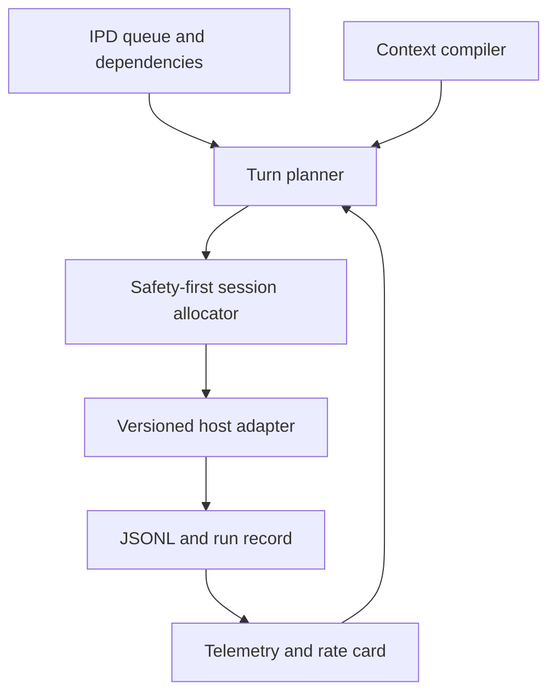

# Session Allocation for Autonomous Agent Runners

*Decision-ready design study for `agent-workflows`*

**Status:** Recommended architecture and implementation plan
**Primary target:** `aw oc run` with OpenCode
**Repository snapshot inspected:** `fariello/agent-workflows` at commit `8d1bcd5160f39b2b60e953902d764f401591039d`
**Research and pricing checked:** 2026-08-29 UTC
**Terminology:** This document uses **runner** and **run** terminology throughout.

### Evidence labels

- **[MEASURED]** comes from the run data supplied with this task or direct inspection of the pinned repository snapshot.
- **[CITED]** comes from a linked primary source, checked on the date above.
- **[INFERRED]** is a calculation, design conclusion, or prediction derived from measured or cited facts.

Correctness is the first optimization objective. Cost is optimized only inside the set of allocations already proven safe. An absent, stale, contradictory, or unparseable signal always selects a fresh session.

## 1. Executive summary

Use **one fresh logical session per isolated `execute` turn** and bind that session immutably to one workspace identity. Do not reuse conversational sessions across worktrees or runs. Use fresh sessions for independent `review` turns too; share their deterministic provider-cached prefix, not their opinions. Allow same-session reuse only for an explicitly dependent, same-workspace turn after hard safety gates and a runtime cost test.

The nine-turn shared execution session read 269.8M cached tokens, worth **$148.38** at the live $0.55/Mtok rate. A clearly labeled reconstruction with the same per-turn work but a 30,790-token fresh base reads about 47.0M, or **$25.86**, before fresh cache-write overhead. For an 80-step turn and the live write/read ratio, continuation is cheaper only while inherited context `C` is below roughly **1.144 times** the fresh pack `K`. The measured session exceeds that by turn 2 or 3, depending on actual `K`; 10 and 25 turns are indefensible, and 25 cannot fit the observed 1M-token trajectory.

The main savings lever is a compiled per-turn context pack, structured dependency outcomes, retrieval, and a stable cacheable prefix. Session count is a safety boundary and a secondary economic control.

No recommended saving trades correctness for lower cost.

## 2. Cost model

### 2.1 Live price basis and the historical trap

**[MEASURED]** The authoritative `agent-workflows` gateway rate card after correction is:

| Component | Live price per 1M tokens |
|---|---:|
| Uncached input | $5.50 |
| Output | $27.50 |
| Cache read | $0.55 |
| 5-minute cache write | $6.875 |

The Aug 24 logs were calculated with input $5.00/Mtok, output $25.00/Mtok, and cache reads incorrectly priced at zero. Their token columns remain useful; their recorded dollar totals do not. No allocator, report, benchmark, or regression test may pool those dollar totals with the corrected regime.

**[CITED]** Anthropic's direct Claude Opus 5 and Opus 4.5 through 4.8 list prices on 2026-08-29 were $5/Mtok input, $6.25/Mtok for a 5-minute write, $0.50/Mtok for a cache hit, and $25/Mtok output. The live gateway rates are exactly 10% above those values. Anthropic defines a 5-minute write as 1.25 times base input, a one-hour write as 2 times base input, and a read as 0.1 times base input. The gateway rate, not Anthropic's list price, is authoritative for `aw` accounting.

**[CITED]** Minimum cacheable Claude prefixes are model-specific: 512 tokens for Opus 5, 1,024 for Opus 4.8, 2,048 for Opus 4.7, and 4,096 for Opus 4.5 and 4.6. The default TTL is five minutes, refreshed on a read. A one-hour TTL costs more. The TTL is measured from request start, so a four-minute response leaves about one minute for the next request to begin. The exact model ID behind the gateway must therefore be captured in every run record.

For comparison, **[CITED]** OpenAI GPT-5.6 uses a 1,024 visible-token minimum, a 0.1 times cache-read rate, a 1.25 times write rate, and a minimum 30-minute TTL after the last write or reuse. Its standard GPT-5.6 Sol short-context list prices were $2 input, $0.20 cached input, $2.50 cache writes, and $10 output per 1M tokens on the access date. **[CITED]** Gemini 3.7 Flash used a 4,096-token minimum; its promotional 2026 prices were $0.75 input, $0.075 cached input, $3.75 output, and $0.50 per 1M cached tokens per hour of storage. Gemini explicit caches default to a one-hour TTL, while implicit caching offers no hit guarantee.

These provider comparisons matter to adapter design, but they do not replace the live gateway rate card in the allocation decision.

### 2.2 Variables

For turn `t`:

| Symbol | Meaning | Observable source |
|---|---|---|
| `S_t` | Number of cache-bearing model requests or agent steps in the turn | JSONL events; use a calibrated mapping if not every event is a model request |
| `C_t,start` | Context tokens at the first request | Provider or host usage event |
| `C_t,end` | Context tokens at the last request | Provider or host usage event |
| `Q_t,j` | Cached prefix read by request `j` | Provider usage for that request |
| `R_t` | Total cache-read tokens in the turn, `sum_j Q_t,j` | Sum of JSONL usage fields |
| `I_t` | Uncached input tokens | JSONL usage fields |
| `W_t` | Cache-write tokens | JSONL usage fields |
| `O_t` | Output tokens | JSONL usage fields |
| `p_i`, `p_w`, `p_r`, `p_o` | Prices per token for input, write, read, and output | Versioned rate-card snapshot |
| `K_t` | Tokens in a fresh minimal context pack for the same turn | Token count of compiled pack plus host startup context |
| `C` | Inherited prefix that a continued session would reread | Last observed session context, adjusted for compaction |
| `G_t` | Context growth caused by the turn itself | End minus start, or a prediction before launch |
| `c_pack` | Dollar cost to construct or summarize a fresh pack | Measured compiler/retrieval/model cost |

The exact turn cost is:

```text
Cost_t = p_i * I_t + p_w * W_t + p_r * R_t + p_o * O_t + external_tool_cost_t
```

For a tool-heavy turn whose cached prefix grows approximately linearly within the turn:

```text
R_t = sum(j = 1..S_t, Q_t,j)
R_t approximately S_t * (C_t,start + C_t,end) / 2
```

**[MEASURED]** In the nine supplied turns, `R_t / S_t` tracks the average of start and end context closely. Examples are 49,238 versus 49,554 tokens for turn 1, 405,792 versus 406,137 for turn 4, and 733,411 versus 733,272 for turn 8. This validates `context x steps` as the right first-order model. It does not prove that every reported step is one provider request, so the implementation must calibrate event types against usage records.

### 2.3 Reproducing the measured $16.41 turn

**[MEASURED]** Applying the live rate card:

```text
cache read = 22,038,059 / 1,000,000 * $0.55  = $12.1209
input      =    225,435 / 1,000,000 * $5.50  =  $1.2399
output     =    110,792 / 1,000,000 * $27.50 =  $3.0468
total                                                    $16.4076
```

Rounded to cents, the result is **$16.41**, matching the recorded value. Cache reads are 73.9% of the total. The measured component table contains no cache-write tokens. That may mean there were no writes, the entry was already warm, the gateway did not expose them, or the supplied table omitted them. Until `W_t` is captured explicitly, fresh-versus-continued comparisons must show a range rather than claim an exact realized saving.

### 2.4 The continuation crossover

Consider only the prefix cost that differs between continuing and starting fresh. The turn's own new tool results, uncached input, and output are common to both choices unless an experiment shows the allocation changes agent behavior.

If a warm continued session rereads `C` tokens on each of `S` requests:

```text
PrefixCost_continue = p_r * S * C
```

If a fresh session starts from a minimal pack of `K` tokens, pays `p_seed` on the first request, then rereads that prefix on the remaining `S - 1` requests:

```text
PrefixCost_fresh = p_seed * K + p_r * (S - 1) * K + c_pack
```

`p_seed` is empirical. It may be `p_w` for a new 5-minute cache write, `p_i` if the prefix is uncached but not written, or near `p_r` if an identical prefix created by another fresh logical session is already warm at the provider.

Fresh is cheaper when:

```text
p_r * S * C > p_seed * K + p_r * (S - 1) * K + c_pack

C > C_star

C_star = K * [1 + (p_seed / p_r - 1) / S] + c_pack / (p_r * S)
```

With `p_seed = p_w = $6.875/Mtok`, `p_r = $0.55/Mtok`, and `c_pack = 0`:

```text
C_star / K = 1 + 11.5 / S
```

| Predicted requests or steps `S` | Continue only while `C / K` is below |
|---:|---:|
| 5 | 3.300 |
| 10 | 2.150 |
| 20 | 1.575 |
| 40 | 1.288 |
| 52 | 1.221 |
| 80 | 1.144 |
| 126 | 1.091 |
| 154 | 1.075 |

**[INFERRED]** Long agent turns make a cache write easy to amortize. At 80 requests, only 14.4% inherited bloat makes a fresh session cheaper. At 154 requests, the tolerance is 7.5%. If the fresh stable prefix is already cached across logical sessions, `p_seed` approaches `p_r` and the threshold approaches `C = K`: any irrelevant inherited history favors fresh.

If the continued session's provider cache expired, its first request can pay `p_i * C` or `p_w * C` rather than `p_r * C`. That makes continuation worse than the warm-cache formula and must never be silently treated as a hit.

### 2.5 Applying the model to the nine-turn sequence

**[MEASURED]** Across the nine shared-session turns:

```text
total cache-read tokens = 269,775,018
live cache-read cost    = 269,775,018 / 1M * $0.55 = $148.38
mean within-turn growth = 71,946 tokens
mean start-to-start rise = 94,045 tokens
mean gap between prior end and next start = 16,079 tokens
```

The gap likely contains inter-turn messages, summaries, injected instructions, or host bookkeeping. It is part of the economic burden of continuation even if it is not useful task context.

To get a bounded comparison from the supplied data, hold each turn's steps and within-turn growth fixed, but reset its starting pack to turn 1's 30,790 tokens:

```text
R_fresh,t approximately S_t * [30,790 + (C_t,end - C_t,start) / 2]
```

| Position | Observed shared cache-read cost | Reconstructed fresh-base cost |
|---:|---:|---:|
| 1 | $1.41 | $1.42 |
| 2 | $12.06 | $7.85 |
| 3 | $14.82 | $3.53 |
| 4 | $17.85 | $3.07 |
| 5 | $13.08 | $1.49 |
| 6 | $20.63 | $2.36 |
| 7 | $30.93 | $3.31 |
| 8 | $25.82 | $2.20 |
| 9 | $11.77 | $0.63 |
| **Total** | **$148.38** | **$25.86** |

**[INFERRED, NOT MEASURED]** The reconstructed total is 47,019,865 cache-read tokens, 82.6% below the shared-session total. The apparent $122.52 difference is not yet a realized saving because fresh cache writes, a possibly larger fresh pack, behavior changes, and cross-session cache hits are unknown. It is a strong prioritization signal and a testable prediction, not a final business-case number.

### 2.6 Why the answer is not 3, 10, or 25

Use the measured mean start-to-start increase `D = 94,044.875` tokens, rounded to 94,045 for presentation, hold `S = 80`, and compare a shared chain of `N` turns with singleton turns. Inherited-prefix cache-read cost above singleton grows approximately as:

```text
ExcessReadCost(N) = p_r * S * D * N * (N - 1) / 2
ContextAtStart(N) = 30,790 + (N - 1) * D
```

| Turns in one session | Predicted context at last turn start | Excess cache-read cost versus singleton |
|---:|---:|---:|
| 1 | 30,790 | $0.00 |
| 3 | 218,880 | $12.41 |
| 5 | 406,970 | $41.38 |
| 9 | 783,149 | $148.97 |
| 10 | 877,194 | $186.21 |
| 11 | 971,239 | $227.59 |
| 12 | 1,065,284 | $273.11 |
| 25 | 2,287,867 | $1,241.39 |

This constant-step approximation lands close to the observed ninth-turn start of 783,149 tokens. It also predicts the 1M limit crossing between turns 11 and 12.

**Answer:** There is no universal optimal count. For the current isolated execution architecture, the safe and economic default is **1 execute turn per session**. If future tooling proves same-workspace reuse safe, the measured curve and crossover allow at most about **2** of these long turns for plausible fresh packs up to roughly 100K tokens. **3 is already too many for the measured workload; 10 is grossly uneconomic and nearly at the context limit; 25 is impossible without compaction and remains economically unjustified.** Short same-workspace reviews may cross over later because `S` is smaller, but they still require an independence test.

### 2.7 Sensitivity and flip conditions

#### Steps per turn

The threshold depends on `1 / S`. A five-request turn can tolerate a continued prefix 3.3 times its fresh pack before a new write amortizes. An 80-request turn tolerates 1.144 times. This is why review and execute need different policies even at the same context size.

#### Cache-read price

Holding the live write price at $6.875/Mtok and `S = 80` only to expose the direction:

| Cache-read price per Mtok | `C_star / K` |
|---:|---:|
| $0.10 | 1.847 |
| $0.25 | 1.331 |
| $0.55 | 1.144 |
| $1.00 | 1.073 |
| $2.00 | 1.031 |

If write and read prices move proportionally, their ratio and the threshold stay stable. If reads become free, the economic reason to split disappears, but the workspace-safety and context-quality reasons remain. If writes become free or a fresh prefix is already warm, fresh becomes attractive earlier.

#### Quality and behavior

The formula assumes the same `S`, `I`, `O`, and success probability under each allocation. Continuation could be worth more if relevant history substantially reduces steps, output, retries, or defects. It could be worth less if stale history increases any of them. The allocator therefore needs an empirical quality term, but must implement it as a hard non-inferiority gate, not as a dollar price placed on correctness.

#### Context-pack size

A large `K` delays the crossover, which is precisely why the context compiler is important. If a fresh turn requires copying 250K tokens of repository history, two turns can sometimes be cheaper than two writes. If a compiled pack reduces `K` to 30K to 75K, the second or third long turn is already beyond the live threshold.

### 2.8 Measurements required for production allocation

The runner should capture, without trusting agent compliance:

1. Exact model ID, provider, gateway route, context limit, and host version.
2. Rate-card ID plus `p_i`, `p_w`, `p_r`, and `p_o` copied into the run record.
3. Per provider request: input, cache-read, cache-write, output, context total, latency, and event type.
4. Per turn: first and last context, request count, context growth, cache-hit ratio, total cost, retries, and result.
5. Context-pack token count and content digest, separated into stable and variable sections.
6. Cache TTL requested and, when exposed, whether the first request hit or wrote.
7. Quality outcomes: E/V completion, verifier result, tests, rollback, human correction, and time to accepted integration.

If the host exposes only turn totals, the runner can still decide at turn boundaries using prior-turn aggregates and conservative quantiles. If cache-read or context-size telemetry is absent, adaptive reuse is disabled and fresh is selected.

### 2.9 Runner-native live token telemetry

The runners can observe input, output, cache-read, and cache-write tokens directly, so these counters should be allocation inputs rather than post hoc report fields. They do not depend on an agent remembering to invoke a custom tool. The runner parses them from each child JSONL event, normalizes them through the host adapter, and maintains cumulative values:

```text
ActualCost_n = p_i * I_n + p_w * W_n + p_r * R_n + p_o * O_n
CacheReadBurn_n = p_r * (R_n - R_n-k) / k requests
```

Before a turn, the allocator uses the most recent actual context size for the candidate session, plus the 90th-percentile request count and 95th-percentile growth from comparable completed turns. During a turn, the runner updates the following after every model request when the host exposes them:

- Cumulative `I_live`, `W_live`, `R_live`, and `O_live`.
- Current and peak context tokens.
- Model-request count and context growth.
- Actual cost and cache-read burn rate.
- Cache hit, write, expiry, and compaction events.

The child cannot normally be moved between sessions in the middle of one model turn. Live data therefore has three uses. First, it controls the next turn's allocation using actual values, not Set count or a guessed transcript size. Second, it updates the estimator by action, host, model, and IPD-size bucket. Third, it enables runner-owned guardrails at recoverable boundaries. At 70% of the hard context limit, the session becomes ineligible for another turn. At 85%, or when the host reports imminent compaction or exhaustion, the runner should request a graceful checkpoint if the adapter supports one, preserve the workspace, and continue in a fresh recovery session with a bounded recovery pack. It must not terminate in the middle of an unrecoverable mutation merely to hit a dollar target.

Live cost abortion is disabled by default because an arbitrary spending cap must not corrupt work. An operator may configure a per-turn budget, but the runner acts only at an adapter-declared recoverable checkpoint. Otherwise it records the overrun, marks the session `do_not_reuse`, and completes or fails through the normal watchdog. If per-request telemetry is unavailable but turn totals exist, apply the same logic at the next boundary. If all relevant telemetry is unavailable, select fresh.

## 3. Findings per question

### Q1. Is there an optimal number of turns per session?

#### Recommendation

**[INFERRED]** Use a runtime crossover, not a fixed count. In the current architecture, every isolated execute turn has a different workspace, so the safety gate resolves the answer to one before the cost formula runs. For same-workspace candidates, reuse only when:

```text
C <= K * [1 + (p_seed / p_r - 1) / S_hat]
     + c_pack / (p_r * S_hat)
```

and all quality, context-window, lease, and workspace gates also pass.

#### Evidence and reasoning

- **[MEASURED]** Cache reads were 74% of one live-regime turn's cost.
- **[MEASURED]** Shared-session context rose by 94K start-to-start tokens per execute turn and reached 807K after nine.
- **[MEASURED]** The nine turns reread 269.8M cached tokens.
- **[INFERRED]** At 80 requests, the live rate ratio permits only 14.4% inherited bloat over a fresh pack.
- **[INFERRED]** The answer for observed executions is one, not 3, 10, or 25. A plausible same-workspace continuation might justify a second long turn, but the third measured start is already 263,633 tokens.

#### Conditions that flip the answer

Reuse becomes more attractive if all of the following are true: the workspace is identical, the history is demonstrably relevant, `K` is very large, `S` is small, cache writes are expensive relative to reads, and controlled trials show continuation reduces steps or errors. Fresh becomes more attractive when stable prefixes hit across logical sessions, retrieval shrinks `K`, steps are numerous, the cache expired, or inherited history is stale.

#### Falsifier

Run matched execute items with fresh sessions and a safely rebindable same-workspace continuation. Refute singleton economics if continuation lowers accepted cost per completed V item, including retries and verifier failures, by at least 5% with a one-sided 95% non-inferiority bound showing no quality loss. Record `K`, `C`, `S`, all token classes, and acceptance outcomes.

### Q2. Should Sets be the unit of session sharing?

#### Recommendation

**[INFERRED]** No. A Set remains a scheduling and presentation unit. Dependency edges determine what prior outcomes enter a new turn's context pack. Scope-Path overlap and retrieval determine which files or evidence are included. Neither should override workspace binding to force conversation reuse.

Use the signals in this order:

1. **Declared dependency edge:** controls ordering and imports a predecessor's structured outcome, commit IDs, decisions, and validation evidence.
2. **Workspace identity:** hard gate for conversational reuse.
3. **Scope-Path overlap:** selects source slices and warns about concurrent conflicts; it is not proof that old reasoning is helpful.
4. **Measured semantic similarity:** optional retrieval ranking after the first three, never a safety signal.
5. **Set membership:** fallback label for retrieval only when better metadata is missing.

#### Evidence and reasoning

- **[MEASURED]** Set-keyed sessions combined with item-keyed worktrees caused the wrong-tree incident.
- **[MEASURED]** Children may have real dependencies, but worktree state and committed outcomes are more authoritative than a model's recollection.
- **[CITED]** LangGraph separates thread-level short-term memory from application-level long-term storage and recommends trimming, summarizing, or retrieving state instead of allowing unbounded message growth.
- **[INFERRED]** Two unrelated plans can share a Set and pollute each other. Two dependent plans in different Sets can need the same outcome. Scope overlap can mean relevance, but it can also mean a conflict or stale file view.

#### Conditions that flip the answer

Set-based reuse would be justified only if empirical data showed Set membership predicts accepted-cost savings and quality better than dependency and scope signals, after controlling for workspace identity and turn length. It still could not cross an unsafe workspace boundary.

#### Falsifier

Compare three context strategies over at least 30 dependent and 30 independent item pairs: Set transcript, declared-dependency outcome pack, and scope/retrieval pack. Measure accepted cost, V-item pass rate, unnecessary file reads, stale-reference errors, and verifier findings. Refute dependency-first construction if the Set transcript wins on cost and quality without increasing context growth.

### Q3. Should `review` turns pool differently from `execute` turns?

#### Recommendation

**[INFERRED]** Yes, they need a different cost model, but the default should still be a fresh logical review session. Reuse the stable prompt prefix across fresh sessions at the provider layer. Do not reuse prior review opinions unless the task explicitly calls for a comparative or consistency review.

Offer an opt-in `comparative-review` cohort that may use one same-workspace session when all plans are intentionally evaluated against each other. It remains exclusive to one runner at a time, cost-gated, context-gated, and fully logged. It is not the default for independent reviews.

#### Evidence and reasoning

- **[MEASURED]** Reviews are shorter, read-mostly, and run in the main tree. A smaller `S` moves the cost crossover later: at 10 requests, `C_star` is 2.15 times `K` under the live rate ratio.
- **[CITED]** Exact provider prefix caching is independent of human-level conversation identity. Stable tools, system instructions, conventions, and reference documents can be cached while variable review content is appended.
- **[INFERRED]** A long review conversation creates anchoring, consistency pressure, and contamination from earlier conclusions. That can make separate plans look artificially similar and is a correctness defect.
- **[INFERRED]** A review can still rewrite a plan or spec in the main tree. Session safety does not replace the repository's main-tree mutation lock.

#### Conditions that flip the answer

Aggressive pooling becomes reasonable if reviews are explicitly comparative, blind evaluation shows no independence loss, the host does not permit cache-friendly fresh prefixes, and measured request counts make repeated seed writes material. Fresh remains mandatory when reviews need independent judgment, run concurrently, use different workspace snapshots, or lack telemetry.

#### Falsifier

Randomize the same review corpus to fresh, pooled, and fresh-with-stable-prefix conditions. Have an independent verifier score unique defects found, false positives, convergence of wording and conclusions, cost, and latency. Refute fresh-by-default if pooling saves at least 10% accepted cost while the lower 95% confidence bound for independent defect recall stays within 2 percentage points of fresh.

### Q4. What is the safe interaction between session reuse and worktree isolation?

#### Recommendation

Adopt this invariant:

> **A conversational session is immutably bound to exactly one canonical workspace identity for its lifetime, and may have at most one live runner lease.**

The workspace identity must include at least:

```text
repo_identity        = hash(realpath(git common dir))
worktree_identity    = hash(realpath(git absolute git dir), lease generation)
canonical_worktree   = realpath(target path)
branch_or_detached   = branch name or detached marker
base_commit          = verified starting commit
```

Do not equate worktrees merely because they share a common Git directory, branch name, or base commit. A linked worktree has a distinct absolute Git directory and filesystem path.

#### Evidence and reasoning

- **[MEASURED]** OpenCode's resumed session directory overrode the new `--dir`, redirected four turns into a previous worktree, triggered external-path permissions, and stalled.
- **[CITED]** OpenCode documents `--session`, `--fork`, and `--dir`, but its CLI reference does not promise that `--dir` rebinds an existing session.
- **[CITED]** Claude Code documents that its prompt prefix embeds the working directory by default and that worktrees therefore build different prefixes. This is further evidence that directory is semantic session state, not a cosmetic process option.
- **[INFERRED]** A process `cwd`, a CLI `--dir`, and a session's stored project directory are three different values. Checking only the first two cannot prove where host tools will operate.

#### Required enforcement

1. Store the immutable binding when the session is first observed.
2. Before reuse, compare the full identity and acquire a cross-process exclusive lease keyed by session ID.
3. Ask the host for machine-readable session metadata including its bound directory. If the host cannot provide it, do not reuse across turns whose safety depends on rebinding.
4. Launch with both process `cwd` and explicit directory set to the target.
5. Constrain filesystem tools to the target worktree at the OS or host policy layer. A stale binding must fail with a deterministic `workspace_binding_mismatch`, never open an interactive permission prompt.
6. Where the JSON stream reports project or directory metadata, verify it before accepting mutation events.
7. Treat any mismatch, missing field, symlink ambiguity, deleted worktree, or stolen lease as a hard failure and start a fresh session.

Cross-turn context reuse across different isolated worktrees is therefore **not** safe as conversation reuse with current OpenCode semantics. It remains achievable as a compiled dependency outcome, retrieval, explicit summary, or provider-cached stable prefix. A future host may permit a session fork into a new workspace, but `aw` must require a conformance test and a returned binding attestation before enabling it.

#### Conditions that flip the answer

Cross-worktree reuse becomes eligible only if the host provides an atomic operation that creates a new session identity from selected context, binds it to the target directory, returns that binding, and guarantees tools cannot retain the source directory. It should still pass the economic crossover.

#### Falsifier

Create two linked worktrees with canary files, resume or fork a source session into the second, and attempt reads, writes, shell commands, relative paths, absolute paths, symlinks, and permission prompts under parallel load. Refute the one-session-per-workspace restriction only if every operation lands in the target, no source path is reachable, the binding is machine-verifiable, and 10,000 repeated transitions produce zero mismatches or interactive stalls.

### Q5. Should sessions be shared across runs?

#### Recommendation

**[INFERRED]** Do not share conversational sessions across runs. Permit two different cross-run optimizations:

1. **Content-addressed context artifacts**, reused only after their inputs are revalidated.
2. **Opportunistic provider prefix-cache hits**, whose absence changes cost and latency but never correctness.

Separate the keys:

```text
context_validity_key = hash(
  prompt_schema_version,
  repository_base_commit,
  relevant_dirty_state_digest,
  dependency_outcome_digests,
  IPD_digest,
  conventions_digest,
  tool_schema_digest,
  host_and_policy_versions
)

allocation_economics_key = hash(
  context_validity_key,
  model_id,
  provider_route,
  rate_card_id,
  requested_cache_TTL,
  telemetry_estimator_version
)
```

The rate card affects the decision but not whether content is true. Keeping these keys separate avoids rebuilding valid packs solely because prices changed while preventing stale economic decisions.

#### Evidence and reasoning

- **[CITED]** Anthropic's default cache lasts five minutes and begins aging at request start. A six-hour run or gap between runs cannot assume a warm entry.
- **[CITED]** OpenAI cache routing keys influence placement but do not guarantee a hit. Google implicit caching likewise offers no savings guarantee.
- **[CITED]** Provider caches require exact prompt prefixes. A changed tool schema, model, effort, system prompt, or early dynamic field can invalidate the hit.
- **[INFERRED]** A cross-run conversation can describe a repository commit that no longer exists in the checkout, retain obsolete permissions, and create an unauditable dependency on another run's transcript.
- **[INFERRED]** Immutable content-addressed artifacts can be shared safely by concurrent runners because readers never mutate them and every consumer verifies the digest.

For reviews in a shared main tree, `relevant_dirty_state_digest` must cover the reviewed IPD/spec and selected Scope-Paths, including locally relevant untracked files when policy allows them. For isolated executions, the actual target worktree commit and dependency outcomes are authoritative.

#### Conditions that flip the answer

A conversational session might cross runs only in a frozen, read-only repository snapshot with identical model, tool, policy, and workspace identity; exclusive ownership; an explicit operator request; and an auditable transcript dependency. Even there, a content pack is simpler and less stale, so cross-run conversation reuse is not recommended.

#### Falsifier

Run a controlled frozen-snapshot benchmark across cache TTL boundaries. Refute the prohibition only if cross-run conversations produce a durable cost reduction after cold-cache restarts, do not increase stale-reference or quality failures, have complete lineage, and remain race-free under simultaneous runners. One wrong-workspace or stale-code event is sufficient to retain the prohibition.

### Q6. Is session allocation the right lever?

#### Recommendation

**[INFERRED]** Session allocation is necessary as a safety boundary, but context construction is the primary cost and quality lever. Implement a context compiler before an adaptive session-sharing optimizer.

#### Evidence and reasoning

Each fresh turn should receive a deterministic pack with this logical order:

1. Stable host tool definitions and non-negotiable safety instructions.
2. Stable repository conventions and workflow protocol, with a cache breakpoint after the last identical block where the host/provider supports it.
3. The current IPD and strict E/V checklist.
4. Structured outcomes only from declared dependencies.
5. Retrieved file slices and evidence, each with path, commit or content digest, and reason for inclusion.
6. Current worktree identity, base commit, dirty summary, attempt number, and recovery state.
7. The variable turn instruction.

Dynamic values such as timestamps, run IDs, absolute worktree paths, and attempt IDs must appear after the reusable prefix. If a host injects them before the stable material, it defeats cross-session prefix matching. Claude Code now exposes `--exclude-dynamic-system-prompt-sections` specifically to move working directory and machine details out of the system prefix for better cache reuse. OpenCode needs an equivalent or a lower-level provider adapter.

#### Structured dependency outcome

Do not summarize a predecessor as free prose alone. Produce a runner-owned object such as:

```json
{
  "schema": 1,
  "item_id": "phase-02",
  "base_commit": "...",
  "result_commits": ["..."],
  "touched_paths": ["..."],
  "decisions": [{"id": "D1", "statement": "...", "evidence": ["..."]}],
  "validation": [{"v_id": "V-01", "command": "...", "exit": 0, "log_digest": "..."}],
  "interfaces_changed": ["..."],
  "remaining_work": ["..."],
  "risks": ["..."],
  "artifact_digests": {"...": "..."}
}
```

The successor verifies commits and file digests against its worktree. The outcome is an index into durable state, not a substitute for that state.

#### Comparison of levers

| Lever | Cost effect | Correctness profile | Main failure mode | Recommendation |
|---|---|---|---|---|
| Growing conversation reuse | Avoids some writes but rereads all inherited history on every request | Can retain useful reasoning, but also stale state and bias | Wrong workspace, context rot, quadratic read bill | Do not cross workspaces; rare same-workspace use only |
| Compaction/summarization | Shrinks future context after paying summary cost | Can preserve decisions if structured and verified | Omission or hallucinated summary | Use at natural boundaries inside an unusually long same-workspace turn/session |
| Compiled context pack | Minimizes `K` and makes lineage explicit | High if inputs are content-addressed and verified | Compiler misses a required dependency | Primary mechanism; test recall and recovery |
| Stable provider prefix | Reuses expensive invariant instructions across fresh sessions | No semantic coupling between tasks | Exact-prefix miss, TTL expiry, dynamic data placed early | Primary economic mechanism, but hits are opportunistic |
| Retrieval | Loads only relevant files/outcomes | Fresh evidence can beat old memory | Retrieval miss or wrong ranking | Use with declared dependencies and Scope-Paths, never alone for mandatory context |
| Subagent or helper context | Keeps large exploration out of the main context | Returns a bounded result | Lossy handoff | Useful for large reads; require cited paths/digests |

#### Prior art

- **[CITED]** LangGraph explicitly separates short-term thread memory from long-term application storage and documents token-based trimming, deletion, and summarization.
- **[CITED]** Microsoft AutoGen provides an experimental `TokenLimitedChatCompletionContext` that counts tokens and removes messages until a configured limit is met.
- **[CITED]** Semantic Kernel exposes an experimental chat-history reducer with threshold and target counts for truncation or summarization.
- **[CITED]** OpenAI Agents SDK separates session storage backends from an `OpenAIResponsesCompactionSession` wrapper and treats clear-and-rewrite compaction as a recoverable operation.
- **[CITED]** Google's managed Antigravity API explicitly models conversation context and environment state as independent IDs. It allows clearing conversation while keeping files, or keeping conversation while creating a new environment, and compacts around 135K tokens.

The prior art largely manages context size and persistence. It rarely makes an economic session-allocation decision from cache-read spend, and none of the reviewed frameworks makes Set membership a privileged lifetime boundary. That gap supports an `aw`-specific allocator, but the mature pattern is clear: durable state, workspace, conversation, and bounded model context are separate objects.

#### Conditions that flip the answer

Conversation allocation would become the primary lever if fresh packs could not be made small, the host prevented exact stable prefixes across sessions, continuation reliably reduced steps or failures, and safe workspace rebinding existed. The supplied measurements point in the opposite direction.

#### Falsifier

Ablate four modes on matched items: current full context, fresh plus full pack, fresh plus compiled pack, and safe continued session. Refute context construction as the primary lever if continued sessions win accepted cost and quality after cache writes, retrieval failures, retries, and verifier results are included.

### Q7. What mechanism should decide allocation?

#### Recommendation

Use a lexicographic two-stage allocator at every turn boundary:

1. **Safety and quality gates.** If any gate fails or is unknown, create a fresh session.
2. **Economic crossover.** Among safe candidates only, reuse the session if predicted savings clear a stability margin.

#### Evidence and reasoning

Queue planning computes workspace identities, dependencies, context-pack plans, and initial estimates. The final decision is adaptive at the turn boundary because actual prior context, cache TTL, rate card, worktree state, and failures can change during a run. A running child is never moved to a different session mid-turn.

#### Hard gates

A candidate session is reusable only if all are true:

- Same canonical workspace identity and lease generation.
- Same run. Cross-run conversation reuse is disabled.
- Host capability registry says explicit resume is supported and tested for this version.
- Session metadata attests to the same bound directory.
- No concurrent or stale lease exists.
- Model, provider route, tool schema, permissions, policy, and prompt schema are compatible.
- The task semantics permit history, such as an explicit dependent follow-up or comparative review.
- The inherited history is based on the current repository and dependency digests.
- Predicted final context is below the soft limit.
- Required token and price signals are present and fresh.

#### Economic gate

```text
continue_prefix_cost = p_r * S_hat * C
fresh_prefix_cost = p_seed * K + p_r * (S_hat - 1) * K + c_pack
saving_from_reuse = fresh_prefix_cost - continue_prefix_cost

reuse only if saving_from_reuse >= max($0.25, 0.05 * predicted_total_turn_cost)
```

Positive `saving_from_reuse` means continuation is cheaper. Zero or a negative value selects fresh. This sign convention and the explicit margin prevent the implementation from reusing when the estimated saving is negligible or reversed.

#### Conservative production defaults

```toml
[runner.session_policy]
mode = "safe-adaptive"
isolated_execute = "fresh"
independent_review = "fresh"
comparative_review = "adaptive-same-workspace"
cross_run_conversation_reuse = false
unknown_signal = "fresh"
require_session_directory_attestation = true
require_exclusive_session_lease = true
prediction_min_samples = 5
step_prediction_quantile = 0.90
growth_prediction_quantile = 0.95
context_soft_limit_fraction = 0.70
context_recovery_fraction = 0.85
minimum_saving_usd = 0.25
minimum_saving_fraction = 0.05
live_token_tracking = true
live_cost_abort = false
```

Use the 90th percentile of steps for the same action, host, model, and approximate IPD size bucket. Use the 95th percentile of context growth. Fewer than five comparable observations means no adaptive reuse. The 70% context soft limit leaves room for a high-growth turn and host-injected content; it is a conservative initial default to recalibrate from observed prediction error. Provider or host hard limits remain absolute.

There is deliberately no default `max_turns_per_session` magic number. Isolated execute resolves to one through the workspace gate. Same-workspace reuse ends through cost, context, semantics, or lease gates. An optional operator cap can provide defense in depth without pretending to be the optimization rule.

#### Operator controls

- `--session-policy fresh`: create a new session for every turn.
- `--session-policy safe-adaptive`: recommended default.
- `--force-new-session`: override any reuse decision.
- `--reuse-session <id>`: request reuse, but only if every hard gate passes; it may bypass the economic gate, never workspace, lease, staleness, or context safety.
- `--comparative-review`: declare that cross-review opinions are intentional.
- `--explain-session-allocation`: print the inputs, formula, and selected outcome without exposing secrets.

For Agy, `fresh` must mean omitting both `--conversation` and `--continue`. Clearing only the explicit ID is insufficient. For every host, use an explicit fresh-session capability when available rather than relying on whatever "last conversation" behavior the CLI chooses.

#### Fallback when a session is abandoned

Session loss must not lose work:

1. Keep the item's worktree and branch lease alive.
2. Flush JSONL, process exit, token totals, and failure reason to the run record.
3. Inspect runner-observable Git status, HEAD, diff summary, and existing commits. Do not depend on the failed agent to report them.
4. Build a recovery pack from the IPD, completed E/V evidence, verified commits, current worktree diff, structured dependency outcomes, and a bounded tail of the failed attempt.
5. Start a fresh session bound to the same workspace identity.
6. Require the new agent to verify current state before continuing, but enforce the binding independently of that instruction.
7. If workspace integrity cannot be established, stop for operator recovery rather than create a new worktree and silently discard local changes.

A stall watchdog should kill the child, not delete the worktree. An interactive permission event in autonomous mode should be classified immediately. If it concerns a path outside the bound workspace, abort as `workspace_binding_mismatch` rather than waiting 600 seconds.

#### Conditions that flip the answer

A fresh-only policy can flip to adaptive same-workspace reuse after the host provides a tested explicit-resume contract, immutable directory attestation, exclusive leases, complete current telemetry, and enough observations to estimate cost with the required margin. Cross-worktree conversational reuse remains forbidden unless an atomic host operation creates a new session identity, binds it to the destination, proves the binding before tools run, and passes the wrong-tree stress suite. A price change can flip the economic result but cannot override a safety, independence, or quality gate.

#### Falsifier

Shadow-run the allocator without changing allocation, then compare predictions with realized costs. Refute the formula or defaults if median absolute cost error exceeds 15%, more than 5% of choices have the wrong sign, or the 70% context gate fails to prevent context-limit compaction or termination. Any unsafe reuse refutes the implementation regardless of economic accuracy.

## 4. Recommended design

### 4.1 Architecture



The allocator should be a pure function over a versioned input record. Workspace binding, locking, context compilation, child launch, and telemetry parsing remain separate enforcement components. This makes allocation decisions replayable in tests and reports.

### 4.2 Core records

#### Session binding

```json
{
  "schema": 1,
  "session_id": "ses_...",
  "host": "opencode",
  "host_version": "...",
  "created_by_run": "run_...",
  "workspace": {
    "repo_identity": "sha256:...",
    "worktree_identity": "sha256:...",
    "canonical_path_digest": "sha256:...",
    "base_commit": "...",
    "lease_generation": 4
  },
  "model_id": "...",
  "provider_route": "...",
  "prompt_schema": 3,
  "created_at": "...",
  "last_used_at": "..."
}
```

Keep sensitive absolute paths in protected local state. Reports can use digests plus a redacted display path.

#### Allocation decision

```json
{
  "decision_id": "alloc_...",
  "policy_version": "1",
  "item_id": "...",
  "action": "execute",
  "choice": "fresh",
  "reason_codes": ["ISOLATED_WORKSPACE", "CONVERSATION_REUSE_FORBIDDEN"],
  "candidate_session": null,
  "signals": {
    "predicted_steps_p90": 80,
    "predicted_growth_p95": 110000,
    "continued_context_tokens": null,
    "fresh_pack_tokens": 42000,
    "context_limit_tokens": 1000000,
    "cache_ttl_remaining_seconds": null,
    "prior_actual_input_tokens": null,
    "prior_actual_cache_read_tokens": null,
    "prior_actual_cache_write_tokens": null,
    "prior_actual_output_tokens": null
  },
  "prices_per_mtok": {
    "input": 5.5,
    "cache_write": 6.875,
    "cache_read": 0.55,
    "output": 27.5
  },
  "predicted_costs": {
    "continue_prefix": null,
    "fresh_prefix": 2.1,
    "saving_from_reuse": null
  }
}
```

After the turn, append actuals rather than rewriting the decision. This preserves what the allocator knew at the time.

### 4.3 Workspace and session leases

Session IDs must be run-scoped, collision-resistant, and never discoverable through an implicit "last" lookup in autonomous mode. Use a cross-process lock keyed by `(host, session_id)`, stored in runner-controlled local state rather than the repository. The lock record should include owner run, PID, process start identity, boot ID where available, acquisition time, child timeout, and heartbeat. Stale recovery must verify the process is gone before taking ownership.

Worktree locks and session locks solve different races. Acquire in a fixed order to avoid deadlock:

```text
run state lock -> worktree lease -> session lease -> main-tree mutation lock, if needed
```

Release in reverse order. Never hold a global queue lock while waiting for a long child turn.

### 4.4 Host capability registry

Do not infer capabilities from a CLI name. Key a registry by host and tested version range:

```text
explicit_new_session
explicit_resume_by_id
implicit_resume_can_be_disabled
machine_readable_session_id
machine_readable_bound_directory
directory_rebind_semantics
fork_to_new_directory_semantics
per_request_usage
turn_usage
cache_read_tokens
cache_write_tokens
context_tokens
context_limit
manual_compaction
automatic_compaction
noninteractive_permission_failure
```

Unknown capability values are `unsupported`, not optimistic. Conformance probes run during installation or CI and store the tested host version. An upgrade invalidates the probe until it is rerun.

### 4.5 Cache-friendly context compiler

The compiler should emit both content and a manifest:

- Stable blocks sorted deterministically.
- Variable blocks placed after stable cache breakpoints.
- No timestamps, random IDs, absolute paths, or dirty summaries in the stable prefix.
- Tool definitions and their order pinned for a run.
- Repository conventions keyed by content digest.
- IPD parser enforces E/V bijection before launch.
- Dependency outcomes included only for declared ancestors.
- Scope-Path retrieval reports why each slice was selected.
- Every file slice carries commit or content digest and line/path identity.
- A strict token budget reserves room for predicted tool output and final validation.
- Optional untracked local inputs are inventoried and digested explicitly; they are never assumed to exist in another worktree.

The manifest lets a maintainer answer why the model saw a fact without replaying another session.

### 4.6 Decision procedure pseudocode

```python
def allocate(turn, state, policy, capabilities, estimates, prices):
    # Quality and safety are lexicographic hard gates.
    if turn.action == "execute" and turn.workspace.is_isolated:
        return Fresh("ISOLATED_WORKSPACE")

    candidate = state.explicit_candidate_for(turn)
    if candidate is None:
        return Fresh("NO_EXPLICIT_CANDIDATE")

    checks = [
        candidate.run_id == turn.run_id,
        candidate.workspace_identity == turn.workspace.identity,
        capabilities.explicit_resume_by_id,
        capabilities.machine_readable_bound_directory,
        candidate.bound_directory == turn.workspace.canonical_path,
        state.can_acquire_exclusive_lease(candidate.session_id),
        candidate.prompt_and_tool_compatibility(turn),
        turn.semantics.allow_prior_opinions,
        estimates.complete_and_fresh(min_samples=policy.min_samples),
    ]
    if not all(checks):
        return Fresh("HARD_GATE_FAILED_OR_UNKNOWN")

    S = estimates.steps_p90
    C = candidate.last_context_tokens
    K = turn.context_pack_tokens
    G = estimates.growth_p95

    if C + G > policy.context_soft_fraction * turn.context_limit:
        return Fresh("CONTEXT_HEADROOM")

    continue_cost = prices.cache_read * S * C
    fresh_cost = (
        estimates.seed_price * K
        + prices.cache_read * (S - 1) * K
        + turn.context_pack_construction_cost
    )
    saving_from_reuse = fresh_cost - continue_cost
    margin = max(policy.minimum_saving_usd,
                 policy.minimum_saving_fraction * estimates.total_turn_cost)

    if saving_from_reuse >= margin:
        return Reuse(candidate.session_id,
                     "REUSE_IS_CHEAPER_WITH_MARGIN",
                     saving_from_reuse)
    return Fresh("REUSE_SAVING_BELOW_MARGIN", saving_from_reuse)
```

Table-driven unit tests must cover positive, zero, negative, and exactly-at-margin values so a future refactor cannot invert this comparison.

### 4.7 Observability and audit report

Every run report must stand alone. It should contain:

- Queue, Set labels, dependency graph, actions, workspace identities, and starting commits.
- Policy and estimator versions, all knobs, host capabilities, and operator overrides.
- One allocation decision record per turn with reason codes.
- Context-pack manifest and digest.
- Predicted versus actual steps, context growth, token classes, cost, and latency.
- Per-request live token snapshots, peak context, cache-read burn rate, and any guardrail transition.
- Cache TTL, cache hit/write evidence, and rate-card snapshot.
- Session creation/resume/fork events and immutable bindings.
- Lease acquire/release/stale-recovery events.
- Watchdog, permission, crash, compaction, and retry events.
- E/V evidence, verifier results, integration outcome, and human corrections.
- Counterfactual shadow decision when shadow mode is enabled.

The report must never recompute old cost with an unrecorded current rate and present it as the original charge. It may show both "recorded at the time" and "normalized to rate card X" as separately labeled values.

### 4.8 Failure behavior

| Failure | Required action | Forbidden action |
|---|---|---|
| Missing context/cache telemetry | Fresh session; record `TELEMETRY_MISSING` | Guess reuse from Set membership |
| Session directory mismatch | Kill child, retain worktree, classify binding failure | Wait for permission prompt or retry same session |
| Implicit-resume flag detected in fresh mode | Refuse launch | Hope the host starts new |
| Session lease already held | Fresh session or wait outside global locks | Share session concurrently |
| Provider cache miss | Continue correctly and record actual cost | Treat cache hit as correctness dependency |
| Context soft limit exceeded | Fresh or compact only within same workspace | Start a likely-overflow continuation |
| Live context reaches recovery threshold | Checkpoint at a recoverable boundary, retain the worktree, and start a fresh recovery session | Kill during an unrecoverable mutation or silently compact away evidence |
| Live cost budget exceeded | Stop only at a configured recoverable checkpoint; otherwise mark `do_not_reuse` and record overrun | Sacrifice correctness or lose work to meet a budget |
| Host upgrade without conformance result | Disable reuse | Carry old capability claims forward |
| Crash or stall | Preserve worktree; fresh recovery session | Delete worktree or lose uncommitted state |
| Context-pack digest mismatch | Rebuild from authoritative inputs | Use stale cached pack |
| Review main tree changed since planning | Recompute digest and pack; reacquire mutation lock | Review or rewrite stale content |

## 5. Cross-tool matrix

| Tool | Fresh and resume controls | Directory/workspace semantics | Usage and context telemetry | Compaction and provider-cache support | Recommended policy expressible? | Minimum gap to close |
|---|---|---|---|---|---|---|
| **OpenCode** | `run` creates a session when no continuation is requested; `--session` continues; `--fork` exists; `--continue` is implicit-last behavior | `--dir` exists, but public CLI docs do not promise rebinding. The measured incident shows a resumed session can retain the old project directory | `--format json` emits raw events; measured logs contain per-step token/cost data. The public CLI page documents JSON and `stats`, but not a stable per-request schema | Provider dependent. No documented allocator-facing cache breakpoint, TTL, or directory-neutral prefix control was found | **Yes for safe fresh-per-worktree. No for cross-worktree conversation reuse** | Machine-readable session metadata and bound directory; atomic new/fork-and-bind; versioned usage schema; noninteractive path-mismatch error |
| **Agy / Antigravity CLI** | Repository adapter supports `--conversation <id>` and `--continue`. Fresh must omit both. Current public codelab says `-p` cannot continue, which conflicts with the repository wrapper's current assumptions | Repository adapter passes `--dir`, but public CLI material reviewed does not establish safe rebinding. Google's managed-agent API separately models conversation and environment, showing the separation is feasible upstream | Public CLI evidence reviewed does not confirm per-step context, cache-read, and cache-write fields. Managed API streams accumulated usage at step stop | Managed agent API compacts around 135K. Local CLI behavior and cache controls need a conformance probe | **Yes for fail-closed fresh mode after implicit resume is disabled. Adaptive reuse not yet justified** | Explicit `--new-conversation`; bound-directory attestation; documented JSONL usage schema; no implicit continuation in autonomous mode |
| **Claude Code** | `--continue`, `--resume`, `--session-id`, `--fork-session`, and `--worktree` are documented | `--continue` selects by current directory; resume searches project worktrees and beyond. Treat sessions as workspace-bound. Do not assume `--resume` plus a new cwd is a safe rebind | `-p --output-format json` reports cache creation usage; stream JSON is available. `/context` is interactive. Per-request allocator telemetry may require Agent SDK integration | Automatic prompt caching, 5m/1h TTL controls, `/compact`, auto-compaction, and `--autocompact`. `--exclude-dynamic-system-prompt-sections` improves cache reuse across directories | **Yes. Use fresh/worktree sessions plus stable-prefix caching. Same-workspace adaptive reuse is possible with sufficient JSON usage** | Noninteractive bound-directory attestation and per-request context/cache fields for the full adaptive rule |
| **Codex CLI** | `codex exec` starts a session; `codex exec resume [SESSION_ID]` or `--last` resumes; `--ephemeral` avoids persistence | `--cd` sets workspace root. Interactive resume explicitly handles saved/current directory mismatch and allows a configured choice; explicit `--cd` wins. Noninteractive resume still needs a conformance test before cross-directory use | `--json` emits `turn.completed` with input, cached input, output, and reasoning output tokens. It is turn aggregate, not necessarily every provider request | OpenAI provider caching is automatic; GPT-5.6 exposes 30m TTL controls at API level. CLI compaction details were not established in the reviewed CLI source | **Yes for fresh-per-worktree and turn-boundary economics. Treat resumed sessions as workspace-bound until probed** | Machine-readable saved/current directory in `exec resume`; cache-write and context-limit fields; documented noninteractive rebind guarantee |

### Tool-agnostic fallback contract

If an adapter cannot express all of the following, it supports only fresh allocation:

1. Start a logically fresh conversation without implicit resume.
2. Return the new session ID machine-readably.
3. Bind and attest one workspace before tools run.
4. Fail noninteractively on permission or path mismatch.
5. Emit at least turn-level token classes and model identity.

Per-request telemetry is required for fine-grained estimation, but turn-level telemetry can support conservative turn-boundary decisions. No telemetry means no adaptive reuse.

## 6. Phased adoption plan

### Phase 0: Make the safe behavior true and testable

**Work**

- Keep the production incident fix: every isolated execute turn starts fresh.
- Remove Set-scoped execution session selection and implicit "last session" behavior.
- In Agy fresh mode, omit both `--conversation` and `--continue`.
- Add immutable session-to-workspace binding and exclusive session leases.
- Classify external-path permission events immediately rather than waiting for the stall watchdog.
- Add two-worktree, symlink, concurrent-runner, and stale-session regression tests.

**Acceptance criteria**

- Zero writes, reads, or shell commands land in the prior worktree across 10,000 automated session-transition probes.
- A mismatch terminates in under 5 seconds with `workspace_binding_mismatch`, retains the worktree, and never presents an interactive permission request.
- Static and dynamic tests show no isolated execute allocation reads from `set_sessions` or an implicit continuation selector.

### Phase 1: Make cost and decisions auditable

**Work**

- Version the rate card and token schema.
- Capture input, output, cache read, cache write, context, model, TTL, and latency where available.
- Update runner-owned token totals and actual cost from every JSONL usage event; record 70% soft-limit and 85% recovery-threshold transitions.
- Store allocation decisions and actuals as append-only run records.
- Add a shadow allocator that predicts fresh versus reuse without changing behavior.
- Reject mixed-regime cost aggregation unless explicitly normalized and labeled.

**Acceptance criteria**

- At least 99% of successful OpenCode turns have all token classes or an explicit `unsupported/missing` reason.
- A replay fixture with mixed input, output, cache-read, and cache-write events reconciles every running total and final cost exactly, and the next allocation consumes the recorded last context rather than a Set-derived estimate.
- Recomputed post-correction costs match gateway records within $0.01 per turn.
- The supplied 154-step example reproduces $16.41, and Aug 24 totals are never presented as live-rate charges.

### Phase 2: Compile minimal, recoverable turn context

**Work**

- Implement structured dependency outcomes and content-addressed context manifests.
- Build packs from the IPD, dependencies, conventions, Scope-Paths, retrieval, and current workspace state.
- Preserve local worktree state through crash/stall recovery.
- Add missing-context tests that deliberately omit a required dependency and verify detection.

**Acceptance criteria**

- Every dependency fact in a pack maps to a verified commit, path/content digest, or validation log.
- A fresh recovery session resumes an interrupted dirty worktree without losing changes in 100 injected-crash tests.
- In a matched pilot of at least 30 execute turns, median cache-read tokens fall at least 40% from the Set-session baseline, with no reduction in E/V completion or independent verifier pass rate. If quality is inconclusive, do not claim the saving as accepted.

### Phase 3: Recover prefix savings across fresh sessions

**Work**

- Make stable prompt/tool blocks deterministic and place dynamic workspace fields afterward.
- Add explicit provider cache breakpoints and TTL selection where the host permits.
- For Claude Code, test `--exclude-dynamic-system-prompt-sections`.
- Warm once, then launch fresh sessions in different worktrees and measure actual cache reads/writes.

**Acceptance criteria**

- The second fresh session reports a cache read for the intended stable prefix, or the adapter reports that cross-directory hits are unsupported.
- A changed base commit or conventions digest invalidates only the appropriate context layer.
- Correctness and output are identical on a forced cache miss; cache availability is never a functional dependency.

### Phase 4: Enable adaptive reuse only for safe same-workspace cohorts

**Work**

- Run the allocator in shadow mode until cost-sign accuracy is established.
- First enable it for explicitly comparative reviews, not isolated execution.
- Calibrate step and growth quantiles by host/model/action/size bucket.
- Run blinded review-independence experiments.

**Acceptance criteria**

- Shadow prediction has the correct fresh-versus-reuse cost sign for at least 95% of eligible turns and median absolute cost error below 15%.
- Enabled cohorts reduce accepted cost by at least 10% while independent defect recall is no more than 2 percentage points worse at the lower 95% confidence bound.
- No allocation crosses a workspace, run, or live session lease.

### Phase 5: Generalize through adapter conformance, not assumptions

**Work**

- Add tested capability profiles for Agy, Claude Code, and Codex.
- Run the same workspace-binding, implicit-resume, telemetry, compaction, and failure probes for each version.
- Automatically disable a capability after an untested host upgrade.

**Acceptance criteria**

- Every enabled adapter passes the common contract and wrong-directory suite.
- Missing or changed capability data selects fresh and emits a reason code.
- Cross-tool reports use the same token and decision schema while preserving provider-specific fields.

No phase enables cross-run conversational reuse. Revisit that only after the lower-risk mechanisms have measured results.

## 7. Open questions and conflicts

| Question or conflict | Why it matters | Resolution |
|---|---|---|
| **Pinned code versus incident-fix description** | The task states the fix is fresh per isolated turn, but commit `8d1bcd5` still contains Set/global session selection in `oc_runipd.py` and `agy_runipd.py` | Identify the deployed/fixed commit and diff. Treat the incident account as operational ground truth and Phase 0 as incomplete until the inspected production branch proves it |
| **Missing cache-write row in the $16.41 example** | Fresh-session cost depends on whether and where writes are charged | Capture `cache_write` per request from the gateway. Run a cold first turn followed by a warm repeat and reconcile the bill |
| **Exact Claude model behind the gateway is unspecified** | Cache minimum, context limit, compaction, and price can be model-specific | Persist full provider model ID and resolved context limit in every turn record; reject generic aliases for economic calibration |
| **Gateway rates differ from Anthropic list price** | The 10% uplift is real for `aw`, while public examples use direct rates | Keep gateway rate card authoritative and snapshot it in the run. Show public list prices only as external context |
| **OpenCode rebinding is undocumented** | `--dir` and `--session` coexist in docs, but the incident shows stored directory can win | Add a versioned conformance probe and request upstream session metadata plus atomic fork-and-bind. Until then, no cross-worktree reuse |
| **What exactly is a measured "step"?** | The approximation assumes steps correspond closely to cache-bearing requests | Correlate JSON event IDs with provider usage records. Estimate on provider requests, not UI events, once mapped |
| **Fresh-pack size `K` is not measured** | The $25.86 reconstruction assumes a 30,790-token base | Build the context compiler, token-count actual rendered prompts, and run cold/warm singleton trials. Report a range until then |
| **Fresh sessions may change behavior** | Steps, output, file reads, and quality may not stay constant | Use matched A/B trials and accepted cost per V item, not token-only counterfactuals |
| **Provider cache may be directory-scoped by host prefix** | Fresh sessions in different worktrees may miss even identical conventions if cwd appears early | Hash the rendered prefix, move dynamic fields after the stable block, and verify cache-read tokens. Claude Code provides a relevant exclusion flag; OpenCode needs testing/upstream support |
| **Five-minute Claude TTL versus long turns** | A response can consume most of the TTL before the next request starts | Record request start times and TTL. Consider one-hour writes only when the predicted idle/response gap and reuse count beat their 2x write price |
| **Agy public documentation conflict** | Google's codelab says noninteractive `-p` has no continuation, while the repository wrapper uses `--conversation` and `--continue` | Probe the installed Agy version, save `agy --help`, and make adapter behavior version-specific. Never infer fresh from a missing explicit ID |
| **Review pooling may bias judgment** | Cost savings could hide a correctness regression | Run blinded fresh versus pooled review trials using independent defect recall and conclusion-correlation metrics |
| **Compaction can omit critical state** | A shorter session can be cheaper but wrong | Treat summaries as derived indexes, preserve source digests, and verify decisions/tests against repository state. Inject omissions in tests |
| **Scope-Path declarations can be incomplete** | Retrieval based only on them may miss transitive files | Combine declared paths with dependency outcomes, language-aware import/call graph retrieval, and post-turn missed-file telemetry |
| **Dirty and untracked local information** | Main-tree reviews may depend on locally relevant state that a clean worktree lacks | Inventory allowed untracked inputs, hash them, state whether each was copied or referenced, and include them only under explicit policy. Never imply they exist in another worktree |
| **Cross-run prefix hits are nondeterministic** | TTL, routing, concurrency, and provider load can change costs | Treat hits as an observed optimization only. Record hit/write tokens and do not include a guaranteed hit in correctness or budget admission |
| **Context-quality threshold is unknown** | Cost crossover can occur before or after context rot | Track stale references, unnecessary reads, verifier findings, and human corrections by context size. Keep cost and quality gates separate |

## 8. Sources

All web sources were accessed on **2026-08-29 UTC** unless a different date is stated.

### Repository and target tools

1. `fariello/agent-workflows`, pinned source inspected: [`agent_workflows/oc_runipd.py` at `8d1bcd5`](https://github.com/fariello/agent-workflows/blob/8d1bcd5160f39b2b60e953902d764f401591039d/agent_workflows/oc_runipd.py), especially the Set session selection and `--session` plus `--dir` launch around lines 1613-1640 and persistence around lines 1975-1983.
2. `fariello/agent-workflows`, pinned Agy adapter: [`agent_workflows/agy_runipd.py` at `8d1bcd5`](https://github.com/fariello/agent-workflows/blob/8d1bcd5160f39b2b60e953902d764f401591039d/agent_workflows/agy_runipd.py), especially `--conversation`/`--continue` around lines 1709-1744 and Set session selection around lines 1882-1888.
3. OpenCode, [CLI reference](https://opencode.ai/docs/cli/): `run`, `--session`, `--continue`, `--fork`, `--format json`, `--dir`, sessions, and stats.
4. Anthropic, [Claude Code CLI reference](https://code.claude.com/docs/en/cli-reference): `--continue`, `--resume`, `--session-id`, `--fork-session`, `--worktree`, `--autocompact`, and `--exclude-dynamic-system-prompt-sections`.
5. Anthropic, [How Claude Code uses prompt caching](https://code.claude.com/docs/en/prompt-caching): request layering, invalidation, compaction cost, cache TTL controls, cache usage reporting, and default directory-scoped prefixes.
6. Anthropic, [Explore the context window](https://code.claude.com/docs/en/context-window): automatic compaction, `/autocompact`, context contents, and 1M model variants.
7. OpenAI, [Codex non-interactive mode](https://learn.chatgpt.com/docs/non-interactive-mode): `codex exec`, `--ephemeral`, JSONL events and turn usage, and `exec resume`.
8. OpenAI, [Codex developer commands](https://learn.chatgpt.com/docs/developer-commands?surface=cli): `--cd`, session resume, saved/current directory behavior, and command reference.
9. Google Codelabs, [Hands-on with Antigravity CLI](https://codelabs.developers.google.com/antigravity-cli-hands-on): Agy installation, workspace trust, noninteractive `-p`, model selection, and the statement that `-p` has no follow-up conversation scope. The page was current on access, but this point conflicts with the repository adapter and must be version-probed.

### Provider caching and pricing

10. Anthropic, [Prompt caching](https://platform.claude.com/docs/en/build-with-claude/prompt-caching): prices, multipliers, cacheable blocks, minimum prefix sizes, 5-minute and 1-hour TTLs, exact-prefix rules, lookback, invalidation, and concurrency behavior.
11. OpenAI, [Prompt caching](https://developers.openai.com/api/docs/guides/prompt-caching): GPT-5.6 minimum prefix, read/write multipliers, 30-minute TTL, explicit breakpoints, routing behavior, and usage fields.
12. OpenAI, [API pricing](https://developers.openai.com/api/docs/pricing): GPT-5.6 input, cached-input, cache-write, output, and context-tier prices current on the access date.
13. Google, [Gemini context caching](https://ai.google.dev/gemini-api/docs/generate-content/caching): implicit versus explicit caching, model minimums, one-hour default explicit TTL, usage metadata, and storage-duration billing.
14. Google, [Gemini Developer API pricing](https://ai.google.dev/gemini-api/docs/pricing): Gemini 3.7 Flash 2026 input, output, cached-input, and cache-storage prices.

### State, memory, and orchestration prior art

15. Google, [Managed agents quickstart](https://ai.google.dev/gemini-api/docs/managed-agents-quickstart), last updated 2026-08-26: independent conversation and environment IDs, clearing one while retaining the other, streaming usage, and automatic compaction near 135K tokens.
16. LangChain, [LangGraph memory](https://docs.langchain.com/oss/python/langgraph/add-memory): thread versus long-term memory, checkpointers, retrieval, token trimming, deletion, and summarization.
17. Microsoft AutoGen, [`TokenLimitedChatCompletionContext`](https://microsoft.github.io/autogen/stable/_modules/autogen_core/model_context/_token_limited_chat_completion_context.html): token-counted context limits and removal of messages to fit.
18. Microsoft Learn, [Semantic Kernel `ChatHistoryReducer`](https://learn.microsoft.com/en-us/python/api/semantic-kernel/semantic_kernel.contents.chathistoryreducer?view=semantic-kernel-python): threshold/target reduction and truncation or summarization contract.
19. OpenAI Agents SDK, [Sessions](https://openai.github.io/openai-agents-python/sessions/): durable session backends, Responses compaction wrapper, usage accounting, and recoverable history replacement.

### Source-quality note

Provider and CLI behavior changes quickly. The design intentionally records exact model, host, rate-card, prompt-schema, and capability versions so a future price or semantic change invalidates an economic assumption without weakening the workspace-safety invariant. The measured incident and token data supplied with the research task are local primary evidence but have no public URL; they are reproduced and labeled separately from cited documentation above.
