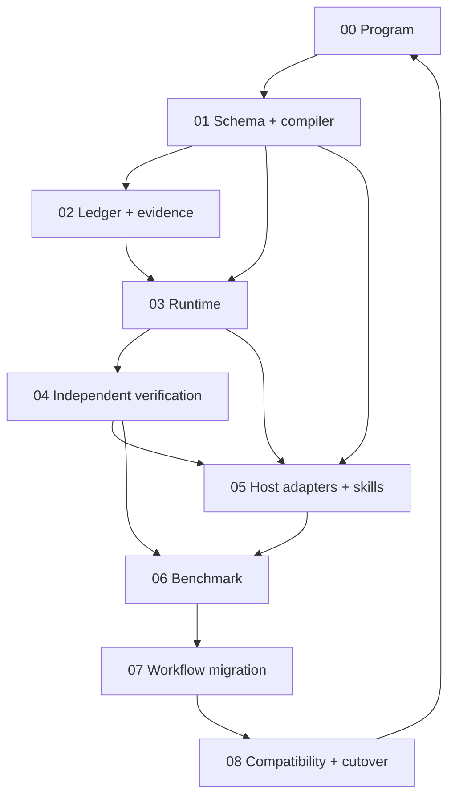

# Agent Workflows Optimal Architecture: IPD Index and Traceability Map

- Set: `awoptimize`
- Plans: one orchestrator plus eight children
- Authoring state: all nine are `Status: draft` in the pending-plan lane; none is approved, executed, transitioned, committed, or pushed
- Reviewed repository commit: `a2110e96b980fbf778027f1676a73774cb819292`
- Lint checkpoint: author; all nine `DISPOSITION conforming`

The IPDs are deliberately more detailed than an ordinary plan, but the detail is split by authority boundary. Order 00 coordinates without copying child checklists. Orders 01-08 each have atomic execution items, a strict one-to-one E/V map, falsifiable required evidence, pending observed evidence, explicit failure/rollback behavior, tests, security coverage, and deferred work.

## 1. Dependency graph

The return edge from Order 08 to Order 00 is a closure gate, not an implementation dependency: the orchestrator performs final whole-Set validation only after every child is terminal and independently verified.

## 2. Plans in dependency order

### Order 00 - Program orchestrator

- File: `20260821-awoptimize-00-p070c8-agent-workflows-optimal-architecture-program.ipd.md`
- Stable ID: `p070c8`; Set `awoptimize`; Order `0`; Kind `orchestrator`; Status `draft`
- Objective: freeze the baseline, sequence Orders 01-08, enforce integration/rollback gates, reconcile every report recommendation and workflow, and own the final terminal decision.
- Dependencies: none to author; each E-gate depends on the preceding accepted child. The final gate depends on all children.
- Primary areas: orchestration metadata and cross-plan validation only; no child implementation duplicated.
- Risks / rollback: false program closure, child semantic drift, unsupported host claim, or cross-order regression. Stop at the last validated child; do not transition the Set; retain existing workflows/adapters.
- Key acceptance tests: all child lifecycle gates; compiler drift; complete workflow disposition; no executor terminal authority; evidence-integrity fixtures; full suite, leak, Markdown, compatibility, and live-capability evidence gates.
- Research findings: linter boundary, same-session audit weakness, instruction density, host-evidence gap, mutable parity, and repository false-completion incident.
- Execution recommendation: a high-capability coordinator on Codex CLI with GPT-5.6 Sol at high reasoning is a provisional fit, not a measured winner. Every child requires an independent fresh-context verifier; use a different capable model for high-impact adjudication only when Order 06 shows benefit.

### Order 01 - Canonical workflow schema and compiler

- File: `20260821-awoptimize-01-nmwy3m-canonical-workflow-schema-and-compiler.ipd.md`
- Stable ID: `nmwy3m`; Set `awoptimize`; Order `1`; Kind `child`; Status `draft`
- Objective: define typed canonical workflow semantics, source layout, stable requirements/steps, compiler IR, generated projections, and byte-stable drift enforcement.
- Dependencies: none beyond approved program baseline.
- Primary areas: new `agent_workflows/` schema/compiler modules; new canonical source/schema directories under `.aw/system/workflows/`; CLI registration; schema/compiler fixtures and tests.
- Risks / rollback: over-engineered schema, lossy Markdown compilation, source-location degradation, generated copy drift. Land behind a non-default command and delete only newly generated outputs on rollback.
- Key acceptance tests: valid/invalid schema fixtures; DAG/cycle/reference failures; stable IDs/digests; deterministic compile; round-trip semantic parity; stale/hand-edited generated output rejection; path traversal and unsafe reference tests.
- Research findings: no single typed semantic source; plan-review parity; assess/advise repeated metadata; host shims need a canonical IR.
- Execution recommendation: GPT-5.6 Sol/Codex CLI at high reasoning or an equivalently capable schema/tooling model; compact packets and a fresh independent verifier. No parallel mutation.
- Human gate: choose YAML, JSON, or TOML after dependency, diagnostics, comments, merge, and serialization evaluation. This is blocking before execution.

### Order 02 - Run ledger and evidence contract

- File: `20260821-awoptimize-02-7qs57e-run-ledger-and-evidence-contract.ipd.md`
- Stable ID: `7qs57e`; Set `awoptimize`; Order `2`; Kind `child`; Status `draft`
- Objective: freeze requirements, capture append-only provenance-rich evidence, validate freshness/state binding, and compute truthful completion predicates.
- Dependencies: Order 01.
- Primary areas: new run/evidence schemas and ledger modules, CLI inspection/validation, redaction/content-addressed logs, corruption/recovery fixtures.
- Risks / rollback: evidence contains secrets, hash chain gives false assurance, filesystem races, schema migration loss. Feature-gate writes, redact before persistence, keep source logs local, and retain readable existing records on rollback.
- Key acceptance tests: stale/wrong-cwd/wrong-commit/nonzero/missing-log/fabricated/self-certifying evidence rejection; append/partial-write/concurrency recovery; requirement revision invalidation; redaction and symlink/path traversal security; E/V completion bijection.
- Research findings: linter accepts non-empty evidence text without authenticity; narrative records are weak resume/provenance artifacts.
- Execution recommendation: high-reasoning implementation model on a deterministic local-test host; fresh security-focused verifier. Serialization tests may be developed read-only in parallel, but one owner integrates ledger writes.
- Human gate: optional signing/key lifecycle is nonblocking; decide only after the hash-chain baseline is measured.

### Order 03 - Deterministic workflow runtime

- File: `20260821-awoptimize-03-7cqbel-deterministic-workflow-runtime.ipd.md`
- Stable ID: `7cqbel`; Set `awoptimize`; Order `3`; Kind `child`; Status `draft`
- Objective: own lifecycle transitions, dependency scheduling, bounded packet rendering, interaction gates, retries, cancellation, resume, residual scans, and machine-readable terminal status.
- Dependencies: Orders 01 and 02.
- Primary areas: new runtime/state modules and CLI; packet/event schemas; fixtures for interruption, idempotency, repository drift, and terminal gates.
- Risks / rollback: dual state authorities, non-idempotent retries, locked/corrupt state, approval bypass, silent compatibility break. Shadow mode and feature flag first; existing workflows remain default until parity.
- Key acceptance tests: every legal/illegal transition; only runtime terminal writes; crash/restart and duplicate attempt; stale fingerprint invalidation; approval/timeout/cancel; fail-closed tool error; exact residual list; no-push/external-action fences.
- Research findings: current broad orchestration relies on model memory; checkmarks and prose should not drive state.
- Execution recommendation: GPT-5.6 Sol/Codex CLI high reasoning, test-first state-machine implementation, fresh verifier. Serialize mutations.
- Human gate: select SQLite or append-only index after portability, locking, and recovery prototype. Ledger remains authoritative. This is blocking.

### Order 04 - Independent verification and orchestration

- File: `20260821-awoptimize-04-mcubhc-independent-verification-and-orchestration.ipd.md`
- Stable ID: `mcubhc`; Set `awoptimize`; Order `4`; Kind `child`; Status `draft`
- Objective: separate coordinator, executor, verifier, and adjudicator authority; define fresh/forked context packets, worktree policy, correction/retry, and a portable no-subagent fallback.
- Dependencies: Orders 01-03.
- Primary areas: role/context contracts, verifier packet/results, orchestration policy, actual-diff/test-integrity adapters, mocked scheduling/isolation fixtures.
- Risks / rollback: lost tacit context, correlated verifier error, worker overreach, concurrent edits, recursive delegation, unbounded cost. Default serial execution plus fresh read-only verification; disable optional fan-out without losing semantics.
- Key acceptance tests: executor cannot approve itself; same-session diagnostic cannot satisfy independence; verifier sees raw diff/evidence; worker scope/tool violations stop; collision/cancel/timeout/retry; correction evidence invalidation; injection in inter-agent messages.
- Research findings: `agy` exact-session audit; independent reviewer caught actual defects; read-only lanes and serial synthesis are existing policy.
- Execution recommendation: coordinator on a strong deterministic-capable host; fresh verifier mandatory. Cross-model verifier is optional until benchmark evidence. Mutation workers require isolated worktrees and disjoint ownership.
- Human gate: whether “independent” must mean a different model is nonblocking and delegated to benchmark evidence.

### Order 05 - Host adapters, skills, and capability registry

- File: `20260821-awoptimize-05-5elu0u-host-adapters-skills-and-capability-registry.ipd.md`
- Stable ID: `5elu0u`; Set `awoptimize`; Order `5`; Kind `child`; Status `draft`
- Objective: generate thin native skills/commands/agents, capture exact host/version capability evidence, parse structured events, and provide fail-closed portable fallbacks for Codex, Gemini, Claude, GLM routes, Kiro, OpenCode, and `agy`.
- Dependencies: Orders 01, 03, and 04.
- Primary areas: conformance registry/harness, adapter generators, generated `.agents`/host-specific packages, `tools/agy_run.py`, install/engine logic, golden fixtures.
- Risks / rollback: fabricated capability claims, command drift, skill activation miss, argument loss, unsafe permissions, duplicated semantics. Keep old shims, mark unsupported combinations unverified, and regenerate from canonical IR.
- Key acceptance tests: registry state machine and evidence expiry; exact version binding; generated semantic digest parity; argument/exit/event mapping; skill trigger positive/negative cases; prompt injection; secret/path isolation; unsupported capability fallback.
- Research findings: current Phase 0 matrix is scaffold evidence only; official hosts expose different syntax and isolation features; reusable Markdown is not itself a skill.
- Execution recommendation: one coordinator plus host-specific **read-only** researchers can work in parallel; actual adapter mutations integrate serially. Each host probe must run on its real pinned CLI/model. Fresh independent verifier required.
- Human gates: choose the primary cross-host skill directory and identify the exact supported `agy` distribution/version. Both block execution of affected adapters.

### Order 06 - Behavioral benchmark and regression harness

- File: `20260821-awoptimize-06-ozlus1-behavioral-benchmark-and-regression-harness.ipd.md`
- Stable ID: `ozlus1`; Set `awoptimize`; Order `6`; Kind `child`; Status `draft`
- Objective: build a versioned trap-rich corpus, runner adapters, hidden checks, preregistered ablations, objective/human scoring, confidence reporting, and offline/live promotion gates.
- Dependencies: Orders 01-05.
- Primary areas: benchmark fixtures/schemas/runners/scorers, offline CI tests, opt-in live-model results, privacy/retention and anti-gaming rules.
- Risks / rollback: benchmark gaming, task leakage, small-sample overclaim, credential/cost exposure, provider drift, human-label bias. Offline smoke remains mandatory; live cells are explicit, budgeted, and capability-scoped.
- Key acceptance tests: deterministic seed/randomization; hidden-check isolation; false-completion scoring; test-weakening detection; paired trial statistics; configuration completeness; cost/latency capture; malformed/partial result rejection; zero credential retention.
- Research findings: no live requested host was installed; repository model observations are suggestive only; model-specific profiles need controlled evidence.
- Execution recommendation: deterministic harness implementation on Codex CLI or equivalent; live execution must include GPT-5.6 Sol, Gemini 3.7 Flash Medium, Claude Opus 5, and GLM 5.3 on authorized exact hosts. Independent blinded human and model verification where approved.
- Human gates: live-call credentials/budget/provider matrix and minimum sample-size/promotion rule. Both block live trials, not offline implementation.

### Order 07 - Workflow family migration

- File: `20260821-awoptimize-07-01iuql-workflow-family-migration.ipd.md`
- Stable ID: `01iuql`; Set `awoptimize`; Order `7`; Kind `child`; Status `draft`
- Objective: map all 60 manifest rows and 151 workflow-tree files to canonical forms, migrate high-risk orchestrators and shared families, preserve compact workflows, and generate compatibility aliases without semantic loss.
- Dependencies: Orders 01-06.
- Primary areas: complete workflow catalog/source, generated workflow bodies and host shims, current release/IPD/verify/setup/assess/advise families, parity and migration tests.
- Risks / rollback: omitted command, behavior drift, activation change, excessive orchestration, history incompatibility. Migrate family-by-family behind generated aliases; revert the affected family only.
- Key acceptance tests: exact manifest/filesystem disposition coverage; plan-review compact/modular digest parity; release/lifecycle/verification state gates; assess/advise lens/persona coverage; compact-workflow behavior parity; same-session `agy` audit non-authoritative; clean generated drift.
- Research findings: the report's complete inventory and disposition; mutable parity; broad prose orchestration; shared harness opportunities.
- Execution recommendation: sequential family owners in isolated worktrees only if paths are disjoint; coordinator integrates one family at a time and reruns cross-family gates. Use the best benchmarked model/profile; fresh verifier required for every family.
- Human gate: skill autoactivation policy is nonblocking; default explicit invocation for costly or mutating workflows until activation precision/recall passes.

### Order 08 - Compatibility, documentation, and cutover

- File: `20260821-awoptimize-08-kk41rr-compatibility-documentation-and-cutover.ipd.md`
- Stable ID: `kk41rr`; Set `awoptimize`; Order `8`; Kind `child`; Status `draft`
- Objective: define compatibility, install/update/rollback behavior, truthful operator/user documentation, security/failure runbooks, deprecation telemetry, release evidence, and an explicit reversible cutover gate.
- Dependencies: Orders 01-07.
- Primary areas: installer/engine migration paths, documentation/specs/changelog, conformance reports, compatibility fixtures, release checklist. This plan does not itself release, tag, push, or deploy.
- Risks / rollback: destructive migration, stale docs, early deprecation, unsupported capability advertising, historical record rewrite. Default to compatibility aliases and non-destructive backup/rollback; abort cutover on any failed tier.
- Key acceptance tests: clean install, in-place update, downgrade/rollback, interrupted migration, dirty/foreign-file preservation, old command compatibility, generated docs parity, unverified host suppression, leak/secret/no-push checks, full suite.
- Research findings: compatibility and host evidence must remain truthful; generated shims are existing public surfaces; vendor/host drift is inevitable.
- Execution recommendation: strongest benchmarked release-capable coordinator; fresh independent release verifier and human approval. Host conformance lanes may be read-only parallel; migration/cutover remains serialized.
- Human gate: deprecation duration/support window before dates are published; proposed floor is two releases.

## 3. Aggregate critical path and safe parallelism

The semantic critical path is **01 → 02 → 03 → 04 → 05 → 06 → 07 → 08 → 00 closure**. Orders 01 and 02 cannot be usefully parallelized because the ledger consumes canonical types. Order 05 can begin documentation-only host research after Order 01, but no adapter implementation may freeze before runtime/orchestration contracts in Orders 03-04. Order 06's offline corpus can be drafted early, but scoring and live cells depend on Orders 01-05. Migration and cutover remain last.

Safe parallel work is narrower than the graph:

- Read-only repository or official-document research may run concurrently.
- Independent host conformance probes may run concurrently only in isolated temporary homes/repos with separate credentials/budgets.
- Independent benchmark trials may run concurrently with unique trial IDs and immutable fixtures.
- Mutating implementation may run concurrently only in separate worktrees, from the same base, with disjoint path ownership and no unmet data dependency.
- The coordinator alone freezes requirements, edits shared schemas/manifests, integrates changes, resolves conflicts, changes lifecycle state, creates commits, or authorizes release/push.
- After any integration, affected evidence is regenerated; the final full suite and compatibility/cutover gates are serialized.

## 4. Rollback points

1. After Order 01: discard the non-default compiler/generated tree; existing workflows remain authoritative.
2. After Order 02: disable ledger capture; preserve any generated evidence as read-only diagnostic data.
3. After Order 03: switch runtime feature flag to legacy direct workflow execution.
4. After Order 04: disable optional orchestration while retaining deterministic checks and human verification.
5. After Order 05: restore existing generated command shims per host; capability registry continues to suppress unsupported claims.
6. After Order 06: do not promote a failing profile; offline unit gates remain usable.
7. During Order 07: revert only the migrated family and its generated aliases.
8. During Order 08: abort cutover and retain compatibility surfaces; never rewrite executed historical records.

## 5. Human approvals and decisions

| Decision | Blocking point | Default if deferred |
|---|---|---|
| Approve the architecture and each IPD through the repository lifecycle | Before any child execution | Remain `draft`/pending; no implementation |
| Canonical serialization format | Order 01 | No compiler implementation |
| Runtime index storage | Order 03 | No persistent scheduler implementation |
| Primary cross-host skill directory | Order 05 affected targets | Generate no claimed native tier; portable command remains |
| Exact `agy` distribution/version | Order 05 `agy` adapter | Current integration remains unverified/legacy |
| Live providers, credentials, and spending budget | Order 06 live matrix | Offline harness only; live results pending |
| Sample-size and promotion precision | Order 06 promotion | Pilot only; no model-specific profile promotion |
| Cross-model verifier requirement by risk tier | After Order 06 | Fresh same-model verifier is minimum; human for unresolved high impact |
| Ledger signatures, retention, and privacy | Order 02 hardening / release | Local hash chain and redacted minimum retention only |
| Skill autoactivation | Order 07 | Explicit invocation for costly/mutating workflows |
| Deprecation duration | Order 08 | Preserve compatibility; publish no removal date |
| Release/tag/push/deploy | After the entire Set is independently validated | No external action |

No model/host recommendation in this index is an empirical ranking. Order 06 exists to replace provisional capability-fit choices with measured task-specific profiles.
