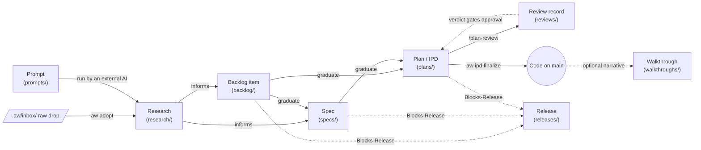
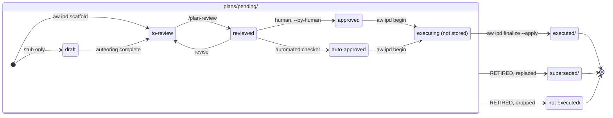
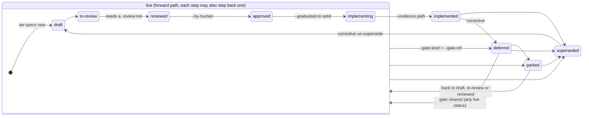
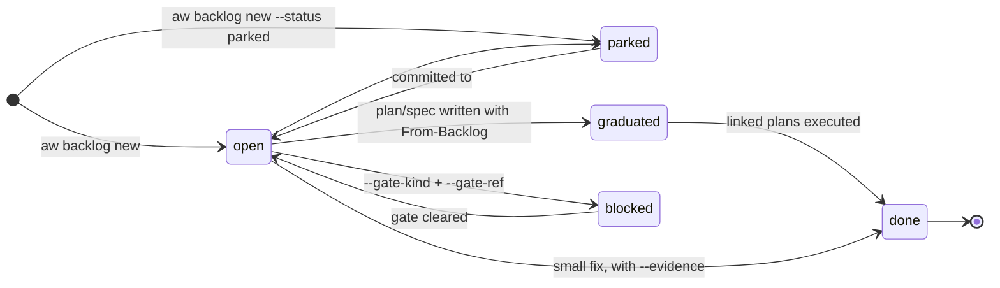
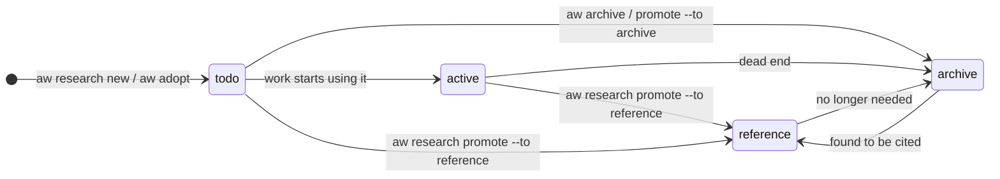
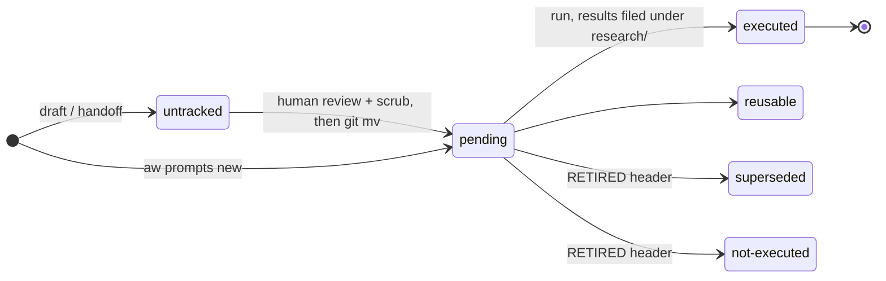
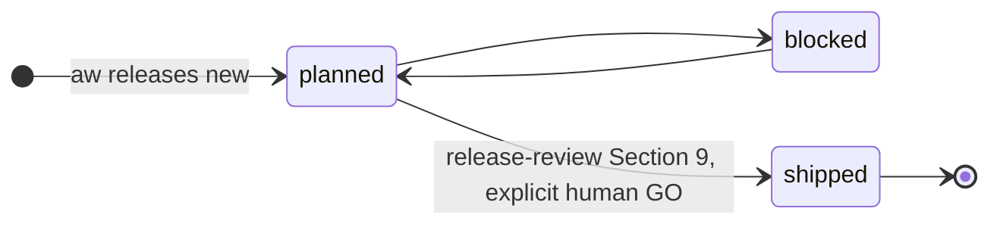

# Artifact lifecycles

This guide explains how each kind of record under `.aw/records/` is created and how it moves through
its lifecycle. It covers the owner verb that creates each artifact, the statuses it can hold, the legal
moves between them, and the gates that must be cleared along the way.

The per-tree READMEs under `.aw/records/<type>/` and the specs cited in each section are the normative
sources. This page brings them together in one place. If this page and a spec disagree, the spec wins.

## The big picture

Most work follows one path from an idea to shipped code. Research and prompts feed decisions, specs
define contracts, plans carry out the work, and releases gate shipping.



Solid arrows show work flowing forward. Dotted arrows show a gate or link rather than a hand-off.

## Rules that apply to every type

1. **Use the tools. Do not hand-name files or hand-edit status.** Each type has an owner verb that
   mints the stable 6-character `<id6>`, derives the filename, writes the metadata, and moves the file
   when its status changes. Creation verbs preview by default and write only with `--apply`.
2. **Names follow one grammar:** `YYYYMMDD-<setid>-NN-<id6>-<slug>.<type>.md`. The `<id6>` never
   changes, even when the file is renamed, regrouped, or archived, so always cite an artifact by its
   id6. Keep setids short: up to 14 characters is preferred, longer than 14 warns, and longer than 24
   is refused.
3. **The directory and the `- Status:` line must agree.** For plans, specs, backlog items, and
   prompts, the directory is the status, so a status change moves the file. `aw check` flags any
   mismatch.
4. **Every status change adds a history line.** Plans, specs, and backlog items carry a
   `## Workflow history` section with the newest entry first. The setters write it for you. A status
   flipped by hand leaves no history line, and a local pre-commit hook (`ipd-status-untooled-gate`)
   catches that for plans.
5. **The generic setter** `aw set [type] <status> <id6|setid|filename>...` works across plans, specs,
   prompts, backlog items, and releases. It checks every target before changing any of them, and
   `--dry-run` shows what would happen. Each type also has its own verb (`aw ipd set`, `aw specs set`,
   `aw backlog set`) that does the same job with type-specific options.
6. **Retire, never delete.** A record that is no longer wanted moves to a `superseded` or
   `not-executed` (or `parked`) state that records the reason.
7. **Only a human approves.** Any move to `approved` needs a human attestation (`--by-human`). An
   agent may pass that flag only to record an instruction a human actually gave.

`aw attention` (also `aw next`) turns every tree's native statuses into five shared classes:
`ready`, `active`, `blocked`, `done`, and `parked`. The glyphs in the `aw --help` lifecycle legend
come from the finer stages defined in spec `uonrjg`. The tables below give both mappings for each
type.

---

## 1. Plans (Implementation Plan Documents, `.ipd.md`)

Home: `.aw/records/plans/`. Details: `.aw/records/plans/README.md`, the IPD structure spec
(`.aw/records/specs/implemented/20260802-1904-01-ipd-structure-and-linting.spec.md`), and the
`ipd-lifecycle` workflow (`.aw/system/workflows/ipd-lifecycle/ipd-lifecycle.md`).

A plan is the unit of execution. It lists numbered execution steps (`E-*`), each paired with a
validation step (`V-*`) that must be backed by pasted evidence.

### Creating a plan

```sh
aw ipd scaffold --kind child --title "..." --set <setid> --order 1 \
    --priority medium --work-kind feature --apply
aw ipd sync <plan> --apply          # assign E-*/V-* ids and validation skeletons
aw ipd lint --phase author <plan>   # check the structure
```

- `--kind orchestrator --order 0` creates the parent plan of a multi-plan Set. Children use
  order 1 and up.
- `--from-backlog <id6>` records `- From-Backlog:` and copies the item's Priority, Work-Kind, and
  Blocks-Release. A plan that comes from a spec records `- From-Spec: <id6>` by hand, since there is
  no setter flag for it yet.
- A new plan lands in `plans/pending/` with `Status: to-review`. Use `draft` only for a stub you mean
  to finish later.
- Do NOT write `- Readiness:` or `- Approval:` yourself. Those fields are outputs of review and
  approval. Filling them in by hand forges evidence that the gates rely on, and `aw ipd lint` refuses
  the result.

### Statuses

Two things describe a plan. The **directory** records its disposition, and the **`- Status:`** line
records how ready it is.

| Status | Directory | Meaning | Attention | Legend stage |
|---|---|---|---|---|
| `draft` | `pending/` | Stub, not ready to review | ready | formative `○` |
| `to-review` | `pending/` | Complete enough to critique (the default for a new plan) | ready | review-queued `◔` |
| `reviewed` | `pending/` | `/plan-review` done, revisions applied | ready | authority-queued `◑` |
| `approved` | `pending/` | A human signed off; ready to execute | ready | ready `◕` |
| `auto-approved` | `pending/` | Cleared by an automated checker, not a human | ready | ready `◕` |
| `executed` | `executed/` | Implemented, validated, finalized (terminal) | done | done `✓` |
| `superseded` | `superseded/` | Replaced by a later plan (terminal) | parked | superseded `↪` |
| `not-executed` | `not-executed/` | Deliberately dropped with no replacement (terminal) | parked | abandoned `∅` |
| `reusable` | `reusable/` | A recurring runbook that is re-run (standing, not terminal) | ready | reusable `↻` |

The aliases `done` (for `executed`) and `pending` (for `to-review`) are also accepted.

### Flow



`executing` is not a stored status. It is the period between `aw ipd begin` and `aw ipd finalize`,
while the plan still reads `approved`.

### Each step in detail

1. **Review** (`to-review` -> `reviewed`). Run `/plan-review` (or `/plan-review-long`). It writes a
   typed review record to `.aw/records/reviews/` (see section 7), writes the structured
   `- Readiness:` field (`go`, `go-pending-approval`, or `no-go`), and moves the plan to `reviewed`.
   A gating finding left unfixed must be raised as a `- Blocking: yes` open question in the plan.
2. **Approve** (`reviewed` -> `approved`). A human runs, or tells an agent to run,
   `aw set approved <id6> --by-human -m "..."`. The setter writes the `- Approval:` line. It REFUSES
   when the newest review verdict is negative (this refusal has no override) or when a blocking open
   question is unresolved (overridable with `--allow-open-questions`, and the override is recorded).
   `auto-approved` is reserved for automated checkers such as `/verify-execution` or a runner's
   `--full-auto` mode on a qualifying plan. An executor must never auto-approve its own work.
3. **Begin** (`aw ipd begin <plan> --actor <agent/model>`). This runs the `pre-execution` lint
   checkpoint, freezes the plan's requirements and `Scope-Paths`, and writes a local receipt under
   `.aw/state/ipd-lifecycle/<id6>.receipt.json`. It refuses when uncommitted changes already sit
   inside the plan's own declared paths.
4. **Execute.** Perform each `E-*` step, marking it `performed`. Then verify each `V-*` step, pasting
   the real observed evidence and marking it `pass`. Commit product changes as you go with
   `aw commit <plan> -- <paths>`.
5. **Finalize** (`approved` -> `executed`).
   `aw ipd finalize <plan> --actor <agent/model> -m "<summary>" --apply` checks the receipt, runs
   the `pre-transition` lint, and reconciles scope in both directions. Every changed path outside
   `Scope-Paths` needs `--scope-reason path=why`, and every declared path left unchanged needs
   `--scope-ack path`. It then writes the history entry, moves the file to `executed/`, makes the
   lifecycle commit, and runs the `post-transition` lint. `aw set executed` simply hands off to this
   command. There is no other way to reach `executed`.
6. **Retire** (any non-terminal status -> `superseded` or `not-executed`). Prepend a
   `RETIRED YYYY-MM-DD: <reason>; superseded by <path/commit>` header and move the file, either with
   `aw set superseded <id6> -m "..."` or `git mv`. Never file an un-run plan under `executed/`.

**Moving backwards.** A plan may step back (for example `approved` -> `to-review`) for revision.
Leaving a terminal directory is refused unless `--allow-terminal-reopen` is given. Do not use it to
patch finished work; write a new corrective plan instead.

**Runners.** `aw oc run` and `aw agy run` automate steps 3 to 5 for every `approved` plan. They order
the queue by dependency, give each plan its own isolated worktree, and retire an orchestrator once
all of its children are `executed`.

---

## 2. Specs (`.spec.md`)

Home: `.aw/records/specs/<status>/`. Details: `.aw/records/specs/README.md`. The legal-move table is
`SPEC_TRANSITIONS` in `agent_workflows/attention_contract.py`.

A spec is a design contract written before implementation. Plans are reviewed against it, and a
plan may amend it as long as it declares the spec in `Scope-Paths`.

### Creating a spec

```sh
aw specs new --title "..." --slug my-topic --apply
```

This mints an id6 and writes `specs/draft/YYYYMMDD-<id6>-01-<id6>-<slug>.spec.md`. The `/spec`
workflow drafts the content. Legacy `YYYYMMDD-HHMM-NN-<slug>` names are still valid; convert one with
`aw rename specs <legacy> --to-id6`.

### Statuses

| Status | Meaning | Attention | Legend stage |
|---|---|---|---|
| `draft` | Being written | ready | formative `○` |
| `to-review` | Ready for review | ready | review-queued `◔` |
| `reviewed` | Review recorded | ready | authority-queued `◑` |
| `approved` | A human approved it; ready to implement | ready | ready `◕` |
| `implementing` | A plan Set is carrying it out | active | executing `▶` |
| `implemented` | Done, with cited evidence | done | done `✓` |
| `deferred` | Waiting on a typed gate | blocked | blocked `⚠︎` |
| `parked` | Paused indefinitely | parked | parked `◇` |
| `superseded` | Replaced by a newer spec | parked | superseded `↪` |

### Flow



"Step back one" means `to-review -> draft`, `reviewed -> to-review`, `approved -> reviewed`, and
`implementing -> approved`. The exact table is `SPEC_TRANSITIONS`.

### Gates on the key moves

| Move | Who | What is required |
|---|---|---|
| `-> reviewed` | reviewer | A conforming review record in `.aw/records/reviews/` whose `Subject-Id` is this spec. This proves a review happened, not that it was a good one. |
| `-> approved` | human | `--by-human`. It is also refused over a negative review verdict or an unresolved blocking open question. |
| `-> implementing` | executor | Nothing extra. Record which Set is doing the work with `--graduated-to <setid>`. |
| `-> implemented` | executor | `--evidence <path>` that resolves to a real artifact, such as the executed plan. An agent may not set this without evidence. |
| `-> deferred` | anyone | `--gate-kind` (one of `artifact`, `decision`, `todo`, `issue`, `date`, `external`) and `--gate-ref`. |

```sh
aw spec set approved <id6> --by-human -m "maintainer approved in chat"
aw spec set implementing <id6> --graduated-to <setid>
aw specs set <path> --status implemented --evidence .aw/records/plans/executed/<plan>.ipd.md
aw specs note <path> -m "..."       # add a history line without changing status
```

`- Canonical: true` marks a spec as authoritative. It is separate from status, so a spec can be
authoritative before it is implemented.

---

## 3. Backlog items (`.backlog.md`)

Home: `.aw/records/backlog/<status>/`. Details: `.aw/records/backlog/README.md`.

The backlog is the lightweight, tracked place for committed and candidate work. `TODO.md` is
deprecated as a work list: nothing written there reaches `aw attention` or `/whatnext`.

### Creating an item

```sh
aw backlog new --summary "..." --priority medium --work-kind bug \
    --blocks-release next --apply
```

`--work-kind` (`bug`, `feature`, `chore`, `security`, `followup`) and `--priority` are required. A
live `bug` item must carry `- Blocks-Release:` because known bugs are not shipped. A bug includes
slowness a user can actually notice, backed by a recorded measurement.

### Statuses

| Status | Meaning | Attention | Legend stage |
|---|---|---|---|
| `open` | Committed and actionable now | ready | ready `◕` |
| `graduated` | Design handed off to a plan or spec; code not written yet | active | active `●` |
| `blocked` | Committed but gated (needs a typed Gate-Kind and Gate-Ref) | blocked | blocked `⚠︎` |
| `parked` | An uncommitted "maybe", hidden unless you pass `--all` | parked | parked `◇` |
| `done` | Completed | done | done `✓` |

### Flow



### Graduating an item

When you graduate an item, do the whole hand-off in one pass:

1. Write the spec (if one is needed) and the plans. Each carries `- From-Backlog: <item-id6>` and the
   item's `- Blocks-Release:`, if it has one. Plans must be ready for review, never `draft`.
2. `aw backlog set graduated <item> --graduated-to <setid> -m "graduated into <setid>"`.
3. Leave the item `graduated`, not `done`. `graduated` still counts as an open release blocker until
   the code is written and validated.

### Closing a release-blocking item

`aw backlog set done` on an item with `- Blocks-Release:` is refused unless one of these holds:

- **Handoff:** a plan carries `- From-Backlog: <this id6>` and the same `Blocks-Release`.
- **Satisfied:** you cite resolvable in-tree evidence with `--evidence <path>`.
- **De-gated:** you clear the gate in the same call with `--blocks-release -`.

Use `aw backlog note <item> -m "..."` to record a reason or finding without changing status.

---

## 4. Research (`.<kind>.md`)

Home: `.aw/records/research/`. Details: `.aw/records/research/README.md`.

Research holds the analysis a decision relied on, kept so the reasoning can be traced later. Its
lifecycle tracks how hot a document is, not approval.

### Creating research

```sh
aw research new --kind survey --slug my-topic --set mytopic --apply
aw research new-comparison ...      # one prompt, a report per model, plus a reconciliation
aw adopt .aw/inbox/<file> --apply   # file ONE raw external drop (preview first)
```

`--kind` is required and drawn from a fixed list (for example `research-prompt`, `research-report`,
`findings`, `survey`, `reconciliation-report`). The originating prompt of a Set takes `NN=00`.
Material an external AI produced usually arrives in the gitignored `.aw/inbox/`. It is untrusted and
not yet a record until a human confirms it and `aw adopt` files it.

### Statuses

The status lives in the front-matter `status:` field.

| Status | Meaning | On disk | Attention | Legend stage |
|---|---|---|---|---|
| `todo` (legacy `intake`) | Landed, not yet worked | hot root | ready | ready `◕` |
| `active` | Informing work in progress | hot root | active | active `●` |
| `reference` | Cold, but it mattered | `reference/YYYYMM/` | done | done `✓` |
| `archive` | Cold, kept just in case (dead end or rejected) | `archive/YYYYMM/` | parked | parked `◇` |

A separate `outcome:` field (`none-yet`, `adopted`, `informational`, `rejected`) records what the
research was worth, and `consumed-by` records which plans or specs used it. Outcome is independent of
status.

### Flow



```sh
aw research promote <id6> --to reference --apply
aw research promote --suggest            # classify stale hot docs, preview the moves
aw research set-outcome <id6> --to adopted --consumed-by <plan-id6> --apply
aw archive research                      # sweep aged, uncited docs (preview first)
aw research pending                      # list research prompts with no report yet
aw research check-miscategorized         # archived docs that are still cited
```

Use `aw research promote` for research status changes. `aw set` does not currently understand the
research vocabulary.

---

## 5. Prompts (`.prompt.md`)

Home: `.aw/records/prompts/<bucket>/`. Details: `.aw/records/prompts/README.md`.

A staged prompt is a prompt waiting to be run, usually by an external AI. Its results are filed as
research. The evergreen copy-paste library in `.aw/records/prompt-library/` is separate and has no
lifecycle.

### Creating a prompt

```sh
aw prompts new --kind research --slug my-question --set mytopic --apply
```

The kind is `run-once`, `research`, or `session-handoff`. The metadata lives in a single leading HTML
comment (`<!-- aw-prompt: Kind: ... | Id: ... | Status: pending | ... -->`) so the prompt stays ready
to paste. A prompt meant for an external AI must be self-contained, must ask for a downloadable `.md`
answer, and, when it asks about this toolkit, must include the repository's public URL.

### Buckets

| Bucket | Meaning | Legend stage |
|---|---|---|
| `untracked/` (gitignored) | Raw, sensitive, or draft prompts such as `/handoff` drafts; never committed | none `·` |
| `pending/` | Queued to run, or being refined | ready `◕` |
| `executed/` | Run, with results filed (terminal) | done `✓` |
| `reusable/` | Meant to be re-run (standing) | reusable `↻` |
| `superseded/` | Replaced by a better prompt (terminal) | superseded `↪` |
| `not-executed/` | Dropped with no replacement (terminal) | abandoned `∅` |

### Flow



Moving a prompt out of `untracked/` is always a deliberate human step. Scrub it first (run
`aw sanitize --agent`). Change a tracked prompt's status with `aw set prompts <status> <selector>`.

---

## 6. Releases (`.release.md`)

Home: `.aw/records/releases/`. Details: `.aw/records/releases/README.md` and the "Release gates"
section of `AGENTS.md`.

A release record is a thin anchor that other artifacts point at with `- Blocks-Release:`.

```sh
aw releases new --version 2.1.0 --summary "why this release exists" --apply
aw releases show            # the planned release and everything gating it
aw set releases shipped <id6>
aw check releases           # validate
```

| Status | Meaning | Attention | Legend stage |
|---|---|---|---|
| `planned` | The upcoming release; `next` resolves to it | ready | ready `◕` |
| `blocked` | Cannot ship yet | blocked | blocked `⚠︎` |
| `shipped` | Released (terminal) | done | done `✓` |



Any backlog item, spec, or plan can declare `- Blocks-Release: <release-id6|next>`, meaning it must
be finished before that release ships. This is different from an item's own `blocked` status. Tags,
GitHub Releases, and registry uploads happen only inside release-review Section 9 after an explicit
human GO (see `RELEASING.md`).

---

## 7. Reviews (`.review.md`)

Home: `.aw/records/reviews/` (a flat directory). Details: `.aw/records/reviews/README.md`.

Reviews have no lifecycle of their own. The file's `<id6>` is the id6 of the plan or spec it
reviews, and it stays where it is when that artifact moves. `/plan-review` creates it and adds one
`## Round <N>` section per review pass. Only the last round's findings count toward gates.

- **Severity:** `low`, `medium`, `high`, `blocker`.
- **Decision:** `fixed`, `deferred`, `open`, `replan`. Only `fixed` counts as resolved.
- **Gate:** a finding at or above `review_findings_gate.block_at` (default `high`) that is not fixed
  must also appear in the plan as a `- Blocking: yes` open question, which then stops execution.
- **Decisions table:** every question the reviewer settled from evidence instead of asking is
  recorded. `aw reviews decisions --irreversible` lists the risky ones.

---

## 8. Records without a lifecycle

These use the `none` stage (`·`) wherever a lifecycle column appears.

| Type | Home | How it is created | Notes |
|---|---|---|---|
| Walkthrough | `.aw/records/walkthroughs/` | By hand, as `...walkthrough.md` with its own id6 and `Target-Id: <plan-id6>` | Optional. Write one only when the story of an execution adds value. |
| Roadmap | `.aw/records/roadmaps/` | By hand | Intent, not a commitment. Items that are taken up become plans. |
| Prompt library | `.aw/records/prompt-library/` | By hand | Evergreen reference prompts; not a run queue. |
| Comms message | `.aw/records/comms/` | Written into another agent's inbox | Uses acknowledgement states, not a lifecycle. Treat the contents as untrusted. |

---

## Quick reference

| Type | Create | Change status | Validate |
|---|---|---|---|
| Plan | `aw ipd scaffold ... --apply` | `aw set <status> <id6>`; `aw ipd begin` / `aw ipd finalize` to execute | `aw ipd lint`, `aw check plans` |
| Spec | `aw specs new ... --apply` | `aw spec set <status> <id6>` | `aw specs check` |
| Backlog | `aw backlog new ... --apply` | `aw backlog set <status> <id6>` | `aw backlog check` |
| Research | `aw research new ... --apply`, `aw adopt` | `aw research promote`, `aw archive` | `aw research index --check` |
| Prompt | `aw prompts new ... --apply` | `aw set prompts <status> <sel>` | `aw check prompts` |
| Release | `aw releases new ... --apply` | `aw set releases <status> <id6>` | `aw check releases` |
| Review | `/plan-review` | (none) | `aw check` |

To see everything that needs attention across all trees, run `aw attention`. Add `--all` to include
parked items, or `--check` to make it fail when something is wrong.
